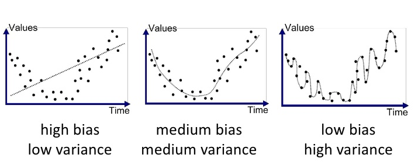
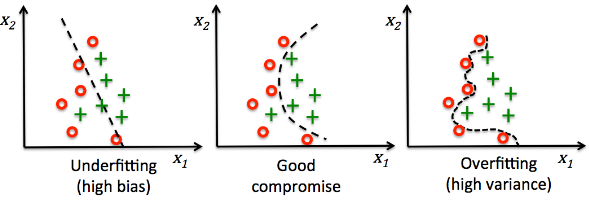

# 1 신경망 입문

## 1.1 소개

인공 신경망의 뉴런(계산 단위)들은 **가중치**(weight)를 통해 연결되어 있다. 인공 신경망은 각 입력 뉴련의 계산 결과를 출력 뉴런으로 전파하면서 전체적으로 하나의 함수를 계산한다. 그 과정에서 가중치가 중간 매개 변수로 작용한다. 학습은 뉴런을 연결하는 가중치들을 변경함으로써 일어난다.

훈련 알고리즘은 특정 입력을 신경망이 '예측한 결과가 훈련 자료에 있는 출력 분류명과 얼마나 잘 부합하는지'에 기초해서 신경망 가중치들의 정확성을 평가한다.

신경망의 함수 계산에서 발생한 오차는 마치 불쾌한 경험이 시냅스 연결 강도의 변화를 일으키는 것과 비슷하다. 뉴런 사이의 가중치는 예측 오차에 기초해서 변한다. 계속 조정해서 좀 더 정확한 예측값을 내도록 정렬된다.

> 인공 신경망과 사람의 뇌가 작동하는 방식을 비교하는 이런 생물학적 비유는, 실제 뇌가 작동하는 방식과는 거리가 멀다는 비판도 많다. 하지만 실제로 신경과학의 원리들이 유용할 때도 많다.

- 모형 일반화(model generalizaion): 유한한 수의 입력-출력 쌍들로 훈련한 신경망이 미지의 입력을 정확하게 계산하는 능력을 의미한다.

사실 신경망의 기본 계산 단위들은 대부분 **최소제곱 회귀**(least-squares regression)나 **로지스틱 회귀**(logistic regression) 같은 전통적인 기계 학습 알고리즘에서 영감을 얻은 것이다. 신경망의 능력은 그런 기본 단위를 대량으로 연결하고, 서로 다른 단위들의 가중치를 결합적으로(jointly) 학습해서 예측 오차를 최소화하는 데서 비롯된다.

## 1.1.1 인간 대 컴퓨터

작은 크기의 자료 집합(data set, 데이터 셋)은 전통적인 기계 학습이 여전히 신경망보다 더 나은 성과를 보인다. 전통적인 기계 학습에서는 알고리즘 선택 폭이 더 넓고 모형 해석이 용이하며, 사람의 통찰을 이용해서 훈련을 실행할 때가 많기 때문이다.

지금은 소위 '빅데이터' 시대가 도래해서 심층 학습 알고리즘들이 큰 성공을 거두게 됐다.

---

## 1.2 신경망의 기본 구조

단층(single-layer) 신경망과 다층(multi-layer) 신경망을 살펴볼 것이다.

### 단일 계산층: 퍼셉트론

가장 단순한 형태의 신경망을 퍼셉트론이라 부른다. 이 신경망은 입력층 하나와 출력 노드 하나로 구성된다.

- 훈련 사례: ($\bar{X}, y$)

  - $\bar{X} = \left[x_{1},...,x_{d}\right]$: d개의 feature(특징) 변수들

  - $y \in \{-1, +1 \}$: 해당 binary class variable(이진 분류 변수)의 observed value(관측값)이 들어 있다.

- 위는 관측값이 이미 훈련 자료의 일부로 주어졌음을 의미하며, 훈련의 목표는 '아직 관측하지 않은 입력에 대한 분류 변수 값을 퍼셉트론이 정확하게 예측'하는 것이다.

훈련은 다음의 과정을 거치며 진행된다.

1. 입력층은 d개의 노드로 구성되며 d개의 feature로 이루어진 벡터 $\bar{X}=\left[x_{1},...x_{d}\right]$를, 가중치가 $\bar{W}=\left[ w_{1} ... w_{d} \right]$인 edge(간선)들을 통해 출력 노드에 전달한다.

2. 선형 함수 $\bar{W} \cdot \bar{X} = \sum_{i=1}^d{w_{i}x_{i}}$는 출력 노드에서 계산된다.(입력층 자체는 그 어떤 계산도 수행하지 않는다.)

3. 신경망은 이 함수가 산출한 실숫값의 부호를 이용해서, $\bar{X}$의 종속변수를 예측한다.

정리하자면 예측값 $\hat{y}$는 다음과 같이 계산된다.(변수 y 위의 hat(악센트 기호)는 이것이 예측값이라는 의미이다.)

$$ \hat{y} = sgn\left\{\bar{W} \cdot \bar{X} \right\} = sgn\left\{\sum_{j=1}^d w_{j}x_{j}\right\} $$

error(예측 오차)가 $E(\bar{X}) = y - \hat{y}$이므로, 지금 예제에서 예측 오차가 될 수 있는 값들의 집합은 $\{-2, 0, +2\}$이다. 오차값 $E(\bar{X})$가 0이 아닌 경우에는 신경망의 오차 gradient(기울기)를 갱신할 필요가 있다.

---

### &nbsp;&nbsp;&nbsp;🔒 정의: sign function&nbsp;&nbsp;&nbsp;

여기선 sgn은 sign function(부호 함수)이다. $sgnx = 2H(x) - 1$($H(x)$는 unit step function(단위 계단 함수, =헤비사이드 계단 함수))과 동일하다. 0에서 불연속이며, 실숫값을 +1 또는 -1로 mapping(사상)하므로 이진 분류 과제에 적합하다.

---

위 과정에서 sign function는 **활성화 함수**(activation function) 역할이다. 이 활성화 함수를 어떻게 선택하는가에 따라 <U>기계 학습에 쓰여온 여러 종류의 기존 모형을 흉내 낼 수 있다.</U> 

이를테면 **SVM**(Support Vector Machine, 지지 벡터 기계), **logistic regression classifier**(로지스틱 회귀 분류기),**least-squares regression with numeric targets**(수치 목푯값 최소제곱 회귀)를 흉내 내는 것이 가능하다.

### 신경망의 깊이

퍼셉트론이 두 개의 층으로 이루어지지만, 입력층은 그 어떤 계산도 수행하지 않고 그냥 특정 값들을 전달하기만 했다. 따라서 신경망의 depth(깊이)를 셀 때는 입력층을 포함하지 않는다. 퍼셉트론은 **계산층**(computational layer)이 단 하나이므로 단층 신경망에 해당한다.

---

### &nbsp;&nbsp;&nbsp;🔒 정의: bias, variance&nbsp;&nbsp;&nbsp;

> [Bias와 Variance의 정의](https://gaussian37.github.io/machine-learning-concept-bias_and_variance/)

우선 아래 그림을 보며 $f(x), \hat{f}(x), E[\hat{f}(x)]$의 차이를 구분해 보자.

- $f(x)$: feature 변수에 대해 실제 정답에 해당하는 값(true)

- $\hat{f}(x)$: 예측 모델에 feature 변수을 input으로 주었을 때, 모델이 출력한 예측값들이다.(predicted value)

- $E[\hat{f}(x)]$: 모델이 출력한 예측값들($\hat{f}(x)$)의 평균(기댓값)이다. 대표 예측값으로 볼 수 있다.(average predicted value)

**bias**란 바로 **모델이 출력한 예측값 - 실제 정답의 평균**이다. 즉, bias가 크다는 것은 그만큼 예측값이 정답과 차이가 크다는 의미다.

$$ Bias[\hat{f}(x)] = E[\hat{f}(x) - f(x)] $$

반면 **variance**는 **예측값이 얼마나 변화할 수 있는 지**를 나타내는 양(quantity)의 개념이다. 즉, <U>모델의 예측값이 얼마나 flexibility를 가지는지</U>를 나타낸다고 볼 수 있다.

regression(회귀)와 classification(분류) 모델의 예제를 보면 더 이해하기 쉽다.

- 큰 점: true 값

- 점선: regression 모델의 예측값

- 점선: classification 모델의 학습 결과

- 첫 번째 그래프는 flexibility의 부족으로 정답을 잘 예측하지 못한다. (underfitting)

- 세 번째 그래프는 필요 이상으로 복잡하여(high variance), 모델이 예측값과 정답 사이의 편차가 크게 발생하고 있다. (overfitting)

---

### 치우침 항

예측을 하는 많은 경우에서 변하지 않는 부분이 존재한다. 이런 **invariant**(불변) 부분을 **bias**(치우침) 항이라고 부른다. 

예를 들어 feature 변수들이 평균(mean) 중심으로 배치되어 있되, $\{-1, +1\}$ 범위의 이진 분류 예측값들의 평균이 0이 아닌 상황을 생각해 보자.(즉, 이진 분류의 분포가 한쪽으로 크게 치우쳐 있을 것이다.) 이런 상황에는 그런 invariant한 부분을 반영하는 추가적인 bias variable(치우침 변수) $b$를 도입할 필요가 있다. (공간적으로 보면 **평행이동**으로 볼 수 있다.)

$$ \hat{y} = sgn\{ \bar{W} \cdot \bar{X} + b \} = sgn \left\{ \sum_{j=1}^{d}{w_{j}x_{j}} + b \right\} $$

이런 bias 항을 edge에 도입하는 한 가지 접근 방식은 bias neuron(치우침 뉴런)을 신경망에 추가하는 것이다. 여기서 bias neuron은 항상 1이라는 값을 출력 노드에 전달한다. bias neuron을 출력 노드에 연결하는 edge의 weight는 위 식의 bias 항 b 역할을 한다.

또 다른 접근 방식은 값이 1인 feature를 도입하는 feature engineering trick을 사용하는 것이다. 상수 feature의 계수가 치우침 항으로 작용하므로, 아래 식을 그대로 사용할 수 있다.

$$ \hat{y} = sgn\left\{\bar{W} \cdot \bar{X} \right\} = sgn\left\{\sum_{j=1}^d w_{j}x_{j}\right\} $$

### 목적 함수

> 간단하게 말하면 최소화 혹은 최대화를 위해 사용하는 함수가 바로 objective function(목적 함수)이다. 이때 최소화 목적 함수가 바로 loss function(손실 함수)이다. 즉, 손실 함수는 objective function의 한 종류라고 볼 수 있다.

> 목적 함수는 손실 함수와 구별하여, '훈련 중 최적화를 위해 사용하는 함수'라는 의미로 사용하기도 한다.

> 목적 함수를 최대화 혹은 최소화하는 인수를 구하는 문제를 **최적화 문제**(optimization problem)이라고 한다.

> 가령 '장바구니 안에 크기와 중량을 고려해서 물건 총액이 최대가 되도록 담겠다'라는 문제가 있다면, 목적 함수는 '담은 물건의 총액'을 나타내게 된다.

---

### &nbsp;&nbsp;&nbsp;🔒 정의: 최소제곱법&nbsp;&nbsp;&nbsp;

> [최소제곱법](https://youngji.medium.com/%EC%B5%9C%EC%86%8C%EC%A0%9C%EA%B3%B1%EB%B2%95-least-squared-method-f7357990329f)

가령 아래의 그래프에서 이 점들 사이의 일관성을 찾기 위해 선형인 일차 함수 $f(x)$를 도출해야 한다고 가정하자. 그래프와 각 점들 간의 차이를 residual이라고 하며, 다시 말하면 이 residual이 최소가 되는 $f(x)$를 찾아야 하는 것이다.

$$ \sum_{i=1}^{n}{residual}^2 = \sum_{i=1}^{n}(y_{i} - f(x_{i}, \beta))^{2} $$

$f(x)$ 는 선형인 일차 함수이므로 기울기 a와 절편 b를 갖는다. ( $f(x_{i}, \beta) = ax_{i}+ b$ ) Residual 합의 최소가 되는 값은 $a, b$를 편미분하여 도출할 수 있는데, 페르마의 정리에 의해 미분값=0으로 도출되는 값이 임계점이 되기 때문이다.

---

원래 퍼셉트론 알고리즘은 오분류를 최소화하기 위해 발견법적으로 설계된 것이었다. 학습 알고리즘의 정확성 보장에 관련된 수렴 증명들이 제시되었고, 지금도 퍼셉트론 알고리즘의 목표를 feature-class label(특징-분류명) 쌍을 담은 '자료 집합 $\mathcal{D}$의 모든 훈련 견본에 관한 최소제곱 형태'로 표현할 수 있다.

$$ \mathrm{Minimize}\underset{W}{-}L = \sum_{(\bar{X},y)\in\mathcal{D}}{(y-\hat{y})^{2}} = \sum_{(\bar{X},y)\in\mathcal{D}}{(y- sgn{\bar{W} \cdot \bar{X}})^{2}} $$

이런 종류의 최소화 objective function(목적 함수)를 **손실 함수**라고도 부른다. 거의 모든 신경망 학습 알고리즘은 손실 함수를 사용하는 형태로 공식화된다.

최소제곱 회귀는 연속인 output에 쓰이며, 해당 손실 함수는 매끄러운 연속 함수이다. 그러나 sign function(부호 함수) 같이 step function 형태의 함수를 적용하는 경우에는 미분 불가능할 뿐만 아니라, 미분이 가능한 점이어도 상수 값을 갖기 때문에 기울기가 정확히 0이 된다. 그래서 이런 step function과 같은 형태에서는 경사 하강법(gradient descent)를 적용하기가 곤란하다.

이런 문제점 때문에 퍼셉트론 알고리즘은 (암묵적으로) 각 견본에 대한 기울기를 smoothing하기 위해 다음과 같은 근사 기울기를 사용한다.

$$ \nabla{L_{smooth}} = \sum_{(\bar{X},y) \in \mathcal{D}}{(y - \hat{y}) \bar{X}} $$

이 근사 기울기는 진짜 기울기가 아닌 것에 주의해야 한다. 

### 가중치 갱신

신경망 훈련 알고리즘은 각 자료 견본 $\bar{X}$ 를 한 번에 하나씩(혹은 batch로 묶어서) 신경망에 공급하고 예측값 $\hat{y}$를 산출한다. 예측값이 도출되면 오차 $E(\bar{X}) = (y - \hat{y})$에 기초하여 가중치를 갱신한다. 

좀 더 구체적으로, 신경망에 공급된 하나의 data point를 $\overline{X}$ 라고 할 때, weight vector $\overline{W}$ 는 다음과 같이 갱신된다.

$$ \overline{W} \Leftarrow \overline{W} + \alpha (y - \hat{y}) \overline{X} $$

매개변수 $\alpha$는 신경망의 learning rate(학습률, 학습 속도)를 제어하는 역할을 한다. 모든 train 견본을 무작위로 훑으면서 가중치를 반복해서 조율하다가, 학습이 수렴에 도달하면 반복이 끝난다.

참고로 전체 과정에서 하나의 train data point를 여러 번 입력할 수 있는데, 각 반복 주기를 **epoch**라고 부른다.

위 식을 오차 $E(\overline{X})$ 를 이용해서 표현할 수 있다.

$$ \overline{W} \Leftarrow \overline{W} + \alpha E(\overline{X}) \overline{X} $$

기본적인 퍼셉트론 알고리즘은 **shochastic gradient-descent**(확률적 경사 하강법)에 해당한다. 무작위로 선택된 train data point에 경사 하강법을 적용해서 예측값의 제곱오차를 암묵적으로 최소화한다.

### linearly separable

퍼셉트론이 제시하는 모형은 **선형 모델**(linear model)에 해당한다. 이런 종류의 모형은 자료가 linearly separable할 때 특히 잘 작동한다.

훈련 자료가 linearly seperable한 경우, 퍼셉트론 알고리즘은 항상 훈련 자료에서 오차 0을 제공하는 지점으로 수렴한다. 반면 자료가 linearly separable하지 않은 경우, 퍼셉트론은 수렴을 보장하지 않는다.(다른 알고리즘들에 비해 매우 나쁜 해를 도출할 수 있다.)

---

## 1.2.1.1 퍼셉트론이 최적화하는 목적함수

> 0-1 Loss는 모델이 예측값이 true 값과 같으면 0, 다르면 1을 출력한다. 이런 목적함수는 훈련하는 모델이 얼마나 제대로 예측하는지는 알 수 있어도, 가중치를 어느 방향으로 수정해야 하는지는 알기 힘들다.

binary classification 문제에서 오분류 횟수를 다음과 같은 손실함수 형태로 표현할 수 있다. 손실함수는 훈련 자료점 $( \overline{X_i}, y_i )$ 에 대해 0/1 손실함수 형태로 표현된다.

$$ L_{i}^{(0/1)} = {1 \over 2}( y_i - sgn \left\{ \overline{W} \cdot \overline{X_i} \right\})^2 = 1 - y_i \cdot sgn\left\{ \overline{W} \cdot \overline{X_i} \right\} $$

- 제곱식을 전개하면 $y_{i}^2$ 와 $sgn \left\{ \overline{W} \cdot \overline{X_i} \right\}^2$ 는 모두 1이 된다. 따라서 $ {1 \over 2} * (1 + 1) = 1 $ 로 정리된다. 
- 결국 손실함수의 값은 나머지 항인 $ - y_i \cdot sgn\left\{ \overline{W} \cdot \overline{X_i} \right\} $ 가 좌우하게 된다.

그런데 이 목적 함수는 계단 형태라서 미분 가능한 함수가 아니다. 따라서 매끄러운 목적함수를 따로 정의할 필요가 있는데, 이를 위해서 위 0/1 손실함수에서 sign 함수를 제거하고 음의 값들을 0으로 설정한다.(퍼셉트론 갱신은 본질적으로 $ \overline{W} \Leftarrow \overline{W} + \alpha \nabla \mathbf{w} \overline{X} $ 인 점을 생각하자.)

$$ L_{i} = max \left\{ -y_{i}(\overline{W} \cdot \overline{X_i}, 0) \right\} $$

이렇게 미분 불가능 함수의 기울기 계산을 가능하게 수정한 손실함수를 **smoothed surrogate loss function**(평활화된 대리 손실함수)라고 부르기도 한다. <U>출력이 이산값</U>인 연속 최적화 기반 학습 방법들(신경망 등)은 거의 이런 smoothed surrogate loss function을 사용한다.

> 그런데 이 퍼셉트론 목적함수에서는, **train data set과 무관하게** $\overline{W}$ 를 영벡터로 두어도 최적의 손실값 0을 도출한다. linear seperable한 자료라면 이런 인위적인 설정으로도 여전히 명확한 seperator로 작동한다. 하지만 그렇지 않다면, 제대로 분리하지 못하게 된다.

> 이런 점을 개선하기 위해 다양한 방식이 제안되었다. 한 가지 예로 오분류 횟수 면에서 지금까지 최상의 해를 기억해 두는 방식이 있다. 이 접근 방식을 **pocket algorithm**(주머니 알고리즘)이라고 하는데, 최상의 해를 '주머니'에 넣어 두는 것 같아서 붙은 이름이다.

> 또 다른 예시로, 손실함수에 margin이라는 개념을 도입한 알고리즘이 있다. 사실상 linear SVM 알고리즘과 동일하다. 이 때문에 linear SVM을 **최적 안정성 퍼셉트론**(perceptron of optimal stability)라고 부르기도 한다.

---