# 1 신경망 입문

## 1.1 소개

인공 신경망의 뉴런(계산 단위)들은 **가중치**(weight)를 통해 연결되어 있다. 인공 신경망은 각 입력 뉴련의 계산 결과를 출력 뉴런으로 전파하면서 전체적으로 하나의 함수를 계산한다. 그 과정에서 가중치가 중간 매개 변수로 작용한다. 학습은 뉴런을 연결하는 가중치들을 변경함으로써 일어난다.

훈련 알고리즘은 특정 입력을 신경망이 '예측한 결과가 훈련 자료에 있는 출력 분류명과 얼마나 잘 부합하는지'에 기초해서 신경망 가중치들의 정확성을 평가한다.

신경망의 함수 계산에서 발생한 오차는 마치 불쾌한 경험이 시냅스 연결 강도의 변화를 일으키는 것과 비슷하다. 뉴런 사이의 가중치는 예측 오차에 기초해서 변한다. 계속 조정해서 좀 더 정확한 예측값을 내도록 정렬된다.

> 인공 신경망과 사람의 뇌가 작동하는 방식을 비교하는 이런 생물학적 비유는, 실제 뇌가 작동하는 방식과는 거리가 멀다는 비판도 많다. 하지만 실제로 신경과학의 원리들이 유용할 때도 많다.

- 모형 일반화(model generalizaion): 유한한 수의 입력-출력 쌍들로 훈련한 신경망이 미지의 입력을 정확하게 계산하는 능력을 의미한다.

사실 신경망의 기본 계산 단위들은 대부분 **최소제곱 회귀**(least-squares regression)나 **로지스틱 회귀**(logistic regression) 같은 전통적인 기계 학습 알고리즘에서 영감을 얻은 것이다. 신경망의 능력은 그런 기본 단위를 대량으로 연결하고, 서로 다른 단위들의 가중치를 결합적으로(jointly) 학습해서 예측 오차를 최소화하는 데서 비롯된다.

## 1.1.1 인간 대 컴퓨터

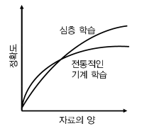

작은 크기의 자료 집합(data set, 데이터 셋)은 전통적인 기계 학습이 여전히 신경망보다 더 나은 성과를 보인다. 전통적인 기계 학습에서는 알고리즘 선택 폭이 더 넓고 모형 해석이 용이하며, 사람의 통찰을 이용해서 훈련을 실행할 때가 많기 때문이다.

지금은 소위 '빅데이터' 시대가 도래해서 심층 학습 알고리즘들이 큰 성공을 거두게 됐다.

---

## 1.2 신경망의 기본 구조

단층(single-layer) 신경망과 다층(multi-layer) 신경망을 살펴볼 것이다.

### 단일 계산층: 퍼셉트론

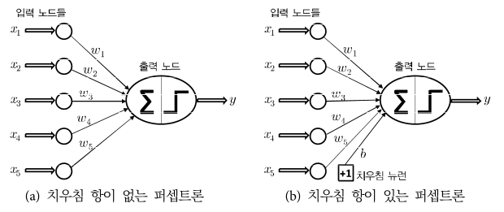

가장 단순한 형태의 신경망을 퍼셉트론이라 부른다. 이 신경망은 입력층 하나와 출력 노드 하나로 구성된다.

- 훈련 사례: ( $\bar{X}, y$ )

  - $\bar{X} = \left[x_{1},...,x_{d}\right]$: d개의 feature(특징) 변수들

  - $y \in \{-1, +1 \}$: 해당 binary class variable(이진 분류 변수)의 observed value(관측값)이 들어 있다.

- 위는 관측값이 이미 훈련 자료의 일부로 주어졌음을 의미하며, 훈련의 목표는 '아직 관측하지 않은 입력에 대한 분류 변수 값을 퍼셉트론이 정확하게 예측'하는 것이다.

훈련은 다음의 과정을 거치며 진행된다.

1. 입력층은 d개의 노드(Activation **Units**)로 구성되며 d개의 feature로 이루어진 벡터 $\bar{X}=\left[x_{1},...x_{d}\right]$를, 가중치가 $\bar{W}=\left[ w_{1} ... w_{d} \right]$ 인 edge(간선)들을 통해 출력 노드에 전달한다.

2. 선형 함수 $\bar{W} \cdot \bar{X} = \sum_{i=1}^{d}{w_{i}x_{i}}$ 는 출력 노드에서 계산된다.(입력층 자체는 그 어떤 계산도 수행하지 않는다.)

3. 신경망은 이 함수가 산출한 실숫값의 부호를 이용해서, $\bar{X}$의 종속변수를 예측한다.

정리하자면 예측값 $\hat{y}$는 다음과 같이 계산된다.(변수 y 위의 hat(악센트 기호)는 이것이 예측값이라는 의미이다.)

$$ \hat{y} = sgn\lbrace\bar{W} \cdot \bar{X} \rbrace = sgn\lbrace\sum_{j=1}^d w_{j}x_{j}\rbrace $$

또한 error(예측 오차)는 $E(\bar{X}) = y - \hat{y}$이므로, 지금 예제에서 예측 오차가 될 수 있는 값들의 집합은 $\{-2, 0, +2\}$이다. 오차값 $E(\bar{X})$가 0이 아닌 경우에는 신경망의 오차 gradient(기울기)를 갱신할 필요가 있다.

---

### <span style='background-color: #393E46; color: #F7F7F7'>&nbsp;&nbsp;&nbsp;🔒 정의: sign function&nbsp;&nbsp;&nbsp;</span>


여기선 sgn은 sign function(부호 함수)이다. $sgnx = 2H(x) - 1$ ( $H(x)$ 는 unit step function(단위 계단 함수, =헤비사이드 계단 함수))과 동일하다. 0에서 불연속이며, 실숫값을 +1 또는 -1로 mapping(사상)하므로 이진 분류 과제에 적합하다.

---

위 과정에서 sign function는 **활성화 함수**(activation function) 역할이다. 이 활성화 함수를 어떻게 선택하는가에 따라 <U>기계 학습에 쓰여온 여러 종류의 기존 모형을 흉내 낼 수 있다.</U> 

이를테면 **SVM**(Support Vector Machine, 지지 벡터 기계), **logistic regression classifier**(로지스틱 회귀 분류기),**least-squares regression with numeric targets**(수치 목푯값 최소제곱 회귀)를 흉내 내는 것이 가능하다.

> [logistic regression의 사용 이유](https://icim.nims.re.kr/post/easyMath/64)

### 신경망의 깊이

퍼셉트론이 두 개의 층으로 이루어지지만, 입력층은 그 어떤 계산도 수행하지 않고 그냥 특정 값들을 전달하기만 했다. 따라서 신경망의 depth(깊이)를 셀 때는 입력층을 포함하지 않는다. 퍼셉트론은 **계산층**(computational layer)이 단 하나이므로 단층 신경망에 해당한다.

---

### <span style='background-color: #393E46; color: #F7F7F7'>&nbsp;&nbsp;&nbsp;🔒 정의: bias, variance&nbsp;&nbsp;&nbsp;</span>

> [Bias와 Variance의 정의](https://gaussian37.github.io/machine-learning-concept-bias_and_variance/)

우선 아래 그림을 보며 $f(x), \hat{f}(x), E[\hat{f}(x)]$의 차이를 구분해 보자.

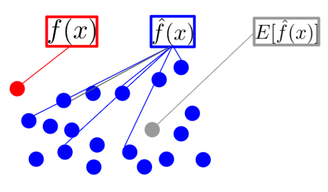

- $f(x)$: feature 변수에 대해 실제 정답에 해당하는 값(true)

- $\hat{f}(x)$: 예측 모델에 feature 변수을 input으로 주었을 때, 모델이 출력한 예측값들이다.(predicted value)

- $E[\hat{f}(x)]$: 모델이 출력한 예측값들( $\hat{f}(x)$ )의 평균(기댓값)이다. 대표 예측값으로 볼 수 있다.(average predicted value)

**bias**란 바로 **모델이 출력한 예측값 - 실제 정답의 평균**이다. 즉, bias가 크다는 것은 그만큼 예측값이 정답과 차이가 크다는 의미다.

$$ Bias[\hat{f}(x)] = E[\hat{f}(x) - f(x)] $$

반면 **variance**는 **예측값이 얼마나 변화할 수 있는 지**를 나타내는 양(quantity)의 개념이다. 즉, <U>모델의 예측값이 얼마나 flexibility를 가지는지</U>를 나타낸다고 볼 수 있다.


regression(회귀)와 classification(분류) 모델의 예제를 보면 더 이해하기 쉽다.


- 큰 점: true 값

- 점선: regression 모델의 예측값


- 점선: classification 모델의 학습 결과

- 첫 번째 그래프는 flexibility의 부족으로 정답을 잘 예측하지 못한다. (underfitting)

- 세 번째 그래프는 필요 이상으로 복잡하여(high variance), 모델이 예측값과 정답 사이의 편차가 크게 발생하고 있다. (overfitting)

---

### 치우침 항

예측을 하는 많은 경우에서 변하지 않는 부분이 존재한다. 이런 **invariant**(불변) 부분을 **bias**(치우침) 항이라고 부른다. 

예를 들어 feature 변수들이 평균(mean) 중심으로 배치되어 있되, $\{-1, +1\}$ 범위의 이진 분류 예측값들의 평균이 0이 아닌 상황을 생각해 보자.(즉, 이진 분류의 분포가 한쪽으로 크게 치우쳐 있을 것이다.) 이런 상황에는 그런 invariant한 부분을 반영하는 추가적인 bias variable(치우침 변수) $b$를 도입할 필요가 있다. (공간적으로 보면 **평행이동**으로 볼 수 있다.)

$$ \hat{y} = sgn\{ \bar{W} \cdot \bar{X} + b \} = sgn \lbrace \sum_{j=1}^{d}{w_{j}x_{j}} + b \rbrace $$

이런 bias 항을 edge에 도입하는 한 가지 접근 방식은 bias neuron(치우침 뉴런)을 신경망에 추가하는 것이다. 여기서 bias neuron은 항상 1이라는 값을 출력 노드에 전달한다. bias neuron을 출력 노드에 연결하는 edge의 weight는 위 식의 bias 항 b 역할을 한다.

또 다른 접근 방식은 값이 1인 feature를 도입하는 feature engineering trick을 사용하는 것이다. 상수 feature의 계수가 치우침 항으로 작용하므로, 아래 식을 그대로 사용할 수 있다.

$$ \hat{y} = sgn\lbrace\bar{W} \cdot \bar{X} \rbrace = sgn\lbrace\sum_{j=1}^d w_{j}x_{j}\rbrace $$

### 목적함수

> 간단하게 말하면 최소화 혹은 최대화를 위해 사용하는 함수가 바로 objective function(목적함수)이다. 이때 최소화 목적함수가 바로 loss function(손실함수)이다. 즉, 손실함수는 objective function의 한 종류라고 볼 수 있다.

> 목적함수는 손실함수와 구별하여, '훈련 중 최적화를 위해 사용하는 함수'라는 의미로 사용하기도 한다.

> 목적함수를 최대화 혹은 최소화하는 인수를 구하는 문제를 **최적화 문제**(optimization problem)이라고 한다.

> 가령 '장바구니 안에 크기와 중량을 고려해서 물건 총액이 최대가 되도록 담겠다'라는 문제가 있다면, 목적함수는 '담은 물건의 총액'을 나타내게 된다.

---

### <span style='background-color: #393E46; color: #F7F7F7'>&nbsp;&nbsp;&nbsp;📝 예제: 행렬곱&nbsp;&nbsp;&nbsp;</span>

실제로 신경망에서 함수가 행렬곱으로 처리되는 과정을 이해하기 위해 다음 예시를 살펴보자. 입력 layer가 하나, 출력 노드가 두 개인 신경망이며, activation function으로 각기 다른 class(개/고양이)에 해당할 확률을 알기 위해 softmax를 적용했다.

> [행렬곱으로 이해하는 신경망](https://wikidocs.net/150781)

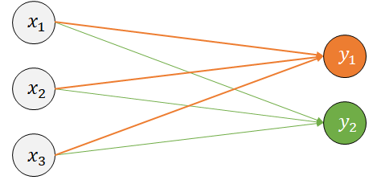

tensorflow로 처음 모델을 만들어 볼 때 Sequential Model로 다음과 같이 구성했었다.

```Python
from tensorflow.keras.models import Sequential
from tensorflow.keras.layers import Dense

model = Sequential()

# 3개의 입력과 2개의 출력
model.add(Dense(2, input_dim=3, activation='softmax'))
```

위 신경망에서 일어나는 연산을 행렬곱으로 나타내면 다음과 같다. 우선 활성화 전 값을 구해 보자.

$$ \begin{bmatrix} x_1 \, x_2 \, x_3 \end{bmatrix} \cdot \begin{bmatrix} w_1 \, \, w_4 \\ w_2 \, \, w_5 \\ w_3 \, \, w_6 \end{bmatrix} + \begin{bmatrix} b_1, b_2 \end{bmatrix} = \begin{bmatrix} y_1 \, \, y_2 \end{bmatrix} $$

- [ $w_1 \, w_2 \, w_3$ ] : $y_1$ node로 향하는 edge들의 weight들

- [ $w_4 \, w_5 \, w_6$ ] : $y_2$ node로 향하는 edge들의 weight들

- [ $b_1 \, b_2$ ] : bias

이를 계산하는 과정을 수식으로 쓰면 다음과 같다.

$$ h_1 = x_1 w_1 + x_2 w_2 + x_3 w_3 + b_1 $$
$$ h_2 = x_1 w_4 + x_2 w_5 + x_3 w_6 + b_2 $$

그리고 activation function을 적용하면 output을 도출할 수 있다.

$$ [y_1, y_2] = softmax([h_1, h_2]) $$

---

### <span style='background-color: #393E46; color: #F7F7F7'>&nbsp;&nbsp;&nbsp;🔒 정의: 최소제곱법&nbsp;&nbsp;&nbsp;</span>

> [최소제곱법](https://youngji.medium.com/%EC%B5%9C%EC%86%8C%EC%A0%9C%EA%B3%B1%EB%B2%95-least-squared-method-f7357990329f)

가령 아래의 그래프에서 이 점들 사이의 일관성을 찾기 위해 선형인 일차 함수 $f(x)$를 도출해야 한다고 가정하자. 그래프와 각 점들 간의 차이를 residual이라고 하며, 다시 말하면 이 residual이 최소가 되는 $f(x)$를 찾아야 하는 것이다.

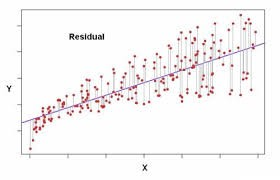

$$ \sum_{i=1}^{n}{residual}^2 = \sum_{i=1}^{n}(y_{i} - f(x_{i}, \beta))^{2} $$

$f(x)$ 는 선형인 일차 함수이므로 기울기 a와 절편 b를 갖는다. ( $f(x_{i}, \beta) = ax_{i}+ b$ ) Residual 합의 최소가 되는 값은 $a, b$를 편미분하여 도출할 수 있는데, 페르마의 정리에 의해 미분값=0으로 도출되는 값이 임계점이 되기 때문이다.

---

원래 퍼셉트론 알고리즘은 오분류를 최소화하기 위해 발견법적으로 설계된 것이었다. 학습 알고리즘의 정확성 보장에 관련된 수렴 증명들이 제시되었고, 지금도 퍼셉트론 알고리즘의 목표를 feature-class label(특징-분류명) 쌍을 담은 '자료 집합 $\mathcal{D}$의 모든 훈련 견본에 관한 최소제곱 형태'로 표현할 수 있다.

$$ \mathrm{Minimize}\underset{W}{-}L = \sum_{(\bar{X},y)\in\mathcal{D}}{(y-\hat{y})^{2}} = \sum_{(\bar{X},y)\in\mathcal{D}}{(y- sgn{\bar{W} \cdot \bar{X}})^{2}} $$

이런 종류의 최소화 objective function(목적함수)를 **손실함수**라고도 부른다. 거의 모든 신경망 학습 알고리즘은 손실함수를 사용하는 형태로 공식화된다.

최소제곱 회귀는 연속인 output에 쓰이며, 해당 손실함수는 매끄러운 연속 함수이다. 그러나 sign function(부호 함수) 같이 step function 형태의 함수를 적용하는 경우에는 미분 불가능할 뿐만 아니라, 미분이 가능한 점이어도 상수 값을 갖기 때문에 **기울기가 정확히 0**이 된다. 그래서 이런 step function과 같은 형태에서는 경사 하강법(gradient descent)를 적용하기가 곤란하다.

이런 문제점 때문에 퍼셉트론 알고리즘은 (암묵적으로) 각 견본에 대한 기울기를 smoothing하기 위해 다음과 같은 **근사 기울기를 사용**한다.

$$ \nabla{L_{smooth}} = \sum_{(\bar{X},y) \in \mathcal{D}}{(y - \hat{y}) \bar{X}} $$

> 이 근사 기울기는 진짜 기울기가 아닌 것에 주의해야 한다. 

### 가중치 갱신

신경망 훈련 알고리즘은 각 자료 견본 $\bar{X}$ 를 한 번에 하나씩(혹은 batch로 묶어서) 신경망에 공급하고 예측값 $\hat{y}$를 산출한다. 예측값이 도출되면 오차 $E(\bar{X}) = (y - \hat{y})$에 기초하여 가중치를 갱신한다. 

좀 더 구체적으로, 신경망에 공급된 하나의 data point를 $\overline{X}$ 라고 할 때, weight vector $\overline{W}$ 는 다음과 같이 갱신된다.(**갱신 함수** 형식으로 표현했다.)

$$ \overline{W} \Leftarrow \overline{W} + \alpha (y - \hat{y}) \overline{X} $$

매개변수 $\alpha$는 신경망의 learning rate(학습률, 학습 속도)를 제어하는 역할을 한다. 모든 train 견본을 무작위로 훑으면서 가중치를 반복해서 조율하다가, 학습이 수렴에 도달하면 반복이 끝난다.

참고로 전체 과정에서 하나의 train data point를 여러 번 입력할 수 있는데, 각 반복 주기를 **epoch**라고 부른다.

위 식을 오차 $E(\overline{X})$ 를 이용해서 표현할 수 있다.

$$ \overline{W} \Leftarrow \overline{W} + \alpha E(\overline{X}) \overline{X} $$

기본적인 퍼셉트론 알고리즘은 **shochastic gradient-descent**(확률적 경사 하강법)에 해당한다. 무작위로 선택된 train data point에 경사 하강법을 적용해서 예측값의 제곱오차를 암묵적으로 최소화한다.

### linearly separable

퍼셉트론이 제시하는 모형은 **선형 모델**(linear model)에 해당한다. 이런 종류의 모형은 자료가 linearly separable할 때 특히 잘 작동한다.

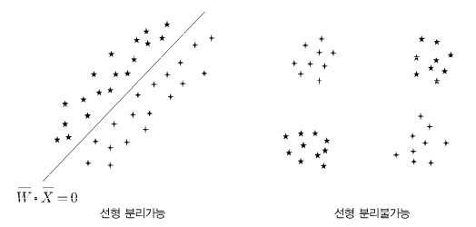

훈련 자료가 linearly seperable한 경우, 퍼셉트론 알고리즘은 항상 훈련 자료에서 오차 0을 제공하는 지점으로 수렴한다. 반면 자료가 linearly separable하지 않은 경우, 퍼셉트론은 수렴을 보장하지 않는다.(다른 알고리즘들에 비해 매우 나쁜 해를 도출할 수 있다.)

---

## 1.2.1.1 퍼셉트론이 최적화하는 목적함수

> 0-1 Loss와 같은 목적함수는 훈련하는 모델이 얼마나 제대로 예측하는지는 알 수 있어도, 가중치를 어느 방향으로 수정해야 하는지는 알기 힘들다.

binary classification 문제에서 오분류 횟수를 다음과 같은 손실함수 형태로 표현할 수 있다. 손실함수는 훈련 자료점 $( \overline{X_i}, y_i )$ 에 대해 0/1 손실함수 형태로 표현된다.

$$ L_{i}^{(0/1)} = {1 \over 2}( y_i - sgn \lbrace \overline{W} \cdot \overline{X_i} \rbrace)^2 = 1 - y_i \cdot sgn\lbrace \overline{W} \cdot \overline{X_i} \rbrace $$

- 제곱식을 전개하면 $y_{i}^2$ 와 $sgn \lbrace \overline{W} \cdot \overline{X_i} \rbrace^2$ 는 모두 1이 된다. 따라서 ${1 \over 2} * (1 + 1) = 1$ 로 정리된다. 
- 결국 손실함수의 값은 나머지 항인 $- y_i \cdot sgn\lbrace \overline{W} \cdot \overline{X_i} \rbrace$ 가 좌우하게 된다.

그런데 이 목적함수는 계단 형태라서 미분 가능한 함수가 아니다. 따라서 smoothed한 목적함수를 따로 정의할 필요가 있는데, 이를 위해서 위 0/1 손실함수에서 sign 함수를 제거하고 음의 값들을 0으로 설정한다.(퍼셉트론 갱신은 본질적으로 $\overline{W} \Leftarrow \overline{W} + \alpha \nabla \mathbf{w} \overline{X}$ 인 점을 생각하자.)

$$ L_{i} = max \lbrace -y_{i}(\overline{W} \cdot \overline{X_i}, 0) \rbrace $$

이렇게 미분 불가능 함수의 기울기 계산을 가능하게 수정한 손실함수를 **smoothed surrogate loss function**(평활화된 대리 손실함수)라고 부르기도 한다. <U>출력이 이산값</U>인 연속 최적화 기반 학습 방법들(신경망 등)은 거의 이런 smoothed surrogate loss function을 사용한다.

> 그런데 이 퍼셉트론 목적함수에서는, **train data set과 무관하게** $\overline{W}$ 를 영벡터로 두어도 최적의 손실값 0을 도출한다. linear seperable한 자료라면 이런 인위적인 설정으로도 여전히 명확한 seperator로 작동한다. 하지만 그렇지 않다면, 제대로 분리하지 못하게 된다.

> 이런 점을 개선하기 위해 다양한 방식이 제안되었다. 한 가지 예로 오분류 횟수 면에서 지금까지 최상의 해를 기억해 두는 방식이 있다. 이 접근 방식을 **pocket algorithm**(주머니 알고리즘)이라고 하는데, 최상의 해를 '주머니'에 넣어 두는 것 같아서 붙은 이름이다.

> 또 다른 예시로, 손실함수에 margin이라는 개념을 도입한 알고리즘이 있다. 사실상 linear SVM 알고리즘과 동일하다. 이 때문에 linear SVM을 **최적 안정성 퍼셉트론**(perceptron of optimal stability)라고 부르기도 한다.

---

## 1.2.1.2 목적함수와 SVM의 관계

목적함수는 SVM에 쓰이는 **경첩 손실**(hinge-loss) 함수를 shift한 버전에 해당한다.(hinge-loss는 0/1 Loss와 비슷하다.)

$$ L_{i}^{svm} = max\lbrace 1 - y_{i}( \overline{W} \cdot \overline{X_i}), 0 \rbrace $$

앞서 언급한 smoothed surrogate loss function과 달리, hinge-loss는 max 함수 안에 상수항 1을 유지하고 있다. 이러한 차이는 기울기 수식 표현에 영향을 미치지는 않지만, '손실이 없어서 가중치 갱신을 유발하지 않는 data point'들의 기준에는 영향을 미친다.

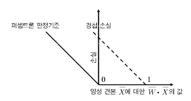

weight의 변화를 다음과 같이 갱신 함수로 표현하면 유사성을 더 확연하게 알 수 있다.

$$ \overline{W} \Leftarrow \overline{W} + \alpha \sum_{(\overline{X}, y) \in S^{+}}{y \overline{X}} $$

- 여기서 $S^{+}$ 는 $y(\overline{W} \cdot \overline{X}) < 0$ 를 만족하는 오분류된 train point $\overline{X} \in S$ 의 집합이다.

퍼셉트론은 갱신을 위해 오차 $E(\overline{X})$ 를 사용하지만, 이 갱신은 y를 사용한다.( $y \in \lbrace -1, +1 \rbrace$ ) 하지만 사실상 둘은 같은 것이다. 

그 이유는 퍼셉트론도 오분류 data point에서는 오차값 $E(\overline{X}) = (y - sgn\lbrace \overline{W} \cdot \overline{X} \rbrace) \in \lbrace -2, +2 \rbrace$ 역시 결코 0이 되지 않기 때문이다. 즉, 항상 오분류 data point에서는 $E(\overline{X}) = 2y$ 가 성립한다. 사실상 계수 2를 learning rate에 포함시키고 $E(\overline{X})$ 를 $y$ 로 대체한다면, SVM과 동일한 갱신 공식이 된다.

### 둘의 차이

1. 퍼셉트론 목적함수는 '오분류된 data point'만 weight의 갱신이 적용되지만, <U>SVM은 결정 결계 근처의 정확한 점들도 갱신에 쓰인다</U>.

2. SVM은 $y(\overline{W} \cdot \overline{X}) < 1$ 이라는 조건을 이용해서 $S^+$ 를 정의했다. ( $y(\overline{W} \cdot \overline{X}) < 0$ 이 아니다.)

> 결국 퍼셉트론은 SVM으로 잘 알려진 기계 학습 알고리즘과 근본적으로 그리 다르지 않다.(기원만 조금 다를 뿐)

---

## 1.2.1.3 활성화 함수와 손실함수의 선택

> 활성화 함수의 선택은 신경망 설계에서 핵심 부분이다.

앞선 예시들은 퍼셉트론으로 binary class label을 예측하는 경우였다. 따라서 sign function을 activation function으로 사용했지만, 다른 종류의 target을 예측해야 한다면 상황이 다르다.

- 예를 들어 <U>target이 연속적인 실수</U>라면 identity function(항등함수)을 activation function으로 사용하는 것이 합당하다. 이 경우 최소제곱 회귀와 학습 알고리즘이 같아진다.

- 다른 예시로, 만일 어떤 binary-classification, 즉 <U>binary class의 **확률**을 예측</U>(T/F, 1/0 일 확률 등)해야 한다면, sigmoid로 출력 노드를 활성화하는 것이 합당하다. 이 경우 예측값 $\hat{y}$ 는 종속변수의 관측값 y가 1일 확률을 나타낸다. 

  - 그리고 손실함수로는, y가 가질 수 있는 값이 $\lbrace -1, 1 \rbrace$ 이라는 가정 하에, $| { y / 2 - 0.5 + \hat{y} } |$ 의 음의 로그를 사용한다.

> sigmoid function은 확률의 총 합 = 1이 된다. 즉, 출력값이 실제 확률을 나타낸다.

단층 퍼셉트론을 벗어나서 다층 구조로 넘어가면 비선형 활성화 함수가 아주 중요해진다. **sign**, **sigmoid**, **tanh**(hyperbolic tangent, 쌍곡탄젠트) function과 같은 여러 함수를 신경망의 여러 층에 사용할 수 있다.

앞으로 activation function을 다음과 같이 $\phi^{피}$ 로 표기할 것이다.<br/>

$$ \hat{y} = \phi ( \overline{W} \cdot \overline{X} ) $$

이 활성화 함수는 하나의 뉴런이 노드 안에서 계산하는 두 개의 함수 중 하나이다. 

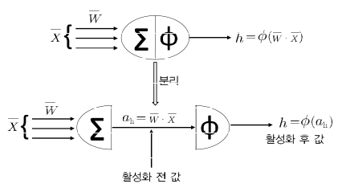

그림을 보면 하나의 뉴런 안에서 두 번의 함수 계산이 이루어 진다. 활성화 함수 $\phi( \cdot )$ 를 계산하기 전의 값을 **pre-activation value**(활성화 전 값)이라고 부르고, 적용 뒤의 값을 **post-activation value**(활성화 후 값)이라고 부른다.

> 한 뉴런의 출력은 항상 post-activation value이지만, pre-activation value도 다양한 분석에서 쓰인다. 이를테면, backpropagation algorithm(역전파 알고리즘)은 pre-actication value를 이용한다.

### 활성화 함수의 종류

- 가장 기본적인 activation function $\phi( \cdot )$ 는 비선형성을 전혀 제공하지 않는 linear activation function, 즉 **identity function**과 동일하다.

$$ \phi(v) = v $$

<U>target이 실수</U>일 때는 이런 linear activation function이 출력 노드에 주로 쓰인다. <U>output이 이산값이라고 해도, smoothed surrogate loss function을 설정해야 하는 경우</U>면 linear activation function이 쓰인다.

다른 고전적인 activation function으로는 다음과 같은 것들이 있다.

- **sign function**

$$ \phi(v) = sgn(v) $$

결과를 예측하는 시점에서 <U>binary output을 산출하기 위해</U> sign function을 쓸 수 있지만, 훈련 시점에서는 미분이 불가능하므로 loss function으로 사용할 수 없다.

- **sigmoid function**

$$ \phi(v) = { 1 \over { 1 +e^{-v} }} $$

(0,1) 범위의 실숫값을 출력하는 sigmoid function은 <U>결과를 확률로 해석해야 할 때</U> 좋다. 더 나아가서 <U>확률적 출력은 생성하거나, maximum-likelihood(최대가능도) 모형에 기초해서 loss function을 만들 때</U>도 도움이 된다.

- **tanh function**

$$ \phi(v) = { {e^{2v} - 1} \over {e^{2v} + 1} } $$

tanh function은 sigmoid와 비슷하나, 치역이 [-1, 1]이 되도록 수평 $\cdot$ 수직으로 비례 $\cdot$ 이동된 것이다. 둘의 관계는 다음과 같다.

$$ tanh(v) = 2 \cdot sigmoid(2v) - 1 $$

<U>계산의 결과가 음수일 수도 있는 경우</U>에는 tanh function이 sigmoid보다 좋다. 더 나아가서 <U>tanh는 중심이 평균이고, sigmoid보다 기울기가 커서 훈련에 더 적합</U>하다. 

예전부터 sigmoid와 tanh function은 신경망에 비선형성을 도입하는 주된 수단으로 쓰였다. 그러나 최근에는 몇 가지 piecewise(조각별) linear activation function이 인기를 끌고 있다.

- ReLU(Retified Linear Unit, 정류(개선) 선형 단위)

$$ \phi(v) = max \lbrace v, 0\rbrace $$

- hardtanh(엄격한 쌍곡탄젠트)

$$ \phi(v) = max\lbrace min[v,1], -1 \rbrace $$

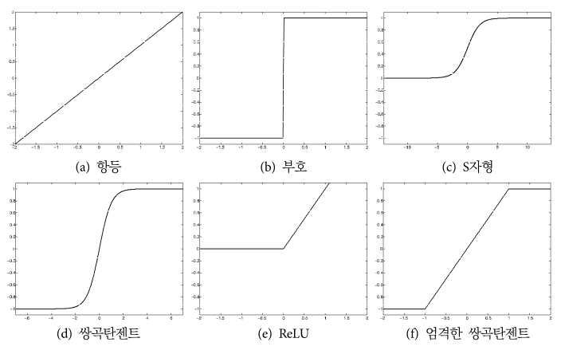

> 이 activation function들이 모두 monotonic function임을 주목하자.(단조 함수, 여기서는 오른쪽으로 줄곧 상승하는 monotonically increasing function들이다.)

> 또한 identity function을 제외한 activation function은 인수의 절댓값이 클 때 활성화 값이 거의 변하지 않는다. 이를 **saturation**(포화)이라고 한다.

이 함수들 중 다수를 squashing(압착) 함수라고 부르는데, 이는 이 함수들이 임의의 범위의 값들을 한정된 범위의 치역으로 mapping하기 때문이다.

---

## 1.2.1.4 출력 노드의 수와 종류 선택

출력 노드의 종류와 수 역시 activation function과 밀접한 연관이 있다. 일단 activation function 자체는 주어진 과제의 성격에 따라 정했다.

예를 들어 <U>k중 classification(분류) 과제</U>('k' 개의 다른 이벤트에 대해 이벤트의 확률 분포를 계산)라면 주어진 한 층에서 $\bar{v} = [v_1, ..., v_k]$ 를 출력하는 softmax activation function을 이용해서 k개의 값을 출력할 수 있다.

좀 더 구체적으로 말하자면, i번째 output의 activation function은 다음과 같이 정의된다.

$$ \phi{(\bar{v})}_i = {{exp(v_i)} \over {\sum_{j=1}^{k}{exp(v_j)}}}, \forall i \in \lbrace 1, ..., k \rbrace $$

- $v_1, ... v_k$ : 각 노드로 들어온 입력

이 식의 값이 k 개의 노드가 출력한 값이 된다. 아래는 출력이 세 개인 softmax function의 예시다.

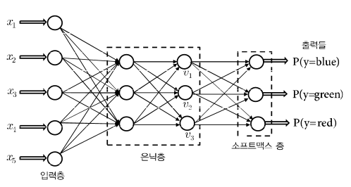

- 마지막 hidden layer가 출력한 세 개의 값( $v_1, v_2, v_3$ )을 입력으로 받아, softmax function이 확률값으로 변환한다.

다중 신경망의 마지막 hidden layer는 주로 linear(identity) activation function을 사용하며, 그 hidden layer의 출력이 softmax layer의 입력이 된다.

> 지금의 softmax layer에서 weight와 관련된 연산이 없는 것에 주목하자. 단순히 실숫값 출력을 확률값으로 변환할 뿐이다.

> sigmoid와 달리 출력으로 나온 확률값의 총 합은 1이 아니며, 큰 값이 class에 해당할 가능성이 높은 것은 맞지만 실제 확률값을 나타내는 것은 아니다.

이렇게 linear activation function을 사용하는 hidden layer 하나에 softmax layer를 연결한 신경망은, 정확히 '**multinomial logistic regression**'(다중 로지스틱 회귀) 모형을 구현한다.

---

## 1.2.1.5 손실함수의 선택

과제에 적합한 모형을 만들어 내기 위해서는 loss function를 제대로 선택하는 것이 중요하다. 

- 예를 들어 binary value가 아닌 수치를 출력하는 최소제곱 회귀를 위해서는 $(y - \hat{y})^2$ 형태의 단순한 제곱 손실함수가 필요하다. $y$ (target, 목푯값) $\hat{y}$ (prediction, 예측값) 둘은 하나의 train set을 구성한다.

- target이 $y \in \lbrace -1, +1 \rbrace$ 이고, 예측값 $\hat{y}$ 이 실수인 경우, hinge-loss function과 같은 다른 종류의 손실 함수를 사용할 수도 있다.(이 경우 activation function은 identity function이다.) 이 경우 학습 모델을 SVM이라 부른다.

softmax는 다중 예측에서 특히 유용했다. 그런데 softmax는 **output이 확률값**이므로 위의 제곱 손실함수나, hinge-loss function는 쓸 수 없다. 대신 <U>확률 예측에서는 target이 이진이냐 범주냐에 따라</U> 두 종류의 loss function을 쓸 수 있다.

1. **logistic regression**(이진 목표값)

<U>target이 두 가지 값(yes/no 등) 중 하나인 경우</U> 사용한다. 이 경우 y는 $\lbrace -1, +1 \rbrace$ 중 하나이고, 예측값 $\hat{y}$ 는 임의의 수치이다.

activation function은 identity function이라 가정한다. 실수 예측값이 $\hat{y}$ 인 하나의 train 견본에 대해 loss function은 다음과 같이 정의된다.

$$ L = log(1+exp(-y \cdot \hat{y})) $$

- 1.1 sigmoid를 activation function으로 사용

sigmoid를 activation function으로 사용해서 예측값 $\hat{y} \in (0, 1)$ 을 출력할 수도 있는데, 이 경우 $\hat{y}$ 은 y가 1일 확률을 뜻한다.

y가 가질 수 있는 값을 $\lbrace -1, 1 \rbrace$ 로 가정할 때 손실함수는 $| y/2 - 0.5 + \hat{y} |$ 의 음의 log likelihood이다.(가능도 함수의 로그) 이는 $| y/2 - 0.5 + \hat{y} |$ 가 '예측이 정확할 확률'을 나타내기 때문이다.

위 두 예는 activation function과 loss function의 다른 조합으로도 동일한 결과를 낼 수 있음을 보여준다.

2. **범주 목표값**

<U>여러 가지 **category**(범주)나 **class**(부류) 중 하나를 예측</U>하는 경우다. k 개 class의 확률들(softmax activation function을 적용한) 각각을 $\hat{y}_1, ..., \hat{y}_k$ 이라 하고, r 번째 class가 ground-truth(실측 자료, 모델이 예측해 주길 바라는 값)에 해당하는 class라고 할 때, 하나의 견본에 대한 loss function은 다음과 같이 정의된다.

$$ L = - log(\hat{y}_r) $$

**cross-entropy**(교차 엔트로피) loss function으로 불리는 이런 종류의 loss function은 multinominal logistic regression(다중 로지스틱 회귀)를 구현한다.(k가 2인 경우 binary logistic regression과 동일하다.)

<br/>

> TIP: 아래는 흔히 사용하는 조합이다. 일반적으로 cross-entropy loss가 square error보다 최적화가 쉽다.

- output이 이산값이면 주로 다음과 같이 사용한다

  - activation function: softmax
  
  - loss function: cross-entropy

- output이 실숫값이면 주로 다음과 같이 사용한다.

  - activation function: linear

  - loss function: square error

---

## 1.2.1.6 유용한 activation function 미분

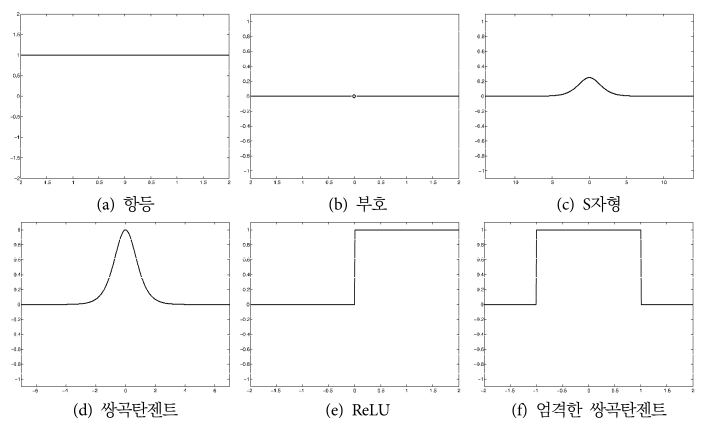

대체로 신경망은 gradient descent에 의존한다. 즉, activation function의 미분이 거듭 등장한다. 

1. linear activation function, sign activation function

- linear activation function의 미분은 모든 점에서 1이다.

- sign activation function $sgn(v)$ 의 미분은 $v=0$ 이외의 모든 v 값에서 0이다.( $v = 0$ 인 경우 연속이 아니며 미분 불가능하다.)

2. sigmoid

sigmoid의 미분은 input보다도 output 관점에서 표현할 때 특히 간단하다. 우선 sigmoid는 다음과 같다.

$$ o = { 1 \over {1+exp(-v)}} $$

- v: 인수

- o: 출력

그렇다면 함수의 미분은 다음과 같이 표현할 수 있다.

$$ { {\partial o} \over {\partial v}  } = { exp(-v) \over {(1+exp(-v))^2}} $$

여기서 핵심은 다음과 같이 더 편하게 표현할 수 있다는 점이다.

$$ { {\partial o} \over {\partial v}  } = o(1-o) $$

sigmoid의 미분은 이렇게 입력이 아니라 주로 출력으로 표현한 함수로 쓰일 때가 많다.

3. tanh

tanh의 미분도 sigmoid와 마찬가지로 출력 o의 함수로 쓰일 때가 많다. 우선 tanh는 다음과 같다.

$$ o = { {exp(2v) - 1} \over {exp(2v)+1} } $$

함수의 미분은 다음과 같이 계산된다.

$$ { {\partial o} \over {\partial v}  } = { 4 \cdot {exp(2v)} \over {(exp(2v)+1)}^2 } $$

그러나 출력 o를 기준으로 표현하면 훨씬 더 간단하다.

$$ { {\partial o} \over {\partial v} } = 1 - o^2 $$

4. ReLU와 hardtanh

- ReLU의 편미분은 인수가 음이 아닐 때는 1이고, 음일 때는 0이다.

- hardtanh의 편미분은 인수가 $[-1, +1]$ 일 때는 1이고, 그 외에는 0이다.

---

## 1.2.2 다층 신경망

계산층이 둘 이상인 신경망을 다층(multilayer) 신경망, 줄여서 다층망이라 부른다. 

- 중산 계산층을 **hidden layer**(은닉층)이라고 부르는데, 계산층의 계산을 사용자가 볼 수 없기 때문에(즉, 숨겨져 있기 때문에) 이런 이름이 붙었다.

모든 계산층이 입력에서 출력으로 순방향으로만 전달하는 구조를 **feed-forward network**(순방향 신경망)이라고 부른다. 이 경우 layer 개수와 각 layer의 노드 종류 및 수만 결정하면 신경망 전체 구조를 정의할 수 있다. 나머지는 출력층에서 최적화할 손실함수만 정의하면 된다.

다층 신경망도 bias neuron을 쓸 수 있다. 아래가 사용한 다층망과 그렇지 않은 예를 나타낸 그림이다. 둘 다 총 세 개의 층으로 구성되어 있다.

> 입력층은 어떤 계산도 수행하지 않으므로 층 수에 포함하지 않을 때가 많음에 다시 한번 유의하자.

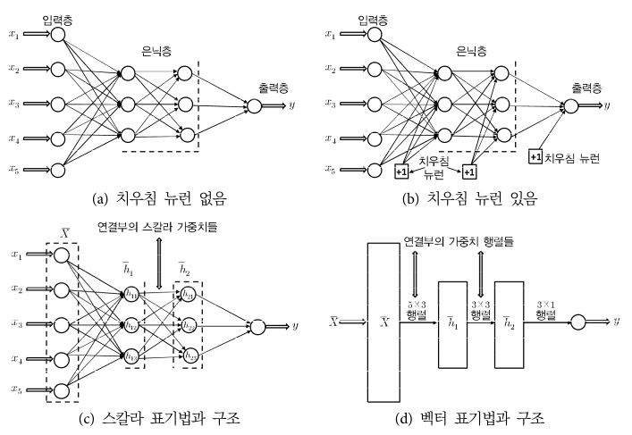

> 신경망의 층 개수를 k라고 하고, 한 층을 구성하는 계산 unit들을 $p_1 ... p_k$ 라고 할 때, 신경망의 출력을 흔히 k개의 열벡터 $\bar{h}_1 ... \bar{h}_k$ 로 표기한다.

### 행렬의 크기

- 입력층과 첫 은닉층 사이의 연결에 해당하는 가중치는 $d \times p_1$ 크기의 행렬 $W_1$ 에 들어 있다.

- r번째 은닉층과 (r+1)번째 은닉층 사이 가충치는 $p_r \times p_{r+1}$ 크기의 행렬 $W_r$ 에 들어 있다.

- 출력층 노드 개수가 o개라고 하면, 마지막 행렬 $W_{k+1}$ 의 크기는 $p_k \times o$ 이다.

d 차원 입력 벡터 $\bar{x}$ 는 다음과 같은 재귀식(점화식)을 통해 출력들로 변환된다. 

1. 입력에서 은닉층으로

$$ {\bar{h}_1} = \phi (W_{1}^{T}\bar{x}) $$

2. 은닉층에서 은닉층으로

$$ {\bar{h}_{p+1}} = \phi (W_{p+1}^{T}\bar{h}_p) \quad \forall p \in \lbrace1 ... k-1 \rbrace $$

3. 은닉층에서 출력층으로

$$ {\bar{o}} = \phi (W_{k+1}^{T}\bar{h}_k) $$

이 과정에서 sigmoid와 같은 activation function은 주어진 벡터 인수에 **성분별로**(elementwise) 적용된다. 

하지만 softmax처럼 원래부터 벡터 형식의 인수를 처리하도록 만들어진 activation function도 있다. 비록 신경망의 각 unit이 하나의 변수를 담지만, 도식화를 할 때는 흔히 한 layer의 계산 unit들을 하나의 벡터로 묶어서 표현한다.(그런 경우 unit을 원이 아니라 사각형으로 표시한다. 그림의 (d)를 참고하면 된다.) 

> 이런 재귀식과 벡터 구조는 오직 (전형적인) feed-forward network에만 유효하단 점에 유의해라. 이외에도 중간층에서 자료가 직접 input되거나, 인접하지 않은 층끼리의 연결이 있는 등 다른 구조의 설계도 얼마든지 가능하다.

### 다양한 변형 사례

그림으로 본 예시는 아주 전형적인 구조이며, 실제로는 다양한 방식으로 변형할 수 있다. 보통 과제의 성격에 맞춰서(classification, dimention reduction 등) 설계하게 된다. 이를테면 출력 노드를 여러 개 둘 수 있다. 

차원 축소의 전형적인 예로 autoencoder가 있다. input을 어떤 표현으로 바꿔서(encode)해서 output으로 내놓기 때문에 input과 output의 개수가 같다. 

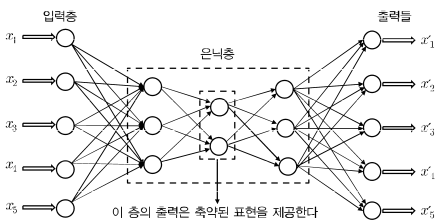

위 그림이 autoencoder의 예시다. 중간의 제한된 hidden layer가 각 사례의 차원을 축소한 표현으로 출력한다. (차원을 축소하므로 손실이 생기고, 그 손실은 자료에 존재하는 noise가 된다.)

이외에도 overfitting을 막기 위해서 다수의 연결을 제거하거나 공유하는 등 완전 연결에서 벗어난 구조가 더 좋은 성과를 내기도 한다. 가중치 제거 및 공유의 전형적인 예로는 **CNN**(Convolution Neural Network, 합성곱 신경망)이 구조가 대표적이다. 

> overfitting이 일어나면 train data에 대해서는 모델이 잘 작동하지만, test data에 대해서는 잘 **Regularization**(일반화)되지 않는다. 

> generalization: 조금 손실이 발생하더라도 새로운 데이터에 대해 올바른 예측을 수행하는 능력. 모델을 단순화시켜 새로운 데이터에 대한 에측성을 높이는 방법을 의미한다.

---

## 1.2.3 계산 그래프로서의 다층망

다층 신경망을 하나의 computational graph(계산 그래프)로 간주하는 것이 도움이 될 때가 많다. 계산 그래프는 다수의 기본 parametric model(매개변수 모형)들이 연결된 그래프다.

> 계산 그래프(computational graph)는 계산 과정을 복수의 노드와 에지를 이용한 그래프로 나타낸 것이다. 계산이 왼쪽에서 오른쪽으로 진행되면 순전파(forward propagation), 오른쪽에서 왼쪽으로 진행되면 역전파(backward propagation)이라고 한다.

---

### <span style='background-color: #393E46; color: #F7F7F7'>&nbsp;&nbsp;&nbsp;🔒 정의: parametric model&nbsp;&nbsp;&nbsp;</span>

parametric model은 내가 <U>데이터가 특정 분포를 따른다</U>는 가정 하에 적용하는 모델이다. 예를 들면 선형 회귀가 대표적이다.  

따라서 parametric model은 학습을 위해 내가 어떤 패러미터를 결정해야 하는지 명확하게 알 수 있다.(데이터가 얼마나 많든 내가 결정해야 할 패러미터의 개수는 변하지 않는다.)

그러나 non-parametric model은 <U>데이터가 어떤 분포를 따르는지 알 수 없기 때문에</U>, 사실상 **데이터가 model의 모양을 결정**하는 방식이다. 대표적으로 decision tree나 k-means clustering이 있다.

non-parametric은 대체로 더 flexible한 모델이 만들어지지만, 모델이 왜 그런 형태로 생성되었는지 명확한 설명이 도출되기 어렵다.

---

원래 다층망은 합성(composition) 함수를 평가한다. 아래 예시를 보자.

- layer m에서 계산하는 함수가 $g_1(\cdot), g_2(\cdot), ... g_k( \cdot )$ 라고 하자.

- layer m+1에서는 이 layer m에서 계산한 결과를 input으로 받는다. 

- layer m+1에 있는 한 node가 계산하는 함수가 $f(\cdot)$ 라고 하면, 그 node는 $f(g_1(\cdot), ..., g_k(\cdot))$ 라는 합성 함수를 계산하는 셈이다.

### 비선형 activation function의 사용

만약 모든 layer에서 identity function을 사용한다면, 다층망은 그냥 하나의 선형회귀를 수행할 뿐이다.

반면 비선형 unit(sigmoid 등 squashing function)으로 이루어진 hidden layer 하나와 linear output layer 하나로 구성된 다층망은 대부분의 합당한 함수를 계산할 수 있다. 그래서 종종 신경망을 **universal function approximator**(보편적 함수 근사기)라고 부른다.

> sigmoid, tanh와 같은 activation function은 함수의 출력이 $[-1, 1]$ 범위로 squash(압착)된다. 따라서 squashing function(압착 함수)라고 부른다.

> 그러나 신경망을 universal function approximator로 사용하려면, 한 layer의 hidden unit이 상당히 많아야 한다.(따라서 학습할 매개변수도 늘어난다. 매우 긴 weight 행렬을 생각해 보자.) 하지만 현실에서는 더 layer가 깊은 신경망이 선호되므로, 한 layer의 hidden unit 자체의 수는 줄어서 전체 매개변수 개수가 줄어 버린다.

---

## 1.3 backpropagation를 이용한 신경망 훈련

다층 신경망에서는 loss function이 이전 layer들의 weight에 대한 복잡한 합성 함수로 구성되기 때문에 훈련이 어렵다. 다층망 훈련에서는 이 합성 함수의 기울기를 **backpropagation algorithm**(역전파 알고리즘)을 이용해 계산한다.

역전파 알고리즘은 **dynamic programming**(동적 계획법)을 이용해서 합을 효율적으로 계산한다. dynamic programming이란 '하나의 큰 문제를 여러 작은 문제로 나눠서 푼 결과를 저장해 둔 뒤, 다시 어떤 문제를 해결할 때 재사용'하는 것을 의미한다. 

> dynamic programming을 쉽게 말하면 앞서 구한 답을 다른 문제에서 다시 사용해서 해결하는 방식을 의미한다.

> 특정 weight로 loss function을 미분해서, loss function이 최솟값을 갖는 weight로 업데이트할 것이다. 따라서 각 weight로 loss function을 편미분한 값을 구할 수 있어야 전체적인 보정이 가능할 것이다.

backpropagation은 두 phase로 구성되는데, 하나는 **forward**(순방향), 다른 하나는 **backward**(역방향)이다.

1. forward phase 

- 훈련 견본의 input 성분들이 들어 온다.

- 알고리즘이 현재의 weight set을 이용해서 출력층 방향(순방향)으로 계산을 진행한다.

- 출력층에 도달하면 최종 output(예측값)을 label과 비교하고, loss function의 미분을 출력에 대해 계산한다.

2. backward phase

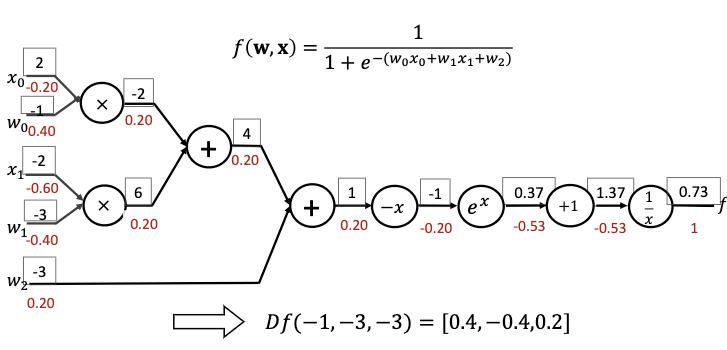

> backward phase의 주된 목표는 서로 다른 weight에 대한 loss function의 기울기를 미분의 chain rule을 이용해서 학습하는 것이다. 이런 기울기들이 weight들의 갱신에 쓰인다. 

$$ { {\partial L} \over {\partial w_{(h_{r-1},h_r)}}} = {{\partial L} \over {\partial o}} \cdot \left[ {{\partial o} \over {\partial h_k}} \prod_{i=r}^{k-1} {{\partial h_{i+1}} \over {\partial h_i}} \right] {{\partial h_r} \over {\partial w_{(h_{r-1},h_r)}}} \quad \forall r \in 1, ..., k $$

- $h_1, h_2, ... ,h_k$ : 신경망을 구성하는 일련의 hidden unit들

- $o$ : output unit

- $L$ : loss function

- $w_{(h_r, h_{r+1})}$ : hidden unit $h_r$ 에서 $h_{r+1}$ 로의 연결에 대한 weight

- 이 edge weight 중 임의의 weight에 대한 손실함수의 기울기를 chain rule을 이용해서 유도한 공식이 위 공식이다.

### 여러 경로로 구성된 그래프의 backpropagation

그러나 이 수식은 신경망에서 $h_1$ 에서 $o$ 로의 경로가 단 하나라고 가정한 것이다. 실제로는 경로가 여러 개일 수 있는 computational graph일 경우 다변수 함수의 chain rule, 줄여서 **multivariable chain rule**(다변수 연쇄법칙)이라고 부르는 방법을 이용한다. 이 경우 $h_1$ 에서 $o$ 로의 경로들의 집합을 $\mathcal{P}$ 라고 두고 일반화한다.

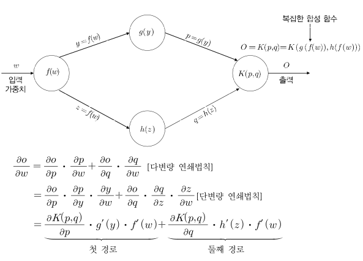

$$ { {\partial L} \over {\partial w_{(h_{r-1},h_r)}}} = {{\partial L} \over {\partial o}} \cdot \left[ {\sum_{[h_r, h_{r+1}, ..., h_k, o] \in \mathcal{P}}} {{\partial o} \over {\partial h_k}} \prod_{i=r}^{k-1} {{\partial h_{i+1}} \over {\partial h_i}} \right] {{\partial h_r} \over {\partial w_{(h_{r-1},h_r)}}} $$

위 식에서 우변의 ${ {\partial h_r} \over {\partial w_{(h_{r-1},h_r)}} }$ 부분을 제외한 경로 합산 부분은 $\Delta (h_r, o) = {{\partial L} \over {\partial h_r}}$ 을 계산한다. 


경로 합산 부분으로 지칭한 부분은 굉장히 많은 합산이 필요해서 감당하기 어려워 보이지만, 재귀적인 식으로 나타내서 보면 쉽게 정리할 수 있다.

---
### <span style='background-color: #393E46; color: #F7F7F7'>&nbsp;&nbsp;&nbsp;📖 수식 정리: 여러 경로로 구성된 backpropagation&nbsp;&nbsp;&nbsp;</span>

0. 구해야 할 값

정리하기 전에 먼저 무엇을 chain rule을 이용해 구하려고 했는지 상기하고 가자. 우리는 어떤 hidden unit $h_r$ 에서 $h_{r+1}$ 로의 연결(edge)에서 계산되는 weight가 $w_{(h_r, h_{r+1})}$ 이고, 이 weight는 다음과 같았다.

$$ { {\partial L} \over {\partial w_{(h_{r-1},h_r)}}} $$

<br/>

1. 출력 노드의 값

차근차근 chain rule을 계산해 보자. 우선 각 출력 노드 $\Delta(o,o)$ 의 값은 다음과 같이 초기화된다.

$$ \Delta (o, o) = {{\partial L} \over {\partial o}} $$

<br/>

2. 특정 node에서의 output 값 $h_r$ 의 $o$ 에 대한 편미분 값(재귀)

$\Delta (h_r, o)$ 를 multivariable chain rule으로 유도한 수식을 재귀식으로 작성할 수 있다.

$$ \Delta (h_r, o) = {{\partial L } \over {\partial h_r}} = \sum_{h:h_r \Rightarrow h} {{\partial L} \over {\partial h}}{{\partial h} \over {\partial h_r}} = \sum_{h:h_r \Rightarrow h} {{\partial h} \over {\partial h_r}} \Delta (h, o) $$

그런데 dynamic programming인 backpropagation에서 $\Delta (h_r, o)$ 를 평가하는 시점이라면, 이미 $\Delta (h, o)$ 는 계산된 상태이다. 따라서 ${{\partial h} \over {\partial h_r}}$ 를 평가해야 한다.

<br/>

3. ${{\partial h} \over {\partial h_r}}$ 의 값을 계산

우선 $h_r$ 과 $h$ 를 연결하는 edge의 weight는 $w_{(h_r, h)}$ 이다. 여기서 hidden unit $h$ 에서 activation function을 적용하기 전에 계산된 활성화 전 값을 $a_h$ 라고 하자. 즉, $a_h$ 는 $h$ 보다 이전 layer의 unit에서 온 input들의 선형 결합이므로, $h = \phi(a_h)$ 이다. 그러면 다음과 같이 공식을 유도할 수 있다.

$$ {{\partial h} \over {\partial h_r}} = {{\partial h} \over {\partial a_h}} \cdot {{\partial a_h} \over {\partial h_r}} = {{\partial \phi(a_h)} \over {\partial a_h}} \cdot w_{(h_r, h)} = \phi ' (a_h) \cdot w_{(h_r, h)} $$

<br/>

4. $\Delta (h_r, o)$ 를 재귀식으로 작성

위 유도과정에 따라 $\Delta (h_r, o)$ 를 재귀식으로 작성하면 다음과 같다.

$$ \Delta (h_r, o) = \sum_{h:h_r \Rightarrow h} \phi ' (a_h) \cdot w_{(h_r, h)} \cdot \Delta (h, o) $$

모든 edge weight에 대한 기울기를 구하기 위해서는 이 수식을 node로 들어오는 edge마다 수행해야 한다.

<br/>

5. ${{\partial h_r} \over {\partial w_{(h_{r-1},h_r)}}}$ 계산

마지막으로 ${{\partial h_r} \over {\partial w_{(h_{r-1},h_r)}}}$ 부분은 다음과 같이 간단히 계산할 수 있다.

$$ {{\partial h_r} \over {\partial w_{(h_{r-1},h_r)}}} = h_{r-1} \cdot \phi'(a_{h_r}) $$

<br/>

이상의 과정에서 backpropagation되는 핵심 기울기는 **layer activation**(층 활성화 값)들에 대한 미분이다.

가중치에 대한 loss function의 편미분은 다음 점화식으로 더 흔하게 표현된다.

$$ {{\partial L} \over {\partial w_{(h_{r-1},h_r)}}} = \delta(h_r, o) \cdot h_{r-1} $$

- 여기서 $\delta(h_r, o)$ 는 다음을 의미한다.(위와 비슷한 과정을 통해 재귀식으로 표현했다.)

$$\delta(h_r, o) = {{\partial L} \over {\partial a_h}} = \phi ' (a_h) \sum_{h:h_r \Rightarrow h}{w_{(h_r, h)}} \cdot \delta(h,o)$$

- $\delta(o, o)$ 는 다음과 같이 초기화한다.

$$ \delta(o, o) = {{\partial L} \over {\partial a_o}} = \phi ' (a_o) \cdot {{\partial L} \over {\partial o}} $$

---