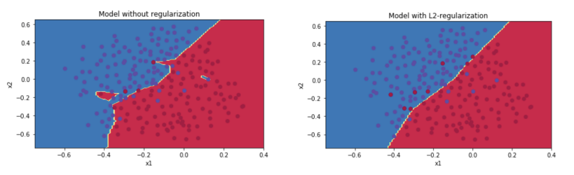
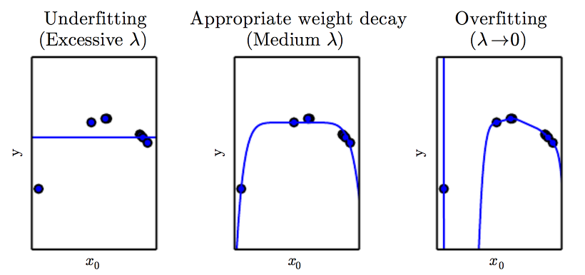
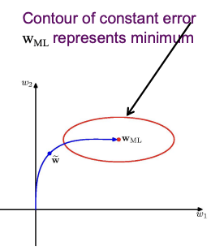
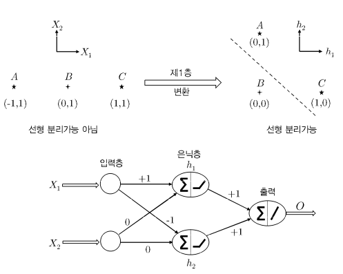
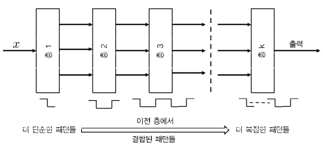
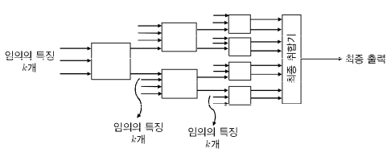

## 1.4 신경망 훈련의 실질적인 문제점들

## 1.4.1 overfitting(과대적합)

신경망 훈련에서 가장 중요한 문제점으로는 overfitting(과대적합)이 꼽힌다. 한 model을 train data set을 이용해서 훈련시킨 뒤, 모형이 label을 완벽하게 예측했다고 해도, 미지의 test data에 대해 좋은 예측 성과를 내리라는 보장이 없다는 것이다.

> train data에 너무 완벽하게 맞춰지면서 training error가 0이 되면, 반대로 실제 데이터에는 제대로 된 예측을 할 수 없을 것이다. 

> 학습에 사용되지 않은 데이터를 활용하여 평가하는 과정을 test를 한다고 하고, 이를 **Generalization**(일반화)라고 표현한다. train data와 test data는 서로 교점이 되는 데이터들이 없기 때문에, test를 Generalization이라고 하고 test error를 generalization error라고 표현하는 것이다.

train data를 늘리면 model의 일반화 성능이 개선되는 반면, model의 복잡도를 늘리면 일반화 성능이 줄어든다. 그렇다고 모형이 너무 단순하면 제대로 feature를 파악하지 못할 위험이 있다.

> 일반적인 법칙으로 전체 훈련점 개수가, 신경망 매개변수 개수의 적어도 2~3배는 되어야 한다.

> 일반적으로, 매개변수가 많은 model을 가리켜 '**capacity**(수용력)이 높다'라고 표현한다. 즉, high capacity model가 잘 일반화되기 위해서는 많은 훈련 자료가 필요하다.

보통 기계학습에서 overfitting을 bias와 variance의 trade-off 관점으로 볼 때가 많다. 모형의 복잡도를 결정할 때는 최적의 지점을 세심하게 선택할 필요가 있다.

> 신경망이 거의 모든 종류의 함수를 흉내낼 수 있을 정도로 강력했지만, 그동안 인기가 없었던 이유가 바로 이런 단점 때문이다. 지금은 가용할 수 있는 data가 많아지면서 기존 기계 학습에 비해 신경망의 장점이 매우 두드러진 것이다.

이제 overfitting의 영향을 완화하는 몇 가지 설계 방법을 소개할 것이다.

---

## 1.4.1.1 regularization(정칙화)

> [Regularization (Weight Decay)](https://deepapple.tistory.com/6)

매개변수가 많을수록 overfitting이 일어나므로, 이를 방지하기 위해 모형에서 (0을 제외한) <U>매개변수의 개수를 줄이는 방향</U>으로 접근할 수 있다.

또한 <U>매개변수의 절댓값의 크기를 줄여도 overfitting이 완화</U>되는 경향이 있는데, 그렇다고 매개변수 값 자체를 직접적으로 제한하는 것은 어렵다. 그래서 loss function에 penalty 항 $ \lambda || \overline{W} ||^p $ 를 도입하는 좀 더 온건한 접근 방식이 쓰인다. 

> 데이터가 단순하고 모델이 복잡하면, training을 하면서 작은 값이었던 weight들의 값이 점점 증가한다. weight가 커질수록 train data가 모델에 주는 영향력이 커지고, 결국 모델이 train data에 딱 맞춰지게 된다. 이것을 local noise의 영향을 크게 받아서, outlier들에 모델이 맞춰지는 현상이라고 표현한다.

이때 $p$ 는 흔히 2로 설정하는데, 이는 **L2 regularization**(Tikhonov regularization, 티호노프 정칙화)에 해당한다. L2 regularization에서는 각 매개변수(에 정칙화 매개변수 $\lambda >0 $ 을 곱한 값)을 제곱한 결과를 loss function에 더해준다.

---

### &nbsp;&nbsp;&nbsp;🔒 정의: L1, L2 Norm/Regularization&nbsp;&nbsp;&nbsp;

> [L1 Regularization, L2 Regularization](https://light-tree.tistory.com/125)

1. **Norm**

**Norm**은 벡터의 크기(혹은 길이)를 측정하는 방법(혹은 함수)를 뜻한다. 

$$ ||x||_{p} := \left( \sum_{i=1}^{n}{|x_i|}^p \right)^{1/p} $$

- L1 Norm

$$ d_{1}(p,q) = {||p-q||}_{1} = \sum_{i=1}^{n}{|p_i - q_i|} $$

- $ p = (p_1, p_2, ..., p_n), \quad q = (q_1, q_2, ..., q_n) $

쉽게 말하면 두 벡터 $ p, q $ 의 각 원소들 간 차이의 절댓값들을 구한 뒤 모두 더한 값이다. 

- L2 Norm

$$ {||x||}_2 := \sqrt{{x_{1}}^{2} + ... + {x_{n}}^2} $$

- $ p = (p_1, p_2, ..., p_n), \quad q = (0, 0, ..., 0) $

- 공식을 간편하게 작성하기 위해 q를 원점으로 뒀을 뿐, 실제로 값이 있다면 차이를 대입하면 된다.

 

2. **Regularization**

- L1 Regularization

기존의 cost function(loss function의 평균)에 $ \lambda |w| $ 를 더한 값을 cost function으로 쓰게 된다.

예를 들어 다음과 같은 수식이 있다고 가정하자.

$$ H(X) = w_1x_1 + w_2x_2 + w_3x_3 + w_4x_4 $$

여기에 L1 Regularization을 적용했을 때 $ w_3 $ 의 값이 0이 되었다면, 이 말은 $ x_3 $ 의 feature이 사실 model의 결과에 별 영향을 주지 못한다는 의미이다.

> 대부분의 구현에서 L2 Regularization을 선호하지만, L1 Regularization도 나름의 용도가 있다. input에서 나가는 edge의 $ w_i $ 의 값이 0이면 해당 input은 최종 output에 아무런 영향을 미치지 않게 된다. 즉, 그런 input이 생략되면서(dropped) 일종의 feature 선택기로 작용한다. 따라서 L1 Regularization을 적용하면서 feature의 영향을 파악해 볼 수 있다.

- L2 Regularization

벡터의 크기를 의미하는 Norm을 이용해서, 가중치 벡터 크기만큼의 penalty를 부여하는 개념이 바로 regularization이다.

> 이런 penalty 부여를 갱신 도중 일종의 'weight decay(가중치 감쇠)를 적용'하는 것으로 봐도 무방하다.

weight decay는 기존의 cost function에 항을 추가해서 큰 값을 가지는 weight에 penalty를 부여하는 것이다. 이때 L2 norm 항이 weight 패러미터의 크기를 나타내기 때문에, 현재 weight의 크기에 비례해서 더해주는 값이 커진다.

$$ E(w) = E_0(w) + {1 \over 2}\lambda\sum_{i}{w_{i}^2} $$

- $E_{0}(w)$ : 기존 cost function

> 앞에 1/2가 붙는 것은 미분의 편의성을 위해서이며, 아예 안 쓰거나 1/N으로 표기하는 경우도 많다. 

w를 행렬로 다시 쓰면 다음과 같이 표현할 수 있다.

$$ E(W) = MSE_{train} + {1 \over 2}\lambda W^{\mathsf{T}}W $$

그렇다면 왜 이 값을 더해주는 것이 penalty로 작용할까? 그 이유는 gradient descent를 생각해 보면 알 수 있다.

gradient descent는 error의 최솟값을 찾아가는 과정이다. 그런데 error 값에 일정 비율 '가중치 크기'에 해당하는 값을 더한다면, 가중치의 절대적인 크기가 클수록 error가 커지고 반영은 결과적으로 덜 이루어지게 된다.

---

아래는 정칙화를 적용한 갱신 공식이다.

$$ \overline{W} \Leftarrow \overline{W}(1-a\lambda) + \alpha \sum_{\overline{X} \in S}{E(\overline{X})\overline{X}} $$

- $E(\overline{X})$ : 오차 $ (y - \hat{y})$ (모형마다 고유의 오차함수가 들어간다.)

- $S$ : mini batch(미니배치)

- $ \alpha $ : learning rate를 조정하는 매개변수

- $ \lambda $ : 정칙화의 정도를 조절하는 정칙화 매개변수. 0이면 원래의 loss function이 되고, 0보다 크면 기울기 변화가 너무 커지지 않도록 감쇠한다.(대체로 0.01 ~0.00001)

> 생물학적으로 비유하면 뇌에서 덜 중요한, 즉 noise 패턴이 제거되면서 발생하는 '점진적 망각'이라고 볼 수 있다.

아래 그림은 하이퍼패러미터 $ \lambda $ 값에 따른 multinomial regression 결과이다.

### 정칙화의 결점

[Regularization in Neural Network](https://cedar.buffalo.edu/~srihari/CSE574/Chap5/Chap5.5-Regularization.pdf)

1. **Invariance to Transformation**

하지만 weight decay를 적용하기 전에 몇몇 <U>scaling 과정을 적용했다면</U> 지금의 방법을 적용할 수 없게 된다. 예시로 2 layer로 구성된 다층 퍼셉트론에 linear transform을 적용하면 어떻게 weight decay를 쓸 수 없게 되는지 보자.

2 layer로 구성된 다층 퍼셉트론이 있다면 다음과 같은 형태일 것이다.

- $ {x_1, x_2, ..., x_i} $ : input

- $ {y_1, y_2, ..., y_k} $ : output

- 첫 hidden layer의 j번째 unit의 output $ z_j $ 은 다음과 같다.(activation function까지 적용한다.) ( $ w_{j0}$ 은 bias )

$$ z_j = h \left( \sum_{i}{w_{ji}x_i + w_{j0}} \right) $$

- output unit의 activation은 다음과 같다.

$$ y_k \ \sum_{j}{w_{kj}z_j + w_{k0}} $$

1. input에 linear transform을 적용

그런데 input data에 linear transform을 적용했다면 input은 다음과 같은 형태가 된다.

$$ x_i = \tilde{x}_i = ax_i + b $$

그렇다면 corresponding linear transformation을 weight, bias에 적용해야 기존과 같은 학습이 된다. 바뀐 weight와 bias 표현식은 다음과 같다.

$$ w_{ji} \rightarrow \tilde{w}_{ji} = {1 \over a} w_{ji} \quad and \quad w_{j0} = w_{j0} - {b \over a} \sum_{i}{w_{ji}} $$

2. output에 linear transform을 적용

만약 output data에 linear transform을 적용했다면 output은 다음과 같은 형태가 된다.

$$ y_k = \tilde{y}_{k} = cy_k + d $$

이런 linear transformation이 적용된 output을 출력하기 위해, 이전 layer인 second layer의 weight와 bias는 다음과 같다.

$$ w_{kj} \rightarrow \tilde{w}_{kj} cw_{kj} \quad and \quad w_{k0} = cw_{k0} + d $$

이렇게 바뀐 weight에는 기존 weight decay를 적용할 수 없다. 기존 식을 회상해 보자.

$$ E(w) = E_0(w) + {1 \over 2}\lambda\sum_{i}{w_{i}^2} $$

이 식은 바뀐 weight의 성분들을 반영하지 못한다. 또한 여러 단계에서 scaling을 적용했다면, 바뀐 weight들을 서로 다르게 취급해야 한다.

만약 위 예시에서 input, output 모두 linear transform을 적용했다면 regularization을 다음과 같이 수정하면 사용할 수 있다.

$$ {{\lambda}_1 \over {2}} \sum_{w \in W_1}{w}^2 + {{\lambda}_2 \over {2}} \sum_{w \in W_2}{w}^2 $$

- $ w_1 $ : first layer의 weights

- $ w_2 $ : second layer의 weights

이 경우 rescaled된 weight로 반영할 수 있다.

$$ \lambda_1 \rightarrow a^{1/2}\lambda_1 \quad and \quad \lambda_2 \rightarrow c^{-1/2}\lambda_2 $$

2. **새로운 오분류를 망각**

또한 대체로 weight decay는 <U>단층 퍼셉트론에서만 쓰인다.</U> 그 이유는 새롭게 오분류된 훈련점들이 가중치 벡터에 너무 큰 영향을 미치는 경우, weight decay에 의해 망각이 너무 빨리 일어나는 경향이 있기 때문이다. 게다가 단층 퍼셉트론은 이후 정리할 다른 종류의 regularization 기법이 더 흔히 쓰인다.

---

## 1.4.1.2 신경망 구조와 매개변수 공유

**RNN**(Recurrent Neural Network, 순환 신경망), **CNN**이 대표적이다. 한 문장을 구성하는 일련의 단어들이 서로 연관되어 있을 때가 많고, 이미지의 인접 픽셀들도 마찬가지로 연관되는 경우가 일반적이다. 따라서 이런 통찰을 이용하면 더 적은 수의 매개변수로 신경망 구조를 만들 수 있다.

---

## 1.4.1.3 Ealry Stopping(조기 종료)

특정 조건을 만족하면 gradient descent의 반복을 일찍 끝내는 기법이다. 종료 시점을 결정하는 일반적인 방법은 다음과 같다.

- 우선 train data set의 일부를 따로 빼서 validation data set을 만든다. 
 
- validation data set을 시험 자료로 써서 model의 error를 측정한다.
 
- validation data의 error가 가장 작은 지점에서 training을 끝낸다.

> weight vector는 원점에서 시작해서 $w_{ML}$ 로 나아간다.

Ealry Stopping은 regularization의 대안인데, <U>지속되는 training으로 계속해서 매개변수가 커지는 것을 방지한다</U>는 점에서 하나의 regularization 항으로 작용한다고 할 수 있다.

---

## 1.4.1.4 너비와 깊이의 절충

hidden layer 안에 수많은 hidden unit이 있다면 layer가 두 개인 다층 신경망도 보편적 함수 근사기가 될 수 있다. 하지만 대체로 depth를 늘리면서 hidden unit들을 줄이는 방향으로 설계하는데, 이런 설계는 일종의 regularization에 해당한다. depth를 계속 깊게 만들면서 unit을 줄이다 보면, layer를 늘려서 생긴 매개변수 증가보다도 <U>layer 너비가 줄어들면서 매개변수가 감소한 영향이 더 커지게 된다</U>. 

이 경우 overfitting보다는 낫지만, 또 다른 방향의 문제점을 해결해야 될 수 있다. 신경망의 여러 layer에서 loss function의 미분값 변동이 크면, 적절한 갱신이 이뤄지지 않을 수 있다. 그런 경향은 **gradient vanishing**(기울기 소실)과 **gradient explosion**(기울기 폭발) 현상을 일으킬 수 있다.

> 간단히 vanishing gradient problem(기울기 소실 문제)은 backpropagation이 진행되면서 input 근처 layer의 갱신 크기가 output에 가까운 layer들에 비해 훨씬 작아지는 문제다. 

> 이를 해결하기 위해 기울기가 더 큰 activation function을 사용하고 weight의 크기 자체도 크게 설정할 수 있지만, 정도가 심하면 반대로 기울기가 폭발하는 문제가 발생할 수 있다.

---

## 1.4.1.5 ensemble method(앙상블 방법)

model의 generalization 능력을 키우기 위해 **bagging**(배깅)과 같은 다양한 앙상블 방법이 쓰인다.(이런 방법은 신경망뿐만 아니라 모든 종류의 기계 학습 알고리즘에 적용된다.) 

> Bagging은 Bootstrap Aggregation의 약자다. sample을 여러 번 뽑아(Bootstrap) 각 모델을 학습시켜 결과물을 집계(Aggregation)하는 방법이다.

신경망에 특화된 앙상블 방법도 여럿 있는데, 대표적으로 **dropout**(드롭아웃), **dropconnect**(드롭커넥트)가 있다. 대체로 accuracy를 약 2% 증가시키는 것이 가능하다. 그러나 구체적인 개선 정도는 어떤 자료인가, 어떤 training 방법인가에 달렸다. 예를 들어 hidden layer의 activation에서 normalization(정규화)를 적용했다면 dropout의 효과가 줄어들 수 있다.

---

## 1.4.2 gradient vanishing, explosion problem

layer가 많은 신경망에서는 chain rule을 이용한 backpropagation이 불안전해지는 문제가 생긴다. 특정 신경망에서는 input과 가까운 앞쪽 layer의 갱신량이 무시할 수준으로 작아지거나(소실) 너무 커질(폭발) 수 있다.

예시로 각 layer가 1개의 unit으로 구성된 다층 신경망을 생각해 보자. 이 경우 한 경로마다의 국소 미분은 activation function의 미분에 weight를 곱한 것이고, backpropagation을 적용하면 이 값들은 계속 곱해질 것이다.

근데 경로마다의 각 값이 무작위로 분포되어 있고, 그 기댓값이 1보다 작다면 결국 계속 곱할 때마다 값은 지수적으로 작아질 것이다.(반대로 각 값의 기댓값이 1보다 크면 기울기 폭발이 일어날 가능성이 크다.)

예로 sigmoid activation에서는 <U>미분값이 인수의 모든 값에서 0.25 미만</U>이다. 심지어 <U>saturation 영역에 도달하면 이보다 더 극도로 작은 미분값</U>을 가지게 된다. 이 때문에 기울기 소실 문제가 잘 발생한다.

한편 ReLU activation에서는 <U>인수가 양수이면 미분값이 항상 1</U>이기 때문에, 비교적 기울기 소실 문제가 덜 발생한다.

이 문제를 해결하기 위해 다양한 요령이 있는데, 그 중에서도 특히 **adaptive learning rate**(적응적 학습 속도)나 **conjugate gradient method**(켤레기울기법)이 도움이 될 때가 많다. 더 나아가서 **batch normalization**(배치 정규화) 같은 기법도 일부 도움이 된다.

---

## 1.4.3 수렴의 어려움

신경망이 깊을수록 기울기들이 신경망을 따라 매끄럽게 흐르지 못하게 만드는 저항이 커진다. vanishing gradient와도 어느 정도 관련은 있지만 이 문제만의 고유한 특징도 있다.

이 문제를 해결하기 위해서 주로 **gating network**(게이트 제어 신경망)이나 **residual network**(잔차 신경망) 등을 사용한다.

---

## 1.4.4 국소 가짜 최적해

신경망의 최적화 함수는 고도로 비선형적이고, **local optimum**(국소 최적해, 극소점 또는 극대점)가 굉장히 많다.(우리가 원하는 해는 global optimum이다.)

매개변수 공간이 크고 local optimum이 많다면, 적당한 initialization point(초기점, 학습 전 weight를 초기화할 값)을 고르기가 쉽지 않다. 

이런 경우 weight initialization을 개선하기 위해 **pretraining**(사전훈련)을 이용하기도 한다. 신경망의 **얕은 부분망**에서 먼저 training을 진행해서 초기 weight를 산출하는 방법이다. 이런 종류의 pretraining은 greedy(탐욕적)하게, 그리고 **layerwise**(층별)하게 수행된다. 즉, 신경망의 각 layer를 한 번에 하나씩 따로 훈련하면서 그 layer의 initialization point를 산출한다.

> unsupervised pretraining(비지도 사전학습)을 적용하면 overfitting에 관련된 문제도 사라지는 경향이 있다.

여기서 핵심은 loss function의 일부 optimum이 train data에만 나타나고 test data에는 나타나지 않는다는 점이다. 비지도 사전학습을 적용하면, initialization point가 test data의 '좋은' optimum이 있는 계곡 바닥 쪽으로 이동하는 경향이 있다.

> 신경망 분야에서는 local optimum 개념을 model generalization의 관점에서 보는 경우가 많다.

---

## 1.4.5 계산의 어려움

텍스트나 이미지 처리에서 신경망을 training하는 데 수 주가 걸리는 일이 드물지 않다. 

---

## 1.5 함수 합성이 강력한 이유

기본적으로 신경망은 단순한 함수들로 구성된 합성 함수를 계산하는 것으로 복잡한 함수의 결과를 산출해 내는 하나의 computational graph이다. 

신경망에 쓰이는 non-linear한 squashing function들은 함수의 여러 성질을 고려해서 세심하게 고안한 것이다. 예를 들어 모든 layer에서 identity function으로 activation한다면, 이 신경망은 linear function만 계산할 수 있다. 

> 결국 모든 층에서 identity activation function을 사용하는 다층 신경망은, linear regression을 수행하는 단층 신경망과 다름 없다.

---

### &nbsp;&nbsp;&nbsp;🔍 증명: identity activation만 사용하는 다층 신경망이 linear regression을 수행하는 단층 신경망과 다를 바 없음&nbsp;&nbsp;&nbsp;

hidden layer가 k인 신경망이 있다. output layer까지 합치면 layer는 총 (k+1) 개이고, 즉 weight matrix도 (k+1) 개이다. 

수식에서 쓰이는 기호는 다음을 의미한다.

- $W_1, ... W_{k+1}$ : weight matrix

- $\bar{x}$ : input 견본에 해당하는 d차원 열벡터

- $\bar{h}_1, ..., \bar{h}_k$ : hidden layer들에 해당하는 열벡터

- $\bar{o}$ : output에 해당하는 m차원 열벡터

이 다층 신경망에서는 다음과 같은 재귀식이 성립한다. activation function $\Phi(\cdot)$ 는 identity function을 의미한다.

$$ \bar{h}_1 = \Phi (W_{1}^T \bar{x}) = W_{1}^{T}\bar{x} $$

$$ \bar{h}_{p+1} = \Phi (W_{p+1}^{T} \bar{h}_p ) = W_{p+1}^{T} \bar{h}_p \quad \forall p \in \lbrace 1,..., k-1 \rbrace $$

$$ \bar{o} = \Phi (W_{k+1}^{T} \bar{h}_k) = W_{k+1}^{T} \bar{h}_k $$

재귀식을 풀자.

$$ \bar{o} = W_{k+1}^{T} W_{k}^{T} ... W_{1}^{T} \bar{x} = (W_1 W_2 ... W_{k+1})^{T} \bar{x} $$

사실상 $(W_1 W_2 ... W_{k+1})^{T}$ 에 대응하는 새로운 ( $d \times m$ ) 행렬 $W_{xo}$ 를 만들어서, 그냥 $W_{xo}$ 의 계수들을 학습시키면 본질적으로 차이가 없는 셈이다.

$$ \bar{o} = W_{xo}^{T} \bar{x} $$

심지어 앞서 $(W_1 W_2 ... W_{k+1})$ 로 학습한 것보다 하나의 행렬로 학습한 것이 더 바람직하다. 왜냐하면 여분의 행렬이 많을수록 <U>매개변수만 많아질 뿐 model의 능력이 좋아지지는 않기 때문</U>이다.

---

보통 sigmoid나 tanh와 같이 특정 구간으로 한정하는 출력을 산출하는 squashing function은, 입력(인수)이 0과 가까울 때 그 기울기가 가장 크다. 인수의 절댓값이 클수록 saturation 상태에 놓이기 때문에 output 값은 그리 변하지 않게 된다. 

squashing function 외에도 인수의 절댓값이 클 때 output 값이 변하지 않는 성질을 가진 함수는 더 있다. 이를테면 non-parametric density estimation(비매개변수적 밀도 추정)에 흔히 쓰이는 **Gaussian kernel**(가우스 핵) function이 그렇다.

$$ \Phi (v) = e^{-v^2/2}  $$

차이가 있다면 gaussian kanel은 인수가 크면 0으로 saturation되는 반면, 앞서 언급한 squashing function들은 -1이나 1로도 saturation된다. 

> 신경망의 보편 근사 정리: 한 hidden layer에 있는 sigmoid unit들(혹은 비슷한 squashing function을 적용)의 선형 결합으로 임의의 함수를 잘 근사할 수 있다.

> 따라서 hidden unit만 충분히 많다면 사실 layer가 단 두 개라도 임의의 함수를 신경망으로 근사할 수 있다.

## 1.5.1 non-linear activation function의 중요성

- $A, C$ : 같은 부류의 견본(★)

- $B$ : 다른 부류의 견본(+)

그림의 data set을 보자. $X_1, X_2$ 의 두 차원으로 표시한 그림에서 견본 $A, B, C$ 는 linearly separable하지 않기 때문에, linear activation function만 사용하는 신경망으로는 이 train data를 결코 완벽하게 분류할 수 없다.

하지만 hidden layer들의 activation function이 ReLU이고, 다음과 같은 두 특징 $h_1$ 과 $h_2$ 을 적용하는 것을 목표로 해 보자.

$$ h_1 = max \lbrace X_1, 0 \rbrace $$

$$ h_2 = max \lbrace -X_1, 0 \rbrace $$

이런 학습 목표는 input에서 weight들을 적절하게 설정하고, ReLU activation을 하면 적용할 수 있다. 그림 속 그래프에 설정한 weight 수치가 나타나 있다.

> ReLU unit은 음수 값을 0으로 고정하는 threshold(문턱) function 역할을 한다.

그 결과 견본 $A, B, C$ 가 linearly separable하게 되었다. 어떤 의미로, 첫 layer의 임무는 문제의 해를 linear classification할 수 있게 만드는 **representation learning**(표현 학습)을 수행했다고 말할 수 있다.

이처럼 non-linear한 activation function은 <U>data의 **non-linear mapping**(비선형 사상)이 가능하게 만들며, 덕분에 내장된 point들이 linearly separable하게 된다.</U>

결국 non-linear한 activation function들은 구체적인 종류의 구조를 trained model에 강제하고, 이 능력은 layer의 depth에 비례해서 증가한다.

> XOR 함수의 구현은 특정 부류의 신경망들이 linearly seperable하지 않은 data를 분류할 수 있게 만드는 자질을 검증하는 것과 마찬가지다.

---

## 1.5.2 깊이를 이용한 매개변수 요구수준 감소

deep learning의 핵심은 함수 합성이 반복될수록 신경망에 필요한 기초 함수의 수가 <U>지수적으로(**거듭제곱 규모로**) 감소</U>할 때가 많다.

예를 들어 크기와 높이가 같은 step function(계단)이 1024번 반복되어 연결된 형태의 1차원 function이 있다고 하자. 

hidden layer를 하나만 사용한다면 적어도 1024개의 unit이 필요할 것이다. 그러나 다층 신경망이라면 이야기가 다르다.

1층에서는 계단 1개를, 2층에서는 계단 2개를, 3층에서는 4개, r층에서는 $2^r$ 개의 계단을 모형화할 수 있다. 이 예시라면 신경망은 총 10개의 layer가 필요할 것이며, 각 layer에는 이전 layer에서 만든 두 패턴을 합치기 위한 적은 수의 상수 node가 필요하다.

---

## 1.5.3 통상적이지 않은 신경망 구조들

앞서 설명한 전형적인 신경망 구조에서 벗어난 변형들도 존재한다.

## 1.5.3.1 input, hidden, output layer 구분이 모호한 구조

신경망에서는 주로 통상적인 구조가 강요되기 때문에, **그 어떤 종류의 매개변수화된 computational graph로도 신경망을 정의할 수 있다**는 점을 간과하기 쉽다. 

예를 들면 **random forest**에서 영감을 받은 논문이 제안한 신경망에서는 망의 여러 layer에서 input을 허용한다.

또한 loss function을 output node들만이 아니라, hidden node에서 계산하는 경우도 있다. 이런 구조에서 hidden node의 기여는 penalty 형태로 주어져서 일종의 regularization 항으로 쓰일 때가 많다.(hidden layer와 output layer가 모호한 경우에 해당) 

예를 들면 hidden node들에 penalty를 가하는 것으로 sparse(희소)한 특징을 train하는 데 쓰인다.

또한 종종 쓰이는 **skip connection**(건너뛰기 연결)도 모호한 구조를 갖는다. skip connection은 한 layer의 node들을 바로 다음 layer가 아닌 그 이후의 어느 layer에 연결하는 방법을 뜻한다. 

이 방법 덕분에 진정으로 깊은 model이 가능한데, 예를 들어 ResNet은 152층 구조에 skip connection을 사용하여 이미지를 처리한다. input, hidden, output layer의 구분이 흐려지는 것은 아니지만, 이 또한 전형적인 구조에서 벗어난 형태다.

대체로 이런 신경망의 특징 공학은 **iterative**(반복적)이다. 이후 layer들이 이전 layer들의 특징을 반복해서 refinement(정련)하는 것이다.

> 반면 전통적인 방식은 이후 layer들이 이전 layer의 표현들을 점차 추상화한다는 점에서 hierarchical(위계적)하다.

---

## 1.5.3.2 특이한 연산, 합곱망

**LSTM network**(long short-term memory network, 장단기 기억망)이나 CNN 같은 신경망은 연산에서 다양합 종류의 곱셈적 '망각'과 합성곱, pooling 연산 등을 사용한다. 

또한 **sum-product network**(합곱망)이라는 독특한 구조의 신경망이 있는데, node들이 sum(덧셈)이나 product(곱셈)을 수행한다. 

sum node는 weight가 붙은 edge를 쓰는 기존의 linear transformr과 비슷하지만, weight가 반드시 양수라는 제한을 갖는다.

product node는 단순히 input들을 곱하기만 한다. 물론 곱셈의 방식에 따라 다양한 product node가 존재한다. 예를 들면 스칼라 값의 곱셈과 벡터 값의 곱셈을 다르게 처리해야 하는 경우가 있다.

이런 sum-product network의 핵심은 어떤 수학 함수라도 input들의 다항식 함수 형태로 표현할 수 있다는 것이다. 참고로 기존 신경망에서 activation function을 이용해서 비선형성 성질을 제공한 것과 달리, sum-product network는 sum 연산이 비선형성을 제공한다.

> 바탕이 되는 computational graph가 순환하지만 않는다면, 그 어떤 종류의 구조와 계산 연산에서도 backpropagation algorithm을 일반화할 수 있다는 점을 기억하자.

> 이처럼 적절한 domain 지식을 반영해서 세심하게 설계한 구조가, 완전 연결 순방향 신경망을 이용한 블랙박스식 접근보다 더 나은 성과를 내는 경우가 더 많다.

---