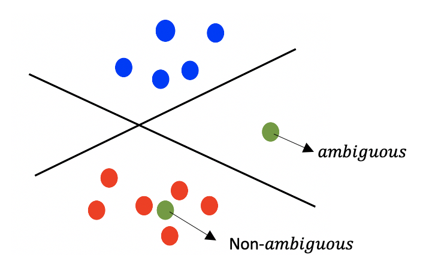

## 1.5.3 통상적이지 않은 신경망 구조들

앞서 설명한 전형적인 신경망 구조에서 벗어난 변형들도 존재한다.

## 1.5.3.1 input, hidden, output layer 구분이 모호한 구조

신경망에서는 주로 통상적인 구조가 강요되기 때문에, **그 어떤 종류의 매개변수화된 computational graph로도 신경망을 정의할 수 있다**는 점을 간과하기 쉽다. 

예를 들면 **random forest**에서 영감을 받은 논문이 제안한 신경망에서는 망의 여러 layer에서 input을 허용한다.

또한 loss function을 output node들만이 아니라, hidden node에서 계산하는 경우도 있다. 이런 구조에서 hidden node의 기여는 penalty 형태로 주어져서 일종의 regularization 항으로 쓰일 때가 많다.(hidden layer와 output layer가 모호한 경우에 해당) 

예를 들면 hidden node들에 penalty를 가하는 것으로 sparse(희소)한 특징을 train하는 데 쓰인다.

또한 종종 쓰이는 **skip connection**(건너뛰기 연결)도 모호한 구조를 갖는다. skip connection은 한 layer의 node들을 바로 다음 layer가 아닌 그 이후의 어느 layer에 연결하는 방법을 뜻한다. 

이 방법 덕분에 진정으로 깊은 model이 가능한데, 예를 들어 ResNet은 152층 구조에 skip connection을 사용하여 이미지를 처리한다. input, hidden, output layer의 구분이 흐려지는 것은 아니지만, 이 또한 전형적인 구조에서 벗어난 형태다.

대체로 이런 신경망의 특징 공학은 **iterative**(반복적)이다. 이후 layer들이 이전 layer들의 특징을 반복해서 refinement(정련)하는 것이다.

> 반면 전통적인 방식은 이후 layer들이 이전 layer의 표현들을 점차 추상화한다는 점에서 hierarchical(위계적)하다.

---

## 1.5.3.2 특이한 연산, 합곱망

**LSTM network**(long short-term memory network, 장단기 기억망)이나 CNN 같은 신경망은 연산에서 다양합 종류의 곱셈적 '망각'과 합성곱, pooling 연산 등을 사용한다. 

또한 **sum-product network**(합곱망)이라는 독특한 구조의 신경망이 있는데, node들이 sum(덧셈)이나 product(곱셈)을 수행한다. 

sum node는 weight가 붙은 edge를 쓰는 기존의 linear transformr과 비슷하지만, weight가 반드시 양수라는 제한을 갖는다.

product node는 단순히 input들을 곱하기만 한다. 물론 곱셈의 방식에 따라 다양한 product node가 존재한다. 예를 들면 스칼라 값의 곱셈과 벡터 값의 곱셈을 다르게 처리해야 하는 경우가 있다.

이런 sum-product network의 핵심은 어떤 수학 함수라도 input들의 다항식 함수 형태로 표현할 수 있다는 것이다. 참고로 기존 신경망에서 activation function을 이용해서 비선형성 성질을 제공한 것과 달리, sum-product network는 sum 연산이 비선형성을 제공한다.

> 바탕이 되는 computational graph가 순환하지만 않는다면, 그 어떤 종류의 구조와 계산 연산에서도 backpropagation algorithm을 일반화할 수 있다는 점을 기억하자.

> 이처럼 적절한 domain 지식을 반영해서 세심하게 설계한 구조가, 완전 연결 순방향 신경망을 이용한 블랙박스식 접근보다 더 나은 성과를 내는 경우가 더 많다.

---

## 1.6 흔히 쓰이는 신경망 구조

### 1.6.1 얕은 모형으로 기본적인 기계 학습 흉내 내기

linear regression, SVM, logistic regression, SVD(Singular Value Decomposition, 특이값 분해), matrix decomposition(행렬 인수분해) 같은 기본적인 기계 학습 모형은 <U>layer가 하나 혹은 둘인 얕은 신경망으로도 흉내낼 수 있다.</U>

더 나아가서, **Widrow-Horr learning model**(위드로-호프 학습 모형)과 같은 여러 신경망 모형은, Fisher's discriminant(피셔의 판별 모형)과 같은 전통적인 기계 학습 모형과 직접적으로 연관되어 있다.(각자 제안된 방식이긴 하지만)

---

## 1.6.2 Radial Basis Function(RBF) 신경망

요즘은 잊혀진 radial basis function(RBF, 방사상 기저 함수) 신경망은, 특정 종류의 문제에 한해서 상당한 잠재력을 가지고 있다. 이 구조의 한계는 깊이가 부족하다는 점인데, 보통 RBF는 layer가 단 두 개이다.

첫 layer는 unsupervised 방식으로 구축되지만, 두 번째 layer는 supervised 기법으로 훈련된다. 순방향 신경망과는 원리가 근본적으로 다른데, RBF 신경망의 능력은 바로 unsupervised layer에 있는 더 많은 수의 node들에서 온다.

> 무엇보다도 RBF 신경망은 depth가 아니라, 특정 layer의 크기를 늘리면서 능력을 키우는 것이다.

이 접근 방식은 separability of patterns(패턴 분리성)에 관련된 **Cover's theorem**(커버의 정리)에 근거하는데, 이 정리는 non-linear transform을 이용해해서 data space를 더 고차원의 공간으로 mapping하면, pattern analysis problem의 linearly separable할 가능성이 커진다는 것이다.

RBF 신경망의 두 번째 layer에는 각 node의 prototype(원형)이 들어 있고, activation value는 그 prototype과 input data의 유사성에 따라 결정된다. 이 activation value들을 그 다음 layer의 train된 weight와 결합한 결과가 최종 예측값이다.

이 접근 방식은 nearest-neighbor(최근접 이웃) 분류기와 아주 비슷하다. 단, 둘째 layer의 weight들이 또 다른 수준의 supervision(지도)를 수행한다는 점이 다르다. 

> 달리 말하면 nearest-neighbor의 supervision 버전이라고 볼 수 있다.

> 사실 nearest-neighbor의 supervision 버전으로 더 잘 알려진 것은 SVM이다. SVM은 '하나의 kernel function과 supervise된 weight들의 결합'이 최종 예측값의 이웃 point들에 대한 weight로 쓰인다. RBF는 이런 SVM과 같은 kernel 기반 방법을 흉내낼 수 있다.

---

### &nbsp;&nbsp;&nbsp;🔒 정의: kernel method, Cover's theorem&nbsp;&nbsp;&nbsp;

> [cover's theorem, Kernel methods](https://knowable.tistory.com/49)

1. **kernel method**

Kernel method란 pattern analysis(패턴 분석)을 위한 알고리즘 중 하나이다. 하나의 layer로 구성된 단순한 퍼셉트론이나 SVM은 XOR 문제를 풀지 못한다. 그런 문제점을 해결하기 위해 나온 개념으로, 저차원을 고차원으로 mapping시켜 linear regression problem을 적용할 수 있게 만든다.

> summary02: 1.5.1 절에서는 다층 신경망으로 이 문제를 해결하는 방법을 증명했다.

고차원으로 mapping시키는 함수를 mapping function이라 하며 $\phi$ 로 표기한다. $\mathcal{L}$ (raw data space)에서 $\mathcal{H}$ (hilbert space: high-demensional feature space)로 data로 mapping한다.

예를 들어 다음과 같은 mapping function이 있다고 하자.

$$ \phi(x) = (x_{1}^2, x_{2}^2, \sqrt{2}x_{1}x_{2}) $$

- $\mathcal{L}$ : $x = {0 \choose 1}$ $z = {1 \choose 0}$

data는 다음과 같이 mapping되게 된다.

- $\mathcal{H}$ : $\phi(x) = \begin{pmatrix} 0 \\ 0 \\ 0 \end{pmatrix}$ $\phi(z) = \begin{pmatrix} 1 \\ 0 \\ 0 \end{pmatrix}$

그런데 모든 data를 고처원으로 mapping시키는 작업은 어려우므로, 내적으로 표현이 가능한 kernel trick 방식을 이용한다.

2. **Cover's theorem**

기계 학습에서 non-linear한 kernel method을 이용해서 data space를 더 고차원의 공간으로 mapping시키면, pattern analysis이 높은 확률로 linearly separable하게 된다는 접근의 근간이 된 이론이다. 

theorem은 homogeneously linearly separable한 $D$ 차원의 data $N$ 개를 다음과 같이 나타낸다. 아래 counting function은 linearly separable한 dichotomies의 개수를 표현한다.

> [dichotomies, growth function 설명](https://keepmind.net/%ea%b8%b0%ea%b3%84%ed%95%99%ec%8a%b5-training-versus-testing/)

> 전체 영역이 연속적인 공간이므로, 공간을 하나하나 따질 수는 없다. 따라서 <U>대신 데이터에 해당하는 해당 점들이 어떻게 분류가 되었나</U>를 확인한다. 이러한 점들을 **dichotomies**라고 부른다.

> dichotomy(이분법)은 데이터를 두 set으로 나누는 행위를 말한다. 가령 N개의 데이터가 있고 hypothesis가 모든 데이터 공간 $\mathcal{X}$ 를 {-1, 1} 로 분류한다면, 두 set로 나눌 수 있는 방법의 수는 $2^N$ 이 된다.

> N개의 data point가 있을 때, 나올 수 있는 최대 dichotomies의 개수를 나타내는 함수를 **Growth function**이라고 한다.

> Growth Function이 크다는 것은 generalization(일반화)이 쉽지 않다는 말과 같다.

$$ C(N,D) $$

- $N$ : data의 개수

- $D$ : dimensional space의 개수

이를 위한 필요충분 조건으로 점들은 general position을 만족해야 한다. 다른 말로 하면 점들은 서로 linearly independent(선형독립)하다.(set의 어떤 원소도 나머지 원소들의 linear combination(선형결합)으로 나타낼 수 없다.)

$N$ 과 $D$ 가 다음 중 어느 조건을 만족하는가에 따라 function $C(N,D)$ 는 다음과 같은 정도로 증가할 수 있다.

- $N \le D + 1$ : N을 지수로 갖는 수준으로 증가한다.

- $N > D + 1$ : 지수적인 증가보다 less growing한다. 

여기에 새로운 data를 추가한다면 다음과 같이 분류할 수 있다.

- non-ambiguous: 새로운 data가 하나의 class로만 분류할 수 있는 경우

- ambiguous: 새로운 data가 어느 class로도 분류될 수 있는 경우

만약 새 데이터가 ambiguous(모호)하다면 dichotomies가 추가될 것이다. 이는 재귀식처럼 표현할 수 있는데 수식은 다음과 같다.

$$ C(N+1, D) = C(N, D) + C(N, D-1) $$

---

### 1.6.3 Restricted Boltzmann Machine(RBM)

Restricted Boltzmann Machine(RBM, 제한된 볼츠만 기계)는 에너지 최소화라는 개념을 이용해서 unsupervised 방식으로 model을 구성하는 신경망 구조를 만든다. 주로 자료를 만들어 내는 model을 만들 때 특히 유용하며, 주로 Probabilistic graphical model(확률적 그래프 모형)와 밀접한 관련이 있다.

RBM의 training은 순방향 신경망과는 상당히 다르다. RBM model은 backpropagation으로 훈련할 수 없으며, 대신 몬테카를로 표집을 이용해야 한다. 

---

### 1.6.4 Recurrent Neural Network(RNN)

Recurrent Neural Network(RNN, 순환 신경망)은 텍스트 문장이나 시계열 자료, 생물학의 염기서열 등 이산적 sequence(순차열) 자료를 다루기 위해 고안됐다.

입력은 $\bar{x}_1, ..., \bar{x}_n$ 인데, 여기서 $\bar{x}_t$ 는 시간 $t$ 에서의 $d$ 차원 자료점이다.

- 서로 다른 $d$ 개의 시계열로 구성된 다변량 시계열 자료를 다루는 과제라고 하면, 벡터 $\bar{x}_t$ 는 $t$ 번째 tick(틱)에서의 $d$ 가지 값으로 이루어진 벡터일 것이다. 

- 텍스트 관련 과제라면 벡터 $\bar{x}_t$ 는 $t$ 번째 시간에서의 **one-hot**(원-핫) 벡터 형식으로 encode된 단어를 담을 것이다.

sequence에서 중요한 점 중 하나는 하나의 연속된 구성 요소들(텍스트라면 인접 단어) 사이에 **dependency**(의존 관계)가 존재한다는 것이다. 따라서 특정 입력 $\bar{x}_t$ 는 <U>오직 그 이전 시간의 input들이 이미 주어지고 하나의 hidden state로 변환된 이후에 주어져야만</U> 도움이 된다.

> 전통적인 신경망이라면 모든 input이 동시에 첫 layer에 주어지면서 이런 조건을 만족할 수 없다. 하지만 RNN은 입력 $\bar{x}_t$ 가 이전 시간의 input으로 만들어진 hidden state들과 직접 상호작용할 수 있다.

RNN의 핵심은 다음과 같다.

1. 각 시간에 하나의 input $\bar{x}_t$ 가 있다.

2. hidden state(은닉 상태) $\bar{h}_t$ 는 각 시간마다 새 input이 입력됨에 따라 변한다.

3. 각 시간은 또한 출력값 $\bar{y}_t$ 를 갖는다.

> 예를 들어 $\bar{y}_t$ 는 $\bar{x}_{t+1}$ 을 미리 예측한 값일 수도 있다. 이런 방식을 **language modeling**(언어 모형화)라고 한다.

응용에 따라서는 output $\bar{y}_t$ 를 산출하는 것이 아니라, sequence의 끝에서만 output을 산출하는 경우도 있다. 예를 들어 주어진 문장에 담긴 정서가 '긍정적'인지, '부정적'인지를 분류하는 응용의 경우, 마지막 시간(문장의 끝 단어)에서만 분류 결과를 출력한다.

아래는 시간 $t$ 에서의 input vector $\bar{x}_t$ 와 시간 $(t-1)$ 에서의 hidden vector의 function이다.

$$ \bar{h_t} = f(\bar{h}_{t-1}, \bar{x}_t) $$

hidden state들에서 output의 확률을 학습하는 데는 이와는 다른 함수 $\bar{y}_t = g(\bar{h}_t)$ 가 쓰인다.

> 각 시간에서 함수 $f(\cdot)$ 와 $g(\cdot)$ 가 동일하다는 점에 주목하라.

여기에 깔린 암묵적인 가정은 바로 'sequence가 특정 수준의 **stationary**(정상성)을 보인다'는 것이다. 간단히 말해서 시간이 흘러도 자료의 바탕 feature가 그리 변하지 않는다고 가정한다. 항상 성립하지는 않겠지만, regularization을 사용하기에는 좋은 가정이다.

RNN 구조의 핵심은 바로 아래 그림 (a)에 해당하는 자기 순환 루프다. 이 루프 덕분에 각 $\bar{x}_t$ 가 입력된 후에 신경망의 hidden state가 변하게 된다.

순방향 신경망에 항상 유한한 길이의 sequence가 입력되므로, (b)처럼 시간순 층별로 표현하는 것도 가능하다. 시간순 층별 표현에서는 hidden-to-hidden weight matrix들을 다수의 연결이 공유하는데, 이는 매시간 동일한 함수가 쓰이게 하기 위한 것이다.

backpropagation algorithm은 이러한 training 도중 이러한 공유와 시간 길이를 반영해서 weight를 갱신한다. 이런 특별한 종류의 backpropagation algorithm을 back-propagation through time, 줄여서 **BPTT**(시간 역전파)라고 부른다.

RNN이 갖는 재귀적 성질 덕분에 순방향 신경망은 <U>input의 길이가 가변적인 함수를 계산하는 능력</U>을 갖는다. 재귀식을 일반화하자면 다음과 같이 출력을 나타낼 수 있다.

- $\bar{h}_0$ : 이 항은 주로 상수 벡터로 고정된다.

- $\bar{h}_1 = f(\bar{h}_0, \bar{x}_1)$

- $\bar{h}_2 = f(f(\bar{h}_0, \bar{x}_1), \bar{x}_1)$

- ...

$$ \bar{y}_t = F_t(\bar{x}_1, \bar{x}_2, ..., \bar{x}_t) $$

> 여기서 함수 $F_t$ 가 $t$ 의 값에 따라 달라지는 것에 주목하자.

이런 성질 덕분에 텍스트 문장과 같은 가변 길이 input에 특히 유용할 수 있는 것이다.

- 단점

또한 특이하게도 RNN은 이론상으로 **Turing complete**(튜링 완전) 성질을 가진다. 간단히 말하자면 충분한 자료와 계산 자원이 주어진다면, RNN은 그 어떤 알고리즘도 흉내낼 수 있다. 다만 현실 응용에서는 RNN은 긴 sequence에 대해 잘 generalization되지 않고, <U>sequence가 길수록 필요한 data의 양과 hidden state의 수가 비현실적인 수치로 증가</U>한다.

게다가 실제 응용에서는 gradient vanishing, explosion problem으로 인해 최적의 매개변수 값을 선택하기가 어렵다. 

> 이런 문제점 때문에 LSTM 등 다양한 변형이 제시되었다.

---

### 1.6.5 Convolutional Neural Network(CNN)

> CNN은 사실 고양이의 시각피질이 작동하는 방식에서 영감을 받아서 만들어졌다. 이런 영감에서 기초한 최초의 구조는 neocognitrion(네오코그니트론)이었고, 이를 일반화한 것이 LeNet-5 구조이다.

CNN에서 신경망의 각 layer는 공간적 크기(width, height)와 depth를 가진 3차원 입체인데, depth는 feature의 개수에 해당한다. (이 depth는 신경망 자체의 depth와 다르게 쓰이니 주의)

주로 CNN input의 feature는 RGB 같은 색상 채널에 해당하며, hidden layer들은 이미지에 존재하는 다양한 종류의 도형들은 encode하는 hidden feature map(은닉 특징 맵)들을 대표현다.

> 물론 input이 grayscale(회색조, LeNet-5가 여기에 해당)일 경우 channel이 한 개겠지만, 이후의 layer들은 3차원일 수 있다.

CNN은 다음과 같은 두 가지 layer로 구성된다.

1. **convolution layer**(합성곱 층)

convolution layer는 convolution 연산을 정의한다. <U>한 layer의 activation value를 다른 layer의 activation value로 mapping하는 일종의 **filter**</U>이다. convolution 연산은 현재 layer와 depth는 같지만, 공간적 크기는 더 작은 3차원 weight filter를 사용한다. 

filter의 모든 weight 사이와 임의로 선택한 receptive field(공간 영역, filter와 같은 size)의 내적은 다음 layer의 hidden state의 값을 정의한다. 

> layer의 최종적인 hidden state는 ReLU와 같은 activation function까지 적용한 결과다.

한 layer에서 filter와 receptive field 사이의 연산은 '다음 layer를 정의하는 데 필요한 모든 위치'에서 수행된다. 그리고 다음 layer에서 activation value들은 이전 layer와 공간적 관계를 유지하게 된다.

한 특정 층의 임의의 activation value가 그 다음 layer의 작은 receptive field로 결정되기 때문에, CNN의 연결은 굉장히 sparse하다. 마지막 두 layer 또는 세 layer를 제외하면 모든 layer는 자신의 공간적 구조를 유지한다. 

따라서 이미지의 어떤 부분이 layer의 어떤 activation value에 영향을 미치는지 시각화할 수 있다.

- 저수준(input과 가까운 앞쪽) layer는 직선 같은 기본적인 도형을 포착한다.

- 고수준(output과 가까운 뒤쪽) layer는 고리(숫자 안에 나타나는 것과 같은) 같은 좀 더 복잡한 도형을 포착한다.

또한 뒤쪽 layer들은 앞쪽 layer들이 파악한 기본 도형들을 조합해서 아라비아 숫자 같은 형상을 생성할 수 있다.

2. **subsampling layer**(부표집 층, 하위표집 층, **pooling**)

subsampling layer는 layer가 <U>차지하는 공간을 절반 크기로 압축</U>한다. 

---

### &nbsp;&nbsp;&nbsp;🔒 정의: sparsity&nbsp;&nbsp;&nbsp;

> [Sparsity의 정의](https://velog.io/@woojinn8/LightWeight-Deep-Learning-1.-Pruning)

위 그림에는 16X16 행렬 세 개가 있다. 

- 첫 번째 행렬은 한 개의 요소를 제외하고는 모두 값이 0이기 떄문에 희소행렬(sparse한 행렬)으로 볼 수 있다.

- 두 번째 행렬은 0이 대다수이기 때문에 이 또한 희소행렬로 볼 수 있다.

- 세 번째는 0이 반을 차지하지만 희소행렬로는 볼 수 없다.

이런 sparse한 정도를 나타내는 개념이 바로 **Sparsity**(희소성)이다. 전체 network에서 얼마나 많은 weight가 정확하게 0인지 나타내는 척도이다.

Sparsity를 측정하는 가장 간단한 방법은 $l_0 norm$ 을 사용하는 것이다.

$$ ||x_0|| = |x_1|^0 + |x_2|^0 + ... + |x_n|^0 $$

---

### 1.6.6 hierarchical feature model(위계적 특징 공학), transfer learning(전이 학습)

 순방향 신경망에서 각 output layer의 출력은 data의 변환된 특징 표현이다. 앞쪽 layer의 특징들은 자료의 기초적인 특성을 대표하는 반면, 뒤쪽 layer들은 분류명과 관련해서 의미 있는 좀 더 복잡한 특성을 대표하는 일종의 hierarchical feature model로 볼 수 있다.

 뒤쪽 layer의 특징들로 표현된 data는 그 습성이 좋을(특히 linearly seperable한 경우) 때가 많다. image data를 이용한 CNN 같은 분야가 특히 이런 성질이 시각적으로 확연하게 드러난다. 

> 예를 들어 CNN에서 앞쪽 layer는 윤곽선 같은 기초적인 특징을 학습하고(트럭이나 당근), 뒤쪽 layer는 고유하고 더 복잡한 특징(트럭의 바퀴 대 당근 꼬투리 등)을 담을 때가 많다.

 미리 trained된 model을 사용하는 학습 기법을 **transfer learning**(전이 학습)이라고 한다. 텍스트나 이미지 자료와 관련된 응용에서 특히 흔하게 쓰인다.

 텍스트 자료는 Wikipedia 같은 표준화된 벤치마크 자료 집합과, word2vec 같은 모형을 이용해서 텍스트 단어들의 표현을 생성한다.  이미지 자료의 경우 대표적인 자료 집합으로 ImageNet이 있다. 이 자료 집합도 미리 훈련해서 얻은 특징들을 다른 종류의 이미지들에 활용할 수 있다.

---