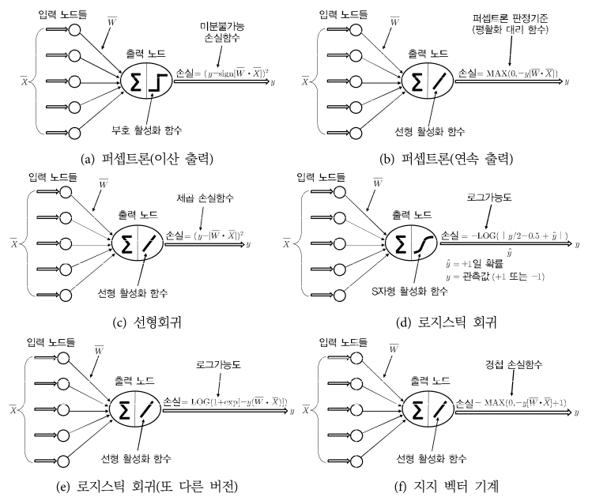
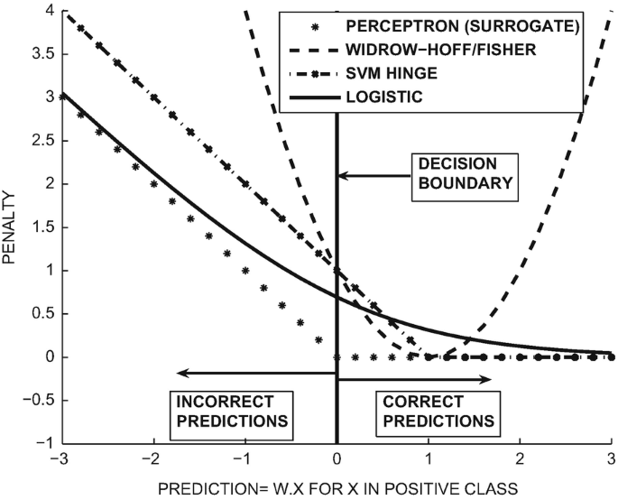
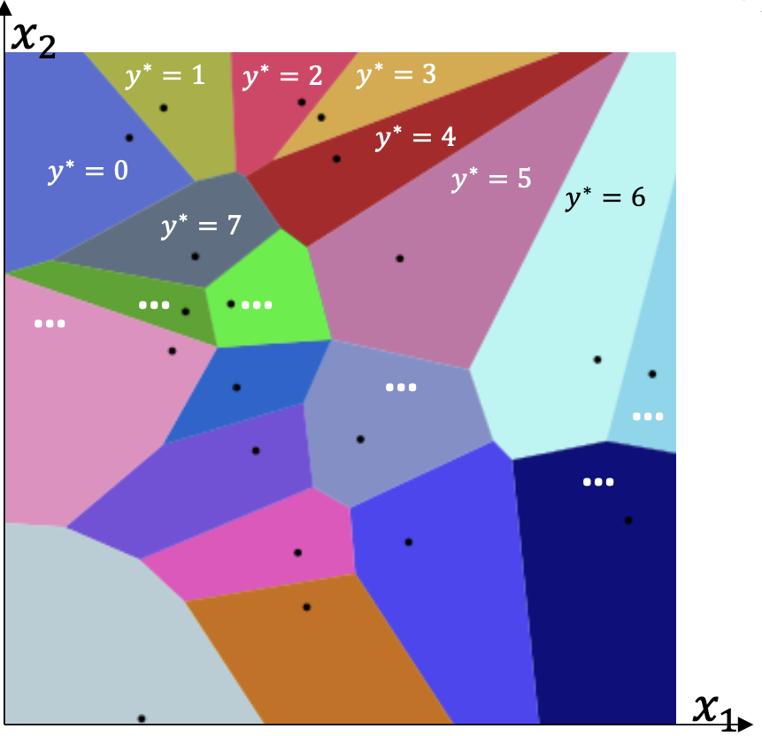
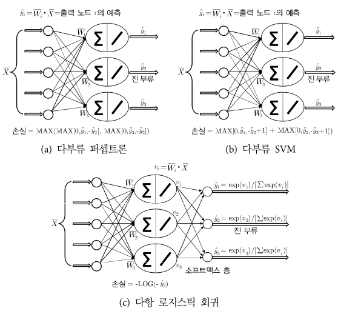
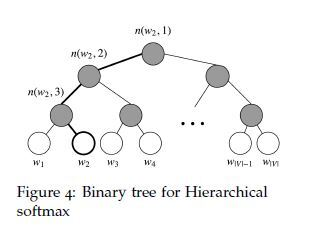

# 얕은 신경망을 이용한 기계 학습

## 2.1 소개

대체로 전통적인 기계 학습은 optimization(최적화)와 backpropagation(경사 하강법)을 이용해서 parameterized model을 학습한다. 이런 model의 예시로 linear regression, SVM, logistic regression, dimention reduction, matrix decomposition(행렬 인수분해) 등이 있다.

이번 장은 기계 학습의 아주 다양한 optimization 중심 방법들은 layer가 1~2개뿐인 아주 단순한 신경망 구조로 흉내 낼 수 있음을 보일 것이다.

---

## 2.2 binary classification(이진 분류) model을 위한 신경망 구조

이번 절 전반은 input node가 d개, output node가 1개인 퍼셉트론을 사용한다.

- $\bar{W} = (w_1, ... , w_d)$ : weight

- bias 항은 굳이 두지 않고, 값이 1인 가짜 input node를 하나 추가해서, 그 계수를 bias 항처럼 쓸 것이다.

### 2.2.1 퍼셉트론 다시 보기

예측값은 다음과 같이 쓸 수 있다.

$$ \hat{y_i} = sgn(\overline{W} \cdot \overline{X_i}) $$

- $(\overline{X_i}, y_i)$ : 하나의 훈련 견본

퍼셉트론 갱신 공식은 다음과 같았다.(regularization이 적용된)

$$ \overline{W} \Leftarrow \overline{W}(1-\alpha\lambda) + \alpha(y_i - \hat{y_i}) \overline{X_i} $$

backpropagation의 갱신이 이처럼 오차에 비례하는 경우, $(y_i - \hat{y_i})^2$ 같은 제곱 손실함수를 사용하는 것이 자연스럽다. 그런데 지금 출력은 이산값이기 때문에, loss function의 값마저 이산적이게 된다. 지점마다 계단 모양을 그리기 때문에 미분할 수 없다.

그래서 1.2.1.1절에서 정리했듯 미분 가능한 smoothed surrogate loss function(평활화된 대리 함수)를 대신 사용한다고 정리했다. 이때 오분류된 훈련 견본 ( $y_i \hat{y_i}$ < 0 )에서만 weight 갱신이 일어났다. 

갱신 공식을 indicator function(지시함수: 인수로 주어진 조건이 성립하면 1, 그렇지 않으면 0) $I(\cdot) \in \lbrace 0, 1 \rbrace$ 을 사용해서 다음과 같이 표현할 수 있다.

$$ \overline{W} \Leftarrow \overline{W}(1-\alpha\lambda) + \alpha y_i \overline{X_i}[I(y_i \hat{y_i} < 0)] $$

- 오분류된 견본일 경우 $(y_i - \hat{y_i}) / 2$ 가 예측값이므로, 위와 같이 $(y_i - \hat{y_i})$ 오차 부분을 수정했다.(계수 2는 learning rate로 흡수)

i번째 훈련 견본에 대한 loss function은 다음과 같았다. 또한 이 loss function을 **perceptron criterion**(퍼셉트론 판정기준)이라고 불렀다.

$$ L_i = \max \lbrace 0, -y_i(\overline{W} \cdot \overline{X_i}) \rbrace $$

---

### 2.2.2 least-squares regression(최소제곱 회귀)

least-squares regression에서 train data는 n개의 서로 다른 훈련 견본 $(\overline{X_1}, y_1)...(\overline{X_n}, y_n)$ 으로 이루어진다. 

- 여기서 각 $\overline{X_i}$ data point는 d차원 표현이고, $y_i$ 는 real(실수) target(목푯값)이다. 실수이기 때문에 regression 문제가 된다.

i번째 훈련 견본에 대한 loss function은 다음과 같다.

$$ L_i = e_i^2 = (y_i - \hat{y_i})^2 $$

backpropagation 갱신 공식은 다음과 같다.

$$ \overline{W} \Leftarrow \overline{W} + \alpha e_i \overline{X} $$

다음과 같이 표현할 수도 있다.

$$ \overline{W} \Leftarrow \overline{W} + \alpha (y_i - \hat{y_i}) \overline{X} $$

regularization을 적용할 수도 있다.

$$ \overline{W} \Leftarrow \overline{W}(1 - \alpha \cdot \lambda) + \alpha (y_i - \hat{y_i}) \overline{X} $$

이 갱신 공식은 2.2.1의 perceptron criterion과 매우 비슷하다. 그러나 두 갱신 공식은 완전히 같은 것은 아니다.( $\hat{y_i}$ 계산 방식이 다르기 때문)

그렇다면 binary target에 적용하면 어떨까? 이 경우는 least-squares classification(최소제곱 분류) 문제가 된다. 이 경우 perceptron criterion(퍼셉트론 판정 기준)과 겉보기에 동일한데, 퍼셉트론 알고리즘과 결과가 같지는 않다.

그 이유는 least-squares classification의 '실숫값' 훈련 오차 $(y_i - \hat{y_i})$ 와, 퍼셉트론 '정수' 오차 $(y_i - \hat{y_i})$ 의 계산 방식이 완전히 다르기 때문이다. (바로 아래 2.2.2.1절에서 설명)

> 이런 least-squares classification(최소제곱 분류)를 Widrow-Hoff learning(위드로-호프 학습)이라고 한다.

---

### 2.2.2.1 Widrow-Hoff learning(위드로-호프 학습)

기존의 least-squares regression을 binary target에 적용하고자 하는 시도에서 탄생했다. 

Widrow-Hoff learning은 미지의 시험 견본의 실수 예측값을 sign function을 이용해서 binary target으로 변환하긴 하지만, <U>훈련 견본과의 오차는 실수 예측값을 직접 사용해서 계산한다.</U> 

> 퍼셉트론의 경우 오차는 항상 {-2, +2}에 속하지만, Widrow-Hoff learning의 경우 $\hat{y_i}$ 가 sign function 없이 $\overline{W} \cdot \overline{X_i}$ 로 결정되기 때문에 오차가 임의의 실숫값이다.

이 때문에 positive 부류에 속하는 data point가 $\overline{W} \cdot \overline{X_i} > 1$ 인 경우에서 차이를 보일 수 있다. 퍼셉트론은 벌점이 가해지지 않겠지만, Widrow-Hoff에서는 실수 예측값 오차이기 때문에 벌점이 가해지게 된다.

<U>성과가 너무 좋은 point에도 부당하게 벌점이 가해지는 것</U>이 이 Widrow-Hoff learning의 단점이다.

이 방법의 loss function은 다음과 같다.

$$ L_i = (y_i - \hat{y_i})^2 = y_i^2(y_i - \hat{y_i})^2 = (1-\hat{y_i}y_i)^2 $$

- $y_i^2 = 1$ 이므로 loss function에 곱하는 것으로 모양을 바꾼 것이다.

> 위 loss function을 '너무 좋은 성과'에 벌점을 부여하지 않도록 수정하는 한 방법을 적용하면 SVM의 loss function이 된다.

---

### 2.2.3 logistic regression

logistic regression(로지스틱 회귀)는 견본들을 확률에 근거해서 분류하는 하나의 확률 모형이다. 각 훈련 견본의 '정답에 해당할 확률(예측값)'을 최대한 크게 만드는 것이 목표다. 이런 optimization(최적화) 목표는 **maximum-likelihood estimation**(최대가능도 추정)이라는 기법을 이용해서 달성할 수 있다.

output node의 <U>loss function은 음의 **log-likelihood**(로그가능도)</U>이고, Widrow-Hoff의 제곱 오차 대신 이 loss function을 쓰는 것이 바로 logistic regression이다.

> output layer의 activation function으로는 sigmoid를 주로 사용한다.

다음은 logistic regression의 output을 수식으로 표현한 것이다.

$$ \hat{y_i} = P(y_i = 1) = {{1} \over {1 + exp(-\overline{W} \cdot \overline{X_i})}} $$

- input data: $\lbrace (\overline{X_1}, y_1),  (\overline{X_2}, y_2),...,  (\overline{X_n}, y_n) \rbrace$

  - $d$ 차원 feature vector $\overline{X_i}$  와, target인 $y_i \in \lbrace -1, +1 \rbrace$ 으로 구성된 훈련 견본 n개 집합

- weight: $\overline{W} = (w_1, ..., w_d)$

- activation function: sigmoid

여기서 신경망은 $P(y_i = 1) > 0.5$ 인 부류, 즉 해당 예측 확률이 0.5보다 큰 부류를 결과(최종 예측값)으로 출력한다.

> 이때 분모의 범위에 집중하자. 만약 $\overline{W} \cdot \overline{X_i}=0$ 라면 $P(y_i = 1) = 0.5$ 이다. $\overline{W} \cdot \overline{X_i} > 0$ 이면 0.5를 넘게 된다.

> 따라서 사실상 $\overline{W} \cdot \overline{X_i}$ 의 **부호에 따라서 판단하는 것과 다름이 없다.**

양성(positive) 견본에서 예측값 $P(y_i = 1)$ 의 확률은 최대화해야 하며, 음성(negative) 견본에서는 예측값 $P(y_i = -1)$ 의 확률은 최소화해야 한다.

다시 정리하면 다음과 같다.

- $y_i = 1$ 인 (positive) 견본에서는 예측값 $\hat{y_i}$ 를 최대화

- $y_i = -1$ 인 (negative) 견본에서는 예측값 $1- \hat{y_i}$ 을 최대화해야 한다.

이 둘을 통합해서 표현한 수식, 즉 최대화해야 하는 것을 표현하면 바로 다음과 같다.

$$ | {{y_i} \over {2}} - {1 \over 2} + \hat{y_i} | $$

그리고 이 <U>최대화해야 하는 값을 모두 곱한 값을 최대화</U>하면, 결과적으로 가능도 $\mathcal{L}$ 이 최대화된다.

$$ \mathcal{L} = \prod_{i=1}^N | {{y_i} \over {2}} - {1 \over 2} + \hat{y_i} | $$

이제 loss function을 $L_i = -\log(\mathcal{L}) = \sum_{i=1}^{n} {-\log(| {{y_i} \over {2}} - {1 \over 2} + \hat{y_i} |)}$

- 여기서 $i$ 번째 훈련 견본의 loss function을 $L_i = -\log(| {{y_i} \over {2}} - {1 \over 2} + \hat{y_i} |)$ 라고 하면 더 간단히 쓸 수 있다.

- <U>log를 적용하는 것으로 곱이 아닌 sum 계산 형태</U>로 바뀌었다.

확률을 다루는 backpropagation 갱신에서는 이렇게 <U>sum 형태의 loss function이 더 편리</U>하다. 

$i$ 번째 loss function $L_i$ 을 $\overline{W}$ 로 편미분하여 기울기를 구하면 다음과 같다. (여기서 $\overline{W}$ 와 관련이 있는 변수가 $\hat{y_i}$ 인 것을 유의하고 보면 쉽다.)

> ${d \over dx}|f(x)| = (\mathrm{sgn} \, f(x)){d \over dx} f(x) = {|f(x)| \over {f(x)}}{d \over dx} f(x)$ :  modulus(절댓값)이 적용된 $|f(x)|$ 의 미분은 사실상 단순히 $f(x)$ 값의 부호 여부에 따라 +1, -1을 $f'(x)$ 에 곱한 것

> ${d \over dx}[log_{a}(u)] = {1 \over \ln{a}} \cdot {1 \over u}u'$

> ${d \over dx}{1 \over {1+ exp({-x})}} = {-{(-exp(-x))} \over {(1+exp(-x))^2}} = {{1} \over {1+exp(-x)}} \cdot {{exp(-x)} \over {1+exp(-x)}} = f(x)(1-f(x)) $

$$ {\partial{L_i} \over {\partial \overline{W}}} = - {{sgn({{y_i} \over {2}} - {1 \over 2} + \hat{y_i})} \over {|{{y_i} \over {2}} - {1 \over 2} + \hat{y_i}|}} \cdot {{\partial \hat{y_i}} \over {\partial \overline{W}}} $$

$$ = - {{sgn({{y_i} \over {2}} - {1 \over 2} + \hat{y_i})} \over {|{{y_i} \over {2}} - {1 \over 2} + \hat{y_i}|}} \cdot {{\overline{X_i}} \over {1+ exp(- \overline{W} \cdot \overline{X_i})}} \cdot { 1 \over {1+ exp(\overline{W} \cdot \overline{X_i})}} $$

$$ 만일 \, y_i = 1 이면 \quad - {{\overline{X_i}} \over {1+exp({\overline{W} \cdot \overline{X_i}})}} $$

$$ 만일 \, y_i = -1 이면 \quad {{\overline{X_i}} \over {1+exp({-\overline{W} \cdot \overline{X_i}})}} $$

위 식을 $y_i \in \lbrace -1, +1 \rbrace$ 을 이용해 좀 더 간단히 표현하면 다음과 같다.

$$ {\partial{L_i} \over {\partial \overline{W}}} = - {{y_i\overline{X_i}} \over {1+ exp(y_i\overline{W} \cdot \overline{X_i})}} $$

> $-$ \[ $(\overline{X_i}, y_i)$ 를 오분류할 확률 \]( $y_i \overline{X_i}$ ) 

이상에 기초해서 logistic regression의 backpropagation 갱신 공식을 세우면 다음과 같다.

$$ \overline{W} \Leftarrow \overline{W}(1 - \alpha \lambda) + \alpha {{y_i \overline{X_i}} \over {1+exp[y_i (\overline{W} \cdot \overline{X_i})]}} $$

여기서 기억해 둘 관점은 다음과 같다.

- perceptron, Widrow-Hoff algorithm: 'mistake(착오)의 magnitude(크기)'를 이용해서 갱신

- logistic regression: 'mistake **확률**'을 이용해서 갱신

---

### 2.2.3.1 다른 종류의 activation function과 loss function을 이용한 구현

사실 다른 종류의 activation function과 loss function을 이용해서도 logistic regression model을 만들 수 있다.

가령 identity function을 이용해서 출력 $\hat{y_i} \in (- \infty, +\infty)$ 를 얻고, 거기에 다음과 같은 loss function을 적용할 수도 있다.

$$ L_i = \log (1+ exp(-y_i \cdot \hat{y_i})) $$

이 model에서 최종 예측값(output)은 $y_i$ 에 sign function(부호 함수)를 적용한 것이다. 

---

## 2.2.4 Support Vector Machine(SVM)

Support Vector Machine(SVM, 지지 벡터 기계)의 loss function은, logistic regression의 loss function과 밀접한 관련이 있다. 단, <U>매끄러운 loss function이 아닌 **hinge-loss**(경첩 손실)을 사용</U>한다.

SVM의 신경망 구조는 least-squares classification(Widrow-Hoff) 구조와 동일하다. <U>주된 차이는 바로 loss function</U>이다.

> Widrow-Hoff에서는 훈련점 $\overline{X_i}$ 의 예측값 $\hat{y_i}$ 를 $\overline{W} \cdot \overline{X}$ 에 identity function을 적용해서 구했다. ( $\hat{y_i} = \overline{W} \cdot \overline{X}$ )

> 또한 Widrow-Hoff의 loss function은 실숫값 $(1-y_i \hat{y_i})^2$ 였다.

SVM에서 $i$ 번째 훈련 견본의 loss function $L_i$ 는 다음과 같이 정의한다. (이 loss function이 바로 hinge-loss다.)

$$ L_i = max \lbrace 0, 1-y_i \hat{y_i} \rbrace $$

이 loss function, 즉 hinge-loss의 핵심은 다음과 같다.

- positive 견본은 그 값이 '1 미만'일 때만 벌점이 가해진다.

- negative 견본은 그 값이 '-1 초과'일 때만 벌점이 가해진다.

- 두 경우 모두 벌점은 선형이되, 해당 threshold(문턱) 값,(1 또는 -1)을 넘으면 즉시 평평해진다.

> Widrow-Hoff가 예측값이 'target과 다를 때마다' 벌점이 부여된 것과 비교해서, 이러한 특성은 SVM의 장점이 된다.

---

### &nbsp;&nbsp;&nbsp;🖌 비교: 4가지 방법의 loss function&nbsp;&nbsp;&nbsp;

아래 그림을 보면 Widrow-Hoff, logistic regression, SVM의 loss function을 비교하는 데 도움이 될 것이다. 그래프는 여러 $\hat{y_i} = \overline{W} \cdot \overline{X_i}$ 이며, positive한( target은 $+1$ ) 견본의 손실 값을 나타내고 있다. (또한 perceptron은 surrogate loss function 버전을 표시했다.)

- logistic regression: $\overline{W} \cdot \overline{X_i}$ 가 <U>+1을 넘으면 loss function은 점점 느리게 감소</U>한다.

- SVM: hinge-loss는 <U>+1을 넘자 완전히 평평</U>해진다. 

  - 즉, 오분류된 point와 결정 경계선 $\overline{W} \cdot \overline{X} = 0$ 에 가까운 point만 벌점을 받는다.

- perceptron: perceptron criterion은 <U>hinge-loss와 모양은 같지만, 왼쪽으로 한 단위 평행이동</U>한 모양이다. 

- Widrow-Hoff: $\overline{W} \cdot \overline{X_i}$ 의 값이 <U>+1보다 더 클 때(너무 정확할 때)도 벌점</U>을 받게 된다.

  - 이런 습성을 가진 것은 Widrow-Hoff의 loss function이 유일하다.

| model | $(\overline{X_i}, y_i)$ 의 loss function $L_i$ |
| --- | --- |
| perceptron(smoothed surrogate) | $\max \lbrace 0, -y_i \cdot (\overline{W} \cdot \overline{X_i}) \rbrace$ |
| Widrow-Hoff | $(y_i - \overline{W} \cdot \overline{X_i})^2 = {\lbrace 1 -y_i \cdot (\overline{W} \cdot \overline{X_i}) \rbrace}^2$ |
| logistic regression | $\log(1+exp[-y_i(\overline{W} \cdot \overline{X_i})])$ |
| SVM(hinge-loss) | $\max\lbrace 0,1 - y_i \cdot (\overline{W} \cdot \overline{X_i}) \rbrace$ |
| SVM( Hinton $L_2 loss$ ) | $[\max\lbrace 0,1 - y_i \cdot (\overline{W} \cdot \overline{X_i}) \rbrace]^2$ |

---

확률을 다루는 backpropagation에서는, $y_i \hat{y_i} < 1$ 인 점에서 갱신을 수행했다.

$$ \overline{W} \Leftarrow \overline{W}(1- \alpha \lambda) + \alpha y_i \overline{X_i}[I(y_i \hat{y_i} < 1)] $$

- $I(\cdot) \in \lbrace 0, 1 \rbrace$ 는 조건이 성립하면 1이 되는 indicator function.

이 접근 방식이 SVM의 기본 갱신 공식의 가장 단순한 형태에 해당한다.

perceptron은 갱신 수행을 결정하는 조건이 $y_i\hat{y_i} < 0$ 이었다. 사실상 둘은 거의 동일한데, 차이를 조금 더 설명하면 다음과 같다.

- perceptron은 <U>주어진 point가 오분류된 경우에만 갱신</U>을 수행한다.

- SVM은 <U>알맞게 분류는 됐으나 확신이 그리 높지 않은 point에서도 갱신</U>을 수행한다.

---

## 2.3 multiclass classification model을 위한 신경망 구조

> 위 그림은 class 2가 우리가 원하는 class(true)라고 가정한다. 가령 class 1은 강아지, 2는 고양이, 3은 자동차인 경우이다.

perceptron의 기본 구조를 조금만 변경해도 model을 만들 수 있다.

### 2.3.1 multiclass perceptron

견본이 속할 수 있는 class가 $k$ 개인 다부류(multiclass) 상황을 가정하자.

- 훈련 견본: $(\overline{X}_1, y_1), ... ,(\overline{X_i}, y_D)$
 
  - $d$ 차원 feature vector $\overline{X_i}$

  - class index $y \in \lbrace 1, ..., k \rbrace$

- 목표

  - $i$ 번째 훈련 견본의 $\overline{W_{y_i}} \cdot \overline{X_i}$ 이, $r \neq y_i$ 인 $\overline{W_r} \cdot \overline{X_i}$ 보다 커야 한다. 
  
  - 이 조건을 만족하는 $k$ 개의 서로 다른 linear separator(선형 분리자) $\overline{W}_1,...,\overline{W}_k$ 를 동시에 만족한다면 제대로 된 classification이 가능하다.

이런 multiclass perceptron의 $i$ 번째 훈련 견본의 loss function은 다음과 같이 정의된다.

$$ L_i = \max{}_{r:r \neq y_i} \lbrace 0, \max(\overline{W_r} \cdot \overline{X_i} - \overline{W_{y_i}} \cdot \overline{X_i}) \rbrace $$

- dot product이므로 $\max(\overline{W_r} \cdot \overline{X_i} - \overline{W_{y_i}} \cdot \overline{X_i}) = \max \lbrace (\overline{W_r} - \overline{W_{y_i}}) \cdot \overline{X_i} \rbrace$ 로 쓸 수도 있다.

요점은 다음과 같다.

- 예측값 $\hat{y_i}$ 가 올바른 class에 해당하면( $y_i = \hat{y_i}$ ), 갱신은 일어나지 않는다.

- 예측값 $\hat{y_i}$ 가 다른 class에 해당하면( $y_i \neq \hat{y_i}$ ), 두 가지 갱신을 진행한다.( $\alpha$ 는 learning rate )

  - correct-class vector를 다음과 같이 갱신: $\overline{W_{y_i}} \Leftarrow \overline{W_{y_i}} + \alpha\overline{X_i}$

  - wrong-class vector를 다음과 같이 갱신: $\overline{W_{\hat{y_i}}} \Leftarrow \overline{W_{\hat{y_i}}} - \alpha\overline{X_i}$

따라서 data마다 항상 모든 node의 weight가 갱신되는 것이 아니라, <U>해당하는 두 개만 갱신</U>된다.

---

### 2.3.2 Weston-Watkins SVM

Weston-Watkins(웨스턴-왓킨스) SVM은 위 multiclass perceptron에서 다음 두 가지를 수정한 형태다.

1. multiclass perceptron이 true와 wrong에 해당되는 두 weights만 갱신하지만, Weston-Watkins SVM은 true class보다 견본에 더 적합하다고 예측된 **임의의** class weights들을 갱신한다.

2. Weston-Watkins SVM은 오분류된 class의 weights을 갱신하면서, 또한 true class에 너무 가까운 class의 weight도 갱신한다. 이는 margin 개념을 이용한다.

Weston-Watkins SVM의 $i$ 번째 훈련 견본의 loss function은 다음과 같다.

$$ L_i = \sum_{r:r \neq y_i} \max(0, \overline{W_r} \cdot \overline{X_i} - \overline{W_{y_i}} \cdot \overline{X_i} + 1) $$

1을 더해주면서 $\overline{W_{y_i}}$ 와 <U>margin이 1이 안 되게 true class로 가깝게 분류하는 $\overline{W_r}$ 도 고려</U>를 하게 바뀌었다. 또한 합을 계산하는 형태라서 <U>true class보다 견본에 더 적합하게 예측하는 모든 weights을 고려</U>한다.

갱신을 고려해야 하는 부분은 다음과 같이 정리할 수 있다.

- 예측값 $\hat{y_i}$ 가 올바른 class에 해당하고( $y_i = \hat{y_i}$ ) $\overline{W_{y_i}}$ 가 이를 가장 잘 분류하며, 그 다음으로 $y_i$ 에 적합하다고 예측된 class가 충분한 margin을 가지고 있다면 갱신은 일어나지 않는다.

- 위 조건에 해당하지 않는다면 다음 갱신을 진행한다. regularization을 포함한 갱신이다.( $\alpha$ 는 learning rate )

  > $\overline{W_r}$ 이 loss function에 양의 값을 기여하면 1을 반환하는 0/1 indicator function을 $\delta(r, \overline{X_i})$ 라고 표기하자.

  - correct-class vector 갱신: $\overline{W_{y_i}} \Leftarrow \overline{W_{y_i}}(1 - \alpha \lambda) + \alpha\overline{X_i}[\sum_{j \neq r}{\delta(j,\overline{X_i})}]$

  - wrong-class vector 갱신: $\overline{W_{\hat{y_i}}} \Leftarrow \overline{W_{\hat{y_i}}}(1 - \alpha \lambda) - \alpha\overline{X_i}[{\delta(r,\overline{X_i})}]$

여기서 $\overline{W_r}$ 이 loss function에 양의 값을 기여한다는 말은 즉, true class의 $\overline{W_{y_i}}$ 보다 더 적합하다고 예측하는 $\overline{W_r}$ 이 있다는 뜻이다.

correct-class vector는 더 적합하다고 예측하는 $\overline{W_r}$ 이 적을수록 더 크게 갱신하게 되고, wrong-class vector는 더 적합하게 예측하는 $\overline{W_r}$ 의 존재 여부에 따라 갱신하게 된다.

> SVM이 제대로 작동하려면 이런 regularization이 반드시 필요하므로, regularization을 고려한 식으로 기억하자.

---

### 2.3.3 multinomial logistic regression(softmax regression)

multinomial logistic regression(다항 로지스틱 회귀) = softmax regression도 위 Weston-Watkins SVM 사례처럼 logistic regression을 multinomial한 방식으로 일반화한 것이다.

그러나 이전 perceptron과 SVM과 다른 점은, 가능도를 posteriori probability(사후확률) $P(r|\overline{X_i})$ 로 고려한다는 점이다. 

> 사후확률 $P(A|B)$ 는 관측 B를 보고 원인이 A라고 생각되는 확률이다.

이런 사후확률을 softmax를 사용하여 추정할 수 있다. 이런 방식으로 class에 해당하는 membership(소속도)를 확률값으로 예측한다.

$$ P(r|\overline{X_i}) = {{\exp(\overline{W_r} \cdot \overline{X_i})} \over {\sum_{j=1}^{k}\exp(\overline{W}_j \cdot \overline{X_i})}} $$

이 softmax regression의 $i$ 번째 훈련 견본의 loss function은 다음과 같다.

$$ L_i = - \log[P(y_i|\overline{X_i})] $$

$$ = - \overline{W_{y_i}} \cdot \overline{X_i} + \log[\sum_{j=1}^{k} \exp (\overline{W}_j \cdot \overline{X_i})] $$

- softmax 활성화 전 값을 $v_r = \overline{W_r} \cdot \overline{X_i}$ 로 표현하면 더 간단히 나타낼 수 있다.

$$ = - v_{y_i} + \log[\sum_{j=1}^{k} \exp (v_j)] $$

softmax regression 역시 예측값 $\hat{y_i}$ 가 올바른 class에 해당하는지에 따라 갱신을 다르게 적용한다.

> backpropagation을 위해 chain rule을 이용한다. ${{\partial L_i} \over {\partial \overline{W_r}}} = {{\partial L_i} \over {\partial v_r}} \cdot {{\partial v_r} \over {\partial \overline{W_r}}} = {{\partial L_i} \over {\partial v_r}} \cdot \overline{X_i}$

- 예측값 $\hat{y_i}$ 가 올바른 class에 해당하면 다음과 같이 갱신한다.

$$ \overline{W_{y_i}} \Leftarrow \overline{W_{y_i}}(1 - \alpha \lambda) + \alpha\overline{X_i} \cdot (1 - P(y_i|\overline{X_i})) $$

- 예측값 $\hat{y_i}$ 가 다른 class에 해당하면( $y_i \neq \hat{y_i}$ ), 다음과 같이 갱신한다.

$$ \overline{W_{\hat{y_i}}} \Leftarrow \overline{W_{\hat{y_i}}}(1 - \alpha \lambda) - \alpha\overline{X_i} \cdot P(\hat{y_i}|\overline{X_i}) $$

즉 예측값 $\hat{y_i}$ 가 큰 확률로 올바른 class로 예측할수록 $\overline{W_{y_i}}$ 는 조금만 커지도록 갱신된다. 반면 예측값 $\hat{y_i}$ 가 다른 class에 큰 확률로 해당한다고 예측할수록 $\overline{W_{\hat{y_i}}}$ 는 크게 작아지도록 갱신된다.

softmax regression은 multiclass perceptron이나 Weston-Watkins SVM과 달리, <U>각 훈련 견본마다 $k$ 개의 seperator $\overline{W}_1,...,\overline{W}_k$ 를 모두 갱신</U>한다.

---

### 2.3.4 hierarchical softmax

만약 class가 굉장히 많다면, softmax regression은 매번 seperator를 갱신해야 하기 때문에 학습이 매우 느려질 것이다. 

> 주로 text mining과 같이 target word를 예측하는 과제가 이런 경우에 해당한다.

이런 문제를 hierarchical softmax(위계적 소프트맥스)를 이용하여 학습 속도를 높일 수 있다. 이 방법의 핵심은 class들을 hierarchical하게 묶어서 binary tree와 비슷한 계통 구조를 만드는 것에 있다.

> 분모를 다 더하지 않고 확률을 구해보려는 아이디어라는 관점에서 보자.

가령 위 그림처럼 $w_4$ 라는 단어의 주변부 단어가 $w_2$ 라는 단어이고, 이 둘의 관계 정도를 나타내는 확률값을 만들고 싶다고 하자. 

tree 구조의 root node(뿌리 노드)에서 terminal node(말단 노드, leaf node)까지 $\log_{2}(k)$ 회 이진 분류를 수행해서 $k$ 중 분류 결과를 얻는다.(말단에 각 단어들이 위치하게 된다.)

그리고 terminal node까지 가면서 만나는 node와 연산을 수행하면서, 최종적으로 도출하는 확률값을 사용하게 된다.

그렇다면 class를 어떻게 hierarchical하게 묶을 수 있을까? 한 가지 접근 방식으로 그냥 random하게 tree 구조를 생성하는 것이다. class가 비슷한 class까지 묶였다면 성능이 향상될 것이다. 또한 Huffman encoding(허프먼 부호화)를 이용해서 binary tree를 만드는 방법도 있다.

> 예를 들어 target word 예측은 WordNet 계통구조에 따라 class를 묶으면 도움이 된다.(다만 binary tree 구조가 아니므로 추가적인 재조직화는 필요하다.)

---