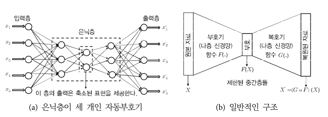
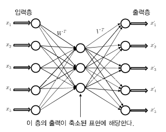

## 2.4 interpretability, feature selection을 위한 saliency analysis

신경망에 있어서 흔한 비판 중 하나로 interpretability(해석성)이 부족하다는 지적이 있다. 그러나 backpropagation을 이용하면 특정 훈련 견본의 classification에 가장 기여한 feature를 파악할 수 있다. 이러한 성질을 이용해서 feature selection(특징 선택)을 할 수 있다.

multiclass classification 신경망이 $k$ 개의 출력 점수 $o_1,...,o_k$ 를 산출한다고 하자. 여기서 가장 큰 점수를 $o_m$ 이라고 하자. 최고 점수에 해당하는 class를 winning class라고 부르자.

- 목표: classfication에서 가장 relevant(유관한), 즉 가장 영향력이 큰 feature(돌출 요인)을 식별한다.

- 훈련 견본: $\overline{X} = (x_1,...,x_d)$

- $k$ 개의 출력 점수: $o_1,...,o_k$

정리하면 각 feature $x_i$ 의 출력 $o_m$ 의 sensitivity(민감도)를 구해야 한다. 이 sensitivity의 **절대** 크기가 클수록 그 feature은 좀 더 relevant하다. 이런 feature을 식별하기 위해 ${{\partial o_m} \over {\partial x_i}}$ 의 절댓값을 구한다.

- ${{\partial o_m} \over {\partial x_i}}$ 의 절댓값이 가장 큰 feature가 winner class로 classification하는 데 가장 큰 영향을 미친다.

- ${{\partial o_m} \over {\partial x_i}}$ 의 부호에 따라 $x_i$ 의 값이 증가하면, winner class의 점수가 증가할지 감소할지 갈린다.

이렇게 '옳게 분류된' 모든 훈련 견본에서 기울기 절댓값을 합산해서, 각 feature의 sensitivity를 계산한다. 전체 훈련 자료에 합산된 sensitivity가 가장 큰 feature들이 가장 relevant한 feature이다.

> 사실 모든 class를 합산할 필요는 없고, 그냥 정분류된 훈련 견본들에서 winner class 하나만 사용해도 된다.

주로 computer vision 응용에서 input image의 서로 다른 부분들이 output에 미치는 영향을 해석할 때 이와 비슷한 방법들을 사용한다. 이런 종류의 saliency analysis(돌출 요인 분석)이 아주 유용하게 쓰인다.

> 예를 들어 개 이미지의 경우 saliency analysis를 하고, 개에 대응되는 부분을 밝은색으로, 그렇지 않은 부분은 검은 배경으로 강조된 흑백 돌출 요인 이미지를 생성할 수 있다.

---

## 2.5 autoencoder를 이용한 행렬 인수분해

**autoencoder**(자동부호기)는 matrix factorization(행렬 인수분해), PCA(주성분 분석), dimension reduction(차원 축소) 같은 다양한 supervised learning 과제에 쓰인다

또한 autoencoder를 변형해서 불완전한 자료의 matrix factorization도 수행할 수 있다. (대체로 추천 시스템을 구축할 때 이런 기법이 쓰인다.) 더 나아가서 NLP(자연어 처리) 분야의 몇몇 방법도 autoencoder의 변형으로 볼 수 있다.

> 단어-문맥 행렬의 non-linear matrix factorization을 수행하는 word2vec이 바로 이런 예다.

이런 model들의 non-linearity는 output layer의 activation function이 제공한다. 

> autoencoder와 그 변형들은, '신경망의 기본 구축 요소들을 적절히 변경해서 조합하는 것으로 ML 방법의 정교한 변형을 구현할 수 있다'는 점을 잘 보여주는 예시다.

이번 절의 요점을 먼저 정리하면 다음과 같다.

1. SVD(Singular Value Decomposition, 특잇값 분해)와 PCA(Principal Component Analysis, 주성분 분석) 같은 전통적인 dimension reduction 방법들이 신경망 경우의 특수한 케이스에 해당한다.

2. 기본 구조에 다양한 종류의 complexity을 추가하는 방법으로, data의 복잡한 non-linear embedding(내장)을 만들 수 있다. non-linear embedding은 전통적인 ML에서도 사용할 수 있지만, 신경망에서는 다양한 종류의 구조 변경으로 embedding 성질을 더 유연하게 제어할 수 있다.

---

### 2.5.1 autoencoder의 기본 원리

>[오토인코더의 모든 것](https://www.youtube.com/watch?v=o_peo6U7IRM&t=455s)

autoencoder의 가장 핵심적인 특성은 <U>output layer의 차원과 input layer의 차원이 같다</U>는 점이다. autoencoder의 각 feature가 신경망을 통과한 뒤, 해당 output node에서 정확히 '재구축'되게 한다. 

즉, autoencoder는 input data를 output에서 **replication**(복제)를 시도한다. 이런 성질을 가지고 있어서 autoencoder를 **replicator neural network**(복제자 신경망)이라고 부르기도 한다. 

input layer와 output layer 사이의 hidden layer들은 차원이 **제한**되기 때문에(더 적은 수의 unit으로 구성), replication가 그리 간단하지 않다. 즉, unit들은 자료의 '축소된 표현'을 담으면서 **lossy**(유손실)한 replication을 시도하게 된다.

loss function으로는 input과 output의 차이를 제곱한 값들의 sum을 도출하는 함수( $L_2 norm$ )를 사용한다. 

위 예시는 3개의 hidden layer를 가진 autoencoder이다. 제일 input과 가까운 hidden layer가 담는 표현은 그 바깥의 두 hidden layer의 표현과 hierarchical하게 연관되는 점을 유의하자.

> 따라서 hierarchical한 자료 축소를 수행할 수도 있다.

$M$ 층 autoencoder에서 input과 output 사이의 layer들이 대층 구조를 갖는 경우가 많다. 즉, $k$ 번째 layer과 $(M-k+1)$ 번째 layer의 unit 수가 같은 경우가 된다. 또한 $M$ 값이 홀수이고, $(M+1)/2$ 번째 layer가 가장 제한된 형태일 경우가 많다.

이런 autoencoder의 대칭성이 (여러 변형에서) <U> $k$ 번째 layer에서 나가는 weight들이 $(M-k)$ 번째 layer의 input으로 들어오는 weight들과 밀접하게 연관</U>되게 만든다.

> 물론 non-linear activation function 때문에 이런 대칭성은 절대적이지는 않다.

자료의 축소된 표현을 **code**(부호)라고도 부른다. 제일 중간 layer의 unit 개수가 바로 축소된 차원 수를 나타낸다. 차원이 축소되어 중간 layer까지 가는 부분을 **encoder**(부호기)라고 하고, 그 이후 부분을 **decoder**(복호기)라고 한다.

---

### 2.5.1.1 hidden layer가 1개인 autoencoder

$n \times d$ 차원 행렬 $D$ 를 다음과 같이 두 행렬 $U, V$ 로 matrix factorization할 것이다.

$$ D \approx UV^{T} $$

- hidden layer 1개는 $k$ 개의 unit을 갖고 있다.( $k \ll d$ )

- 행렬 $D$ 는 ( $n \times d$ )

- 행렬 $U$ 는 ( $n \times k$ )

- 행렬 $V$ 는 ( $d \times k$ )

여기서 $k$ 를 인수분해의 rank(계수)라고 부른다. 행렬 $U$ 는 <U>자료의 축소된 표현</U>을 담으며, 행렬 $V$ 는 <U>basis vector(기저 벡터)</U>들을 담는다. 

전통적인 기계 학습에서는 이런 문제를 **residual matrix**(잔차 행렬) $(D-UV^{\mathbf{T}})$ 를 $L_2 \, norm$ 최소화로 풀어낸다. 다시 말해 matrix factorization을 다음과 같은 objective function의 optimization으로 볼 수 있다.

$$ J = {||D-UV^{\mathbf{T}}||}^{2}_{F} $$

- $|| \cdot ||_{F}$ 표기는 $L_2 \, norm$ 을 뜻한다.

이 objective function은 무한히 많은 최적해를 가지며, 그중에서 basis vector들이 서로 orthogonal한 해를 찾을 것이다. 이 해를 **truncated singular value decomposition**(절단된 특잇값 분해)라고 부른다. 

위는 SVD를 재현하는 신경망을 표현한 그림이다. SVD 역시 동일한 loss function ${||D-UV^{\mathbf{T}}||}^{2}$ 의 최소화를 목표로 하므로, 현재 단층 autoencoder와 사실상 같은 model인 것을 알 수 있다.

전통적인 기계 학습들이 새 견본들을 처리하기 어려워하는 반면, autoencoder로는 쉽게 **out-of-sample**(표본 외) 견본, 즉 원래 행렬 $D$ 에는 없는 견본들의 축소된 표현도 구할 수 있다.(그냥 input으로 공급하면 된다.)

> 다른 말로 하자면 overfitting에서 비교적 자유롭다는 뜻이다.

---

### &nbsp;&nbsp;&nbsp;🔍 최적해의 조건&nbsp;&nbsp;&nbsp;

- 입력 $D$ 는 ( $n \times d$ ) 행렬

- $W$ : encoder의 weight가 든 $(k \times d)$ 행렬

- $V$ : decoder의 weight가 든 $(d \times k)$ 행렬

위 단층 autoencoder에서는 원래의 자료 행렬 $D$ 를 replication한 $DW^{\mathbf{T}}V^{\mathbf{T}}$ 표현을 생성했다. 

따라서 autoencoder는 다음을 최소화하는 optimization 문제를 풀려고 할 것이다.(replication으로 만들어진 space와, 원래 입력 D가 만드는 space의 거리가 최소여야 한다.)

$$ {||DW^{\mathbf{T}}V^{\mathbf{T}} - D||}^2 $$

이 문제의 최적해는 행렬 $W$ 가 다음과 같은 $V$ 의 **pseudo inverse matrix**(유사 역행렬)일 때 존재한다.

$$ W = (V^{\mathbf{T}}V)^{-1}V^{\mathbf{T}} $$

적어도 행렬 $D$ 가 $d$ 차원 full rank(최대 계수) matrix인 degenerate(비퇴화, 비가역적) 경우라면 증명이 어렵지 않다.

> 물론 autoencoder가 도출한 해가 반드시 이 조건을 만족한다는 보장은 없다. 잘못 풀었거나, 행렬 $D$ 의 계수가 full rank가 아닌 경우이다.

pseudo inverse matrix라면 행렬 $W, V$ 는 다음 조건을 만족한다.

- $WV = I$ 

- $V^{\mathbf{T}}W^{\mathbf{T}}=I$

  - $I$ : $(k \times k)$ unit matrix 

이 성질을 이용해서 $D \approx UV^{T}$ 양변에 $W^{\mathbf{T}}$ 를 곱해서 수식을 다르게 표현할 수 있다.

$$ DW^{\mathbf{T}} \approx U(V^{T}W^{\mathbf{T}}) = U $$

즉, pseudo inverse matrix라면 행렬 $D$ 에 $d \times k$ 행렬 $W^{\mathbf{T}}$ 를 곱해서 견본의 축소된 표현 $U$ 를 구할 수 있다.

> 여기서 다시 $V^{\mathbf{T}}$ 를 곱해서 원래의 자료 행렬 $D$ 를 재구축한 버전 $UV^{\mathbf{T}}$ 을 얻을 수 있다.

<U>최적해는 위 방법 말고도 여럿 있지만</U>, 자료의 재구축이 목적일 때는 <U>항상 encode 행렬 $W$ 와 decode 행렬 $V$ 가 (근사적으로) 연관</U>된다.

> pseudo inverse matrix와 $V$ 의 열들이 항상 SVD 최적화 문제로 정의되는 특정 $k$ 차원 부분 공간에 대응되기 때문이다.

---

### 2.5.1.2 SVD와의 관계

앞서 살핀 내용대로 단층 autoencoder는 SVD와 밀접한 연관이 있다.(loss function도 동일했다.)

SVD는 $V$ 의 열들이 orthonormal(정규직교)라는 조건을 만족하는 matrix factorization $UV^{T}$ 를 구한다. 

단층 autoencoder에서도 훈련에서 얻을 수 있는 최적해 중 하나로 '열들이 orthonormal한 $V$ '가 있었다. 

> 최적해가 단 하나가 아니기 때문에, 신경망 훈련으로 얻은 최적해 $V$ 의 열들은 직교하지 않을 수도, unit 크기가 아닐 수도 있다.

그렇지만 autoencoder의 최적해 $V$ 의 $k$ 개 열이 차지하는 subspace는, SVD 상위 $k$ 개의 basis vector가 차지하는 subspace와 동일하다. 

PCA(주성분분석)은 mean-centered(평균 중심) 행렬 $D$ 에 적용된다는 점만 빼면 SVD와 동일하다. 따라서 이 PCA로도 상위 주성분 $k$ 개가 차지하는 subspace를 찾는 것도 가능하다. 하지만 이를 위해선 먼저 $D$ 의 각 열에서 그 평균을 빼서 mean-centered이 되게 만들어야 한다.

또한 encoder와 decoder가 일부 weight들을 공유하면 SVD와 PCA에 더 가까운 orthonormal basis(정규직교 기저)를 얻는 것도 가능하다.

---

### 2.5.1.3 encoder와 decoder의 weight tying(가중치 공유)

$W$ 와 $V$ 의 최적해(여기서 $W$ 는 $V$ 의 pseudo inverse matrix)는 여러 개였다. 이 점을 이용하면 재구축의 accuracy를 크게 잃지 않고도, 필요한 매개변수의 개수를 줄일 수 있다. 

이를 위해 autoencoder에서 흔히 쓰이는 방법은 encoder와 decoder가 weight를 tie(공유)하는 것이다. 구조가 대칭적인 autoencoder이므로 weight를 공유하는 것은 굉장히 자연스럽다.

얕은 autoencoder의 경우 다음과 같은 관계를 가진다.

$$ W = V^{T} $$

또한 이렇게 weight tying한다는 것은, $V^{T}$ 를 $V$ 의 pseudo inverse matrix로 간주한다는 뜻이다. $V^{T}V = I$ 가 성립하며, 이 말은 <U>즉 $V$ 의 열들이 서로 orthogonal하다고 가정</U>하는 것이다. 

> 결과적으로 이런 weight tying으로 이 autoencoder는 SVD를 (근사적이 아니라) **정확하게** 흉내 낼 수 있다.

- 장점

심플하게 생각해도 <U>필요한 매개변수가 절반으로 줄어드는 효과</U>가 발생한다. 따라서 매개변수를 줄이는 방식의 overfitting 방지 효과가 있다.

> 단층이 아니라 홀수 개의 hidden layer와 짝수 개의 weight matrix를 가진 일반적인 autoencoder도, 중심을 기준으로 대칭적이게 weight tying하는 방법이 자주 쓰인다. 물론 서로 대응되는 대칭 hidden layer는 unit 개수가 동일해야 한다.

또한 weight tying을 적용하면, 개별적인 regularization 없이도 $V$ 열들이 비슷한 값으로 regularization된다. <U>적어도 linear activation function에서는 weight tying이 regularization과 비슷한 효과</U>를 낸다.

> weight tying을 적용하지 않으면, $V$ 의 서로 다른 열들의 norm이 크게 달라질 수도 있다.

- 주의점

다만 non-linear activation function을 사용하면 이런 regularization과 orthogonal 성질이 성립하지 않는다. 그래도 해의 조건화 개선 측면에서 장점은 있다.

또한 weight tying을 적용했다면 backpropagation algorithm을 수정해야 한다. weight tying을 적용하지 않은 것처럼 기울기를 계산하되, $\overline{W}$ 갱신 단계에서 서로 다른 버전들의 기울기들을 더한 결과를 적용한다는 점만 다르다.

---

### 2.5.1.4 그 밖의 matrix factorization 방법들

간단한 3 layer autoencoder를 조금 변형해서, 음이 아닌 matrix factorization, PLSA(Probabilistic Latent Semantic Analysis, 확률적 잠재 의미 분석), logistic matrix factorization(로지스틱 행렬 인수분해) 같은 여러 방법을 흉내 낼 수 있다.

---

### 2.5.2 non-linear activation function

사실 autoencoder로 SVM을 정확하게 흉내 낼 수 있다는 점 자체는 그리 대단한 일은 아닐 것이다. autoencoder의 진면목은 non-linear activation과 다수의 layer를 사용할 때 나타난다.

예를 들어 행렬 $D$ 가 binary 성분들을 담고 있다고 하자. 앞서 본 autoencoder를 그대로 적용할 수도 있겠지만, 마지막 layer에서 sigmoid activation function을 적용해서 output을 예측할 수도 있다. model은 다음과 같은 이진 행렬 $B=[b_{ij}]$ 를 산출한다.

$$ B \sim sigmoid(UV^T) $$ 

- $\approx$ 대신 $\sim$ 을 사용한 이유: 이진 행렬 $B$ 가 $sigmoid(UV^T)$ 에 담긴 매개변수들을 가진 베르누이 분포에서 무작위로 추출한 하나의 표본임을 의미.

- 여기서 sigmoid는 인수로 주어진 행렬에 성분별로 적용된다.

이렇게 autoencoder로 수행하는 matrix factorization(decomposition)은 **logistic matrix factorization**(로지스틱 행렬 인수분해)와 동일하다. 

> 두 model 모두 $UV^{T}$ 의 $(i,j)$ 번째 성분이 베르누이 분포의 한 매개변수이면서, output의 이진 성분 $b_{ij}$ 가 그러한 매개변수를 가진 베르누이 분포에서 추출된 것인 점을 생각해 보자.

마찬가지로 autoencoder는 이러한 generative model(생성 모형)의 log-likelihood(로그가능도) loss function으로 행렬 $U, V$ 를 학습한다.

---

### &nbsp;&nbsp;&nbsp;🔒 정의: logistic matrix factorization&nbsp;&nbsp;&nbsp;

> logistic matrix factorization은 kernel matrix factorization의 일종이다.

logistic matrix factorization은 implicit feedback을 이용한 Collaborating Filtering(비슷한 사람들끼리는 비슷한 상품을 좋아할 것이라는 가정 하에, 유저의 과거 행동을 이용해서 미래의 행동을 예측) 방법 중 하나이다.

> [spotify에서 발표한 논문](https://web.stanford.edu/~rezab/nips2014workshop/submits/logmat.pdf)이다.

> implicit feedback(암묵적 피드백), 가령 클릭 수, 조회수, 미디어 재생 횟수 등 직접 rating되지 않은 implicit한 값으로 사용자들의 선호도를 예측하는 데 유용하다.(주로 추천 시스템에서 사용)

먼저 다음은 사용하는 데이터들이다.

- $R = (r_{ui})_{n \times m}$ : 사용자가 음악 $i$ 와 interection한 정도(클릭 수, 스트리밍 수 등) ( $r_{ui} \ge 0$ 으로 non-negative하다. )

- $U = (u_1, ..., u_n)$ : 사용자 $n$ 명

- $I = (i_1, ..., i_m)$ : 음악 $m$ 개

가령 $r_{ui} = 0$ 은 사용자 $u$ 가 음악 $i$ 와 interection이 없다는 의미다. 하지만 <U>'interection이 없다 $\neq$ 해당 음악을 선호하지 않는다'</U>는 점을 주의해야 한다. 또한 수치가 크다고 해서 반드시 사용자가 선호한다는 보장도 없기 때문에 model 구성에 신경을 써야 한다.

> 이때 $r_{ui} = 0$ 인 경우를 negative feedback, 0이 아닌 경우를 positive feedback으로 한다.

즉, $r_{ui}$ 가 얼마나 선호도랑 관련이 깊은 interection인지를 파악하는 것이 목표다. 이런 신뢰도 confidence를 다음과 같이 정의한다.

$$ c_{ui} := \alpha r_{ui} $$

- $\alpha$ : tuning parameter(튜닝 패러미터)로 positive, negative에 따라 confidence의 크기를 조절한다.

다음과 같이 posteriori probability(사후확률)로 사용자가 음악을 선호할 확률을 표현할 수 있다.

$$ p(l_{ui}|\bar{x}_u, \bar{y}_i, \beta_u, \beta_i) = {{\exp(\bar{x}_u\bar{y}_i^{T} + \beta_u + \beta_i)} \over {1+ {\exp(\bar{x}_u\bar{y}_i^{T} + \beta_u + \beta_i)}}} $$

- $l_{ui}$ : 사용자 $u$ 가 음악 $i$ 를 선호하는지 여부를 나타내는 변수 

  - 1이면 선호, 0이면 선호하지 않는다.

- $\bar{x}, \bar{y}$ : user-item matrix $R$ ( $n \times m$ )을 latent vector $\bar{x}$ ( $1 \times n$ ), latent vector $\bar{y}$ ( $1 \times m $ )으로 matrix factorization한 결과

- $\beta_u$ : 사용자 $u$ bias

   - 사람에 따라 음악 성향이 다른 점을 반영하기 위한 bias

- $\beta_i$ : 사용자 $i$ bias

   - 음악마다 지명도나 인기가 다른 점을 반영하기 위한 bias

---

logistic matrix factorization과 SVD는 접근 방식이 매우 다르지만, 신경망 설계면에서 보면 model의 차이는 비교적 작다.(사실상 마지막 layer만 변경하면 된다.) 이런 점이 신경망으로 다양한 model 실험을 가능하게 만든다. 정교한 기계 학습 알고리즘을 발견하게 될 때가 많은 것도 이러한 장점 덕분이다.

> 실제로 word2vec의 변형 중 하나로 logistic matrix factorization을 사용하기도 한다.

또한 이런 접근 방식으로 성분이 [0, 1] 실숫값을 갖는 행렬을 factorization하는 것도 가능하다. 소수를 적절하게 다룰 수 있도록 loss function을 수정하면 된다.

