## 3.6 Batch Normalization(배치 정규화)

> [Batch Normalization 정리](https://velog.io/@choiking10/Batch-Normalization%EC%97%90-%EB%8C%80%ED%95%B4%EC%84%9C-%EC%95%8C%EC%95%84%EB%B3%B4%EC%9E%90)

> [Batch Norm Explained Visually](https://towardsdatascience.com/batch-norm-explained-visually-how-it-works-and-why-neural-networks-need-it-b18919692739)

**Batch Normalization**(배치 정규화)는 gradient vanishing 및 explosion 문제를 해결하기 위해 제안된 방법이다.

- **internal covariate shift**(내부 공변량 이동)에 초점을 맞춘다.

> covariate(공변량)이란 독립변수 외 종속변수에 영향을 줄 수 있는 잡음인자 변량을 의미한다.

> 보통 연구에서는 여러 독립변수가 종속변수에 얼마나 영향을 주는지 확인하려고 하는데, 잡음인자가 있을 경우 독립변수의 순수한 영향력을 알 수 없다.

---

### 3.6.1 shift and scaling, min-max scaling

우선 Normalization(정규화)의 두 가지 대표적인 방식을 보자.

- **shift and scaling**

    데이터를 평균 0, 표준편차 1로 변환한다. **Standardization**(표준화)이라고도 한다.

    > mean 값을 바탕으로 shift, std 값을 바탕으로 scaling한다.

$$ X' = {{X - \mu} \over \sigma} $$

- **min-max scaling**(정규화)

    데이터를 **0~1 사이의 값으로 변환**한다.

    > 예를 들어 이미지 데이터가 픽셀 정보를 0\~255 사이 값을 갖는다고 하자. 이를 255로 나누면 0.0\~1.0 사이 값을 갖게 된다.

$$ X' = {{X - X_{min}} \over {X_{max} - X_{min}}} $$

참고로 batch normalization은 <U>activation distribution을 standardization하는 방식</U>이다.

---

### 3.6.2 covariate shift

아래 그림은 **covariate shift**(공변량 이동)을 나타낸다.

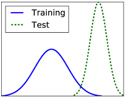

- train/test dataset distribution이 다르다.

흔히 훈련한 모델을 test dataset으로 성능을 측정했을 때 잘 안나오는 경우 overfitting을 의심하지만, covariate shift 관점에서 보면 dataset을 자체를 잘못 구성했기 때문에 발생했을 수 있다.

가령 게임 렌더링으로 구성된 도로에서 training을 수행한 자율주행 자동차가 있다고 하자. train dataset이 너무 단순한 텍스처로만 이루어져 있기 때문에 실제 복잡한 도로에서는 잘 동작하지 않을 것이다. 또한 낮/밤의 차이만으로도 정확도 차이가 크게 날 수 있다.

---

### 3.6.3 internal covariate shift

> [internal covariate shift 정리](https://wegonnamakeit.tistory.com/47)

아래 그림은 **Internal Covariate Shift**(내부 공변량 이동)을 나타낸다.

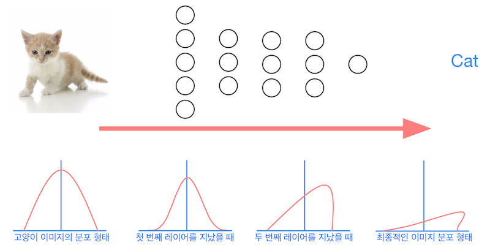

- activation distribution이 달라진다.

> 대표적인 대안으로는 ReLU, careful initialized, small learning rate 등이 있다.

만약 activation을 standardization한다면, 아래 그림과 같이 activation 분포가 평균 0, 표준편차 1로 변환된다.(batch normalization 레이어를 적용)

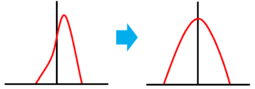

> 결론부터 보면, 정작 BN이 ICS를 제거하느냐 묻는다면 그렇지는 않다.

> 대신 activation이 동일한 scale을 갖기 때문에, gradient descent가 원활하게 수렴될 수 있다.

---

### 3.6.4 batch, epoch

> [epoch vs batch vs mini-batch](https://www.baeldung.com/cs/epoch-vs-batch-vs-mini-batch)

- **epoch**

    네트워크가 전체 training dataset을 한 번 학습하는 것을 의미한다.(forward, backward pass를 모두 거침)

    - 하지만 메모리 제약으로 모든 학습 데이터셋을 한 번에 학습할 수 없으므로, 1 epoch은 여러 iteration으로 나뉘어 수행된다. 
    
    - 한 iteration은 batch size만큼의 data를 가지고 학습한다.

- **batch**, **mini-batch**

    한 번의 iteration에 사용되는 sample의 수를 의미한다. 단, batch size를 전체 training dataset으로 설정하는가, 아니면 이보다 작은 mini-batch로 설정하는가에 따라 다르다.

    - batch

        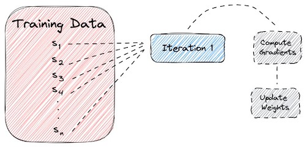

    - mini-batch

        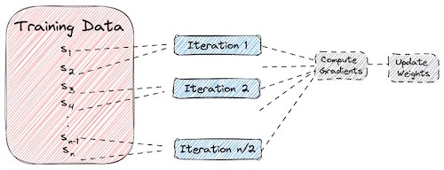

### <span style='background-color: #393E46; color: #F7F7F7'>&nbsp;&nbsp;&nbsp;📝 예제 1: iteration 수 구하기&nbsp;&nbsp;&nbsp;</span>

전체 학습 데이터셋의 크기는 2000개이다. 아래 조건에서 학습에서 갖는 총 iteration 수를 구하라.

- epochs = 20

- batch size = 500

### <span style='background-color: #C2B2B2; color: #F7F7F7'>&nbsp;&nbsp;&nbsp;🔍 풀이&nbsp;&nbsp;&nbsp;</span>

우선 batch size가 500이므로, 1 epoch은 2000/500 = 4 iteration으로 수행된다.

그리고 epoch은 총 20회이므로 4 X 20 = 80 iteration이 수행된다.

---

### 3.6.5 Normalization Types

> [Group Normalization 논문](https://arxiv.org/abs/1803.08494)

그런데 normalization도 여러 전략이 있다.

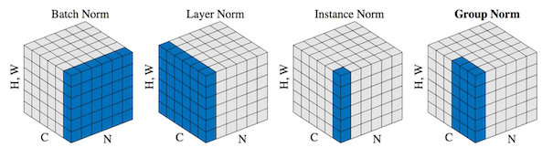

이중에서도 batch normalization을 사용하는 이점은, batch의 모든 sample이 갖는 분포가 균일해진다는 점이다. 

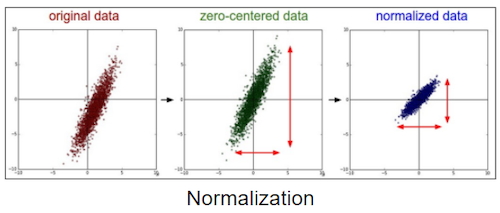

- 하지만 오직 batch size가 큰 경우에만 잘 동작한다.

- batch size가 작은 경우, batch normalization은 역으로 성능을 떨어뜨릴 수 있다.

> 이외 무작위 dropout은 distribution에 영향을 많이 미칠 수 있기 때문에, 동일한 network에서 BN과 함께 사용하지 않는 것이 좋다.

하지만 이러한 변형은 지난 layer에서 얻은 표현력을 감소시킬 수 있다. 특히 모든 data를 단순히 평균 0, 표준편차 1로 변형시키는 **whitening** 방식을 적용하면 이런 문제가 발생하게 된다.

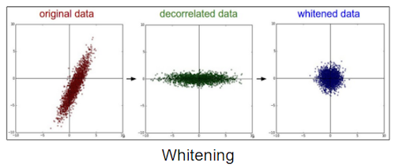

---

### 3.6.6 In-layer normalization

Batch Normalization을 수행하는 intermediate layer는 activation function을 적용하기 전/후 중 어디에 연결하는가에 따라 두 가지로 나뉜다.

- activation layer 이후 연결

- activation layer 이전 연결: input에 linear transform을 적용한 후, 하지만 activation function을 적용하기 전에 BN을 수행한다.

이전,이후 연결에 따른 성능 차이는 의견이 갈리지만, activation 이전에 BN을 수행하는 경우가 보편적이다. 다만 activation 이전에 BN을 수행하는 경우, 아래와 같은 이유로 non-linearity가 감소할 수 있다.

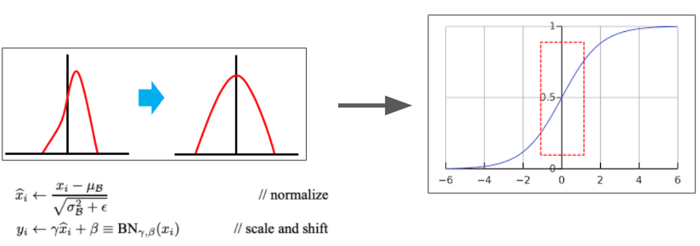

- 예를 들어 normalization을 적용한 뒤, 오른쪽과 같은 tanh activation을 거친다고 하자.

- 이 경우, activation의 입력은 대부분 그림의 빨간색 박스에 해당되는 값이 될 것이다. 그런데 **이 빨간색 박스는 거의 linear한 성질을 띤다.**

따라서 이러한 non-linearity의 감소를 막기 위해 적절한 scale, shift 패러미터를 갖는데, 이것이 $\gamma$ , $\beta$ 이다.

$$ y_i \leftarrow {\gamma} \hat{x_i} + \beta $$

- $\hat{x_i}$ : normalization 후, activation layer의 입력이 되는 값

위 두 패러미터는 training 과정에서 학습된다.(**learable parameter**) 

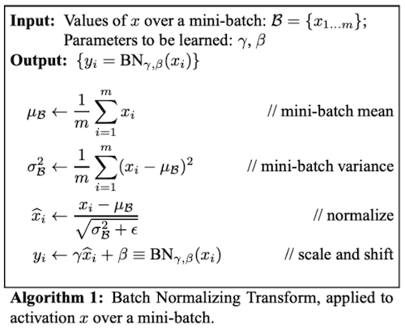

모델을 mini-batch 단위로 학습하기 때문에, 패러미터도 mini-batch 단위로 모두 가지게 된다. 그리고 추론 단계에서는 $n$ 개의 mini-batch를 가지고, 추론에 사용할 평균, 표준편차를 구하게 된다.

> layer가 normalization된 값을 입출력으로 사용하기 때문에, 추론 시에도 normalization이 적용되어야 제대로 된 추론이 가능하다.

이처럼 추론 단계에서 사용하는 parameter를 **moving average**(이동 평균)을 통해 구한다.

---

### 3.6.7 Inference with Batch Normalization

추론(inference) 단계에서는 이러한 mini-batch의 평균, 표준편차를 사용할 수 없다.

따라서 추론 시 사용할 평균, 표준편차를 training set의 평균, 표준편차를 사용하는 방법하여 도출한다. 이렇게 도출한 parameter를 **moving mean**, **moving standard deviation**라고 하며, non-learnable parameter로 Batch Norm layer의 **state** 일부로써 저장된다.

> 아래 예시는 activation 후 BN을 적용하는 경우이다.

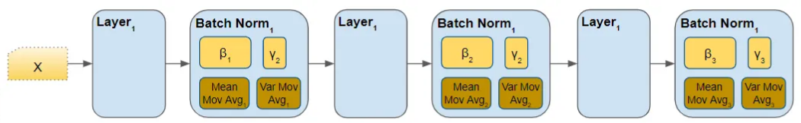

- 각 Batch Norm layer는 고유한 $\beta$ , $\gamma$ , moving mean, moving standard deviation를 갖는다.

이제 moving average를 어떻게 구하는지 보자.

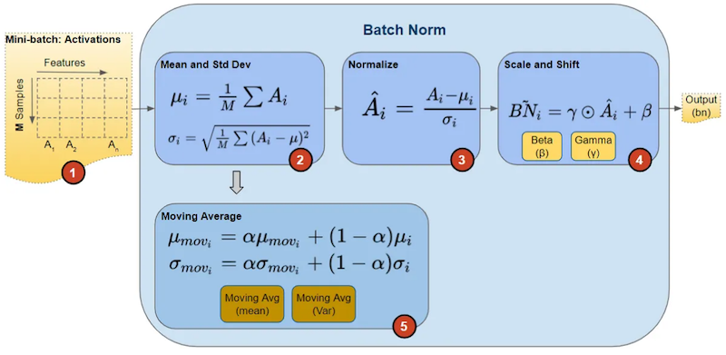

```math
\hat{\mu} \leftarrow \alpha \hat{\mu} + (1- \alpha) {\hat{\mu}}_{\beta}^{(i)}
```

```math
\hat{\sigma} \leftarrow \alpha \hat{\sigma} + (1- \alpha) {\hat{\sigma}}_{\beta}^{(i)}
```

- $\alpha$ : moving average의 decay factor(momentum). 주로 1에 가까운 0.9, 0.99, 0.999를 사용한다.

> moving average 방식이 아니라 모집단 추정방식을 사용할 수도 있지만, 이 경우 state로 모든 $\beta$ , $\gamma$ 를 기억해 둬야 하므로 비효율적이다.

---

### 3.6.8 Batch Normalization in CNN

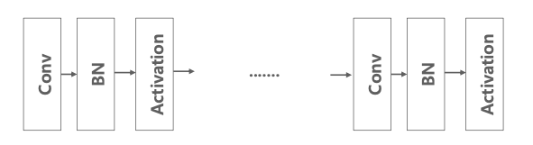

CNN(Convolutional Neural Network)에 BN을 적용 시 기존과 몇 가지 차이점이 있다.

- $b$ : $Wx+b$ 에서 $\beta$ 가 $b$ (bias) 역할을 대체할 수 있기 때문에 $b$ 를 제거한다.

- channel별로 BN을 수행한다.

  - 즉, Batch, Height, Width 정보를 갖는 tensor별로 평균과 분산을 구한다.

    > feed-forward (dense) layer는 자체적인 가중치를 갖는 뉴런 단위로 BN을 적용한다.

    > 하지만 CNN은 같은 transformation(filter)이 input의 volume별로 적용되고, 출력으로 하나의 channel을 구성된다.(filter 개수 = 출력 채널 크기)

---