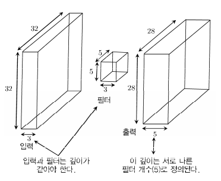
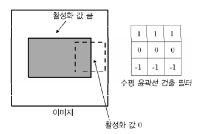
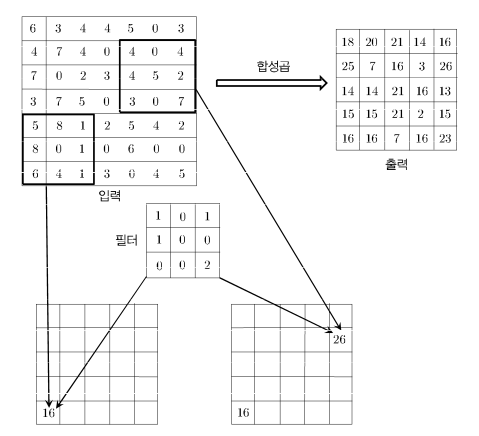

# 8 CNN

## 8.1 소개

**CNN**(Convolutional Neural Network)는 **grid**(격자) 구조의 input data를 처리하도록 설계된 neural network이다. 이런 data에서 주목할 특징은 <U>grid 내 국소 영역에 **spatial dependence**(공간적 의존성)이 존재</U>한다는 점이다.

CNN에서 **spatial**은 특히 convolution 연산에서의 <U>2차원 grid</U>를 함의한다. CNN에서 한 layer는 3차원 volumn을 갖지만, 이 3차원은 온전한 3차원보다는 2(spatial)+1(depth)차원으로 이해할 수 있다.

> 따라서 <U>depth 차원은 겹겹이 쌓인 2차원 grid를 식별하는 index처럼 작용</U>한다.

CNN은 주로 2차원 image를 대상으로 하는 경우가 많다. image는 특정 영역에 색상이 비슷한 pixel이 모여 있을 때가 많기 때문이다. 그런데 image를 구성하는 서로 다른 색상들을 또 다른 하나의 차원으로 간주한다면, image는 3차원 volumn을 형성하는 data가 된다.

image는 다른 자료들과는 달리, 어느 정도의 **translation invariance**(이동 불변성)을 갖는다. CNN은 비슷한 pattern을 가진 국소 영역에 비슷한 특징들을 산출하는데, image를 이용하면 결과를 사람이 이해하기 쉬운 형태로 서술하기도 쉽다.

> 예를 들어, 어떤 사진의 왼쪽 윗부분에 있는 바나나를 오른쪽 아래로 이동시켜도, 바나나가 아닌 다른 무언가로 변신하지는 않는다.

> 이외 CNN에서 주로 사용하는 data로 text나 sequential data, nucleic sequence(염기서열) 등이 있다. 시공간적 정보를 갖는 data에도 CNN을 적용할 수 있다.

CNN의 중요한 특징 중 하나는 바로 convolution 연산이다. 일종의 dot-product(내적) 연산으로, grid 형태로 배치된 weight들과 그와 비슷한 grid 구조의 input들에 dot-product를 적용한다.

> [What is convolution(3Blue1Brown youtube)](https://youtu.be/KuXjwB4LzSA)

> 최초의 CNN은 Hubel(허블)과 Wiesel(비셀)이 수행한 고양이의 시각피질 실험에서 motivation을 얻었다. 시야의 특정 영역이 자극을 받으면, 이에 대응되는 시각 피질의 특정 영역에 있는 신경세포들이 활성화된다.

> 이때 물체의 형태나 방향도 활성화에 영향을 미치는데, 예를 들어 수직 경계선에 잘 활성화되는 신경세포와 수평 경계선에 잘 활성화되는 신경세포가 서로 달랐다. 또한 이런 신경세포들은 층별 구조로 연결되어 있어서, 이러한 hierarchical feature extraction 발상이 가능한 것이었다.

---

### 8.1.1 좀 더 넓은 관점에서 본 CNN

CNN은 주어진 domain에 대응되는 방식으로, parameter를 적극적으로 sharing하면서 연결을 sparse하게 만든다. 즉, CNN은 인접한 두 layer의 node를 모두 연결하지는 않는다. 대신 node는 이전 layer의 특정 국소 영역에 해당하는 node들과 연결된다. 

즉, CNN을 일종의 **domain-aware regularization**으로 볼 수 있다. domain 내 dependence를 이용해서 parameter 요구량을 줄이게 설계한 셈이다. 이런 특성이 CNN이 높은 accuracy를 얻게 한 비결이다.

> 여러 시간층이 parameter를 공유하는 RNN도 domain-aware regularization을 적용할 수 있다. 물론 시간이 흘러도 sequential data 사이에 **temporal dependence**는 별로 변하지 않아야 한다. 

> CNN과의 차이라면, CNN은 spatial dependence를 이용하지만, RNN은 temporal dependence를 이용한다는 점이다.

---

## 8.2 CNN의 기본 구조

CNN에서 각 layer의 unit들은 input data의 grid에 맞게 배치된다. 각 unit은 이전 layer의 국소 공간 영역의 unit들과 연결되며, 결과적으로 input data에 존재하는 spatial한 관계들이 layer를 거치며 계속 전달된다.

CNN에서 한 layer는 3차원 grid 구조를 갖는다. 각 차원을 다음과 같이 부른다.

- height(높이)

- width(너비)

- depth(깊이)

  - input layer의 경우, depth는 input image가 갖는 channel(R,G,B)의 개수가 된다. 

  - hidden layer의 경우, depth는 hidden layer가 표현하는 feature map의 개수가 된다.

  > 이때 한 layer의 depth를 CNN 자체의 depth와 혼동하면 안 된다. depth라는 하나의 용어로 지칭하므로 주의하자.

CNN layer는 흔히 **convolution**, **pooling**, **ReLU** layer로 나뉜다. 또한 마지막 hidden layer는 (이전 hidden layer와 다르게) output layer와 fully-connected될 때가 많다.

각 layer에 depth가 필요한 이유, 즉 각 layer가 3차원이여야 하는 이유를 알아보자. CNN의 input data는 하나의 2차원 grid로 조직화되는데, 이때 개별 grid를 **pixel**(픽셀)이라고 부른다. 그런데 각 pixel의 색상을 정확히 encoding하기 위해서는 RGB에 해당하는 차원이 필요하다.

예를 들어 image가 $32 \times 32$ 이며 RGB로 이루어진 data라고 하자. 그렇다면 encoding한 image는 $32 \times 32 \times 3$ 개의 element로 정의된다. 두 차원으로 spatial dependence를 표헌하고, 마지막 한 차원으로 각 channel의 independent한 성질을 나타내는 것이다.

이어서 $q$ 번째 layer의 input이 $L_{q} \times B_{q} \times d_{q}$ 라고 가정하자.

- $L_{q}$ : height. 예시에서는 32이다.

- $B_{q}$ : width. 예시에서는 32이다.

- $d_{q}$ : depth. 예시에서는 3이다.

> 사실 대부분의 경우에서 $L_{q}$ 와 $B_{q}$ 는 값이 같다.

input layer에서는 이 수치들이 input data size와 적용한 전처리 방식에 따라 결정될 것이다. 앞선 예시에서는 $L_{1} = 32, B_{1} = 32, d_{1} = 3$ 이 된다. 그러나 이후의 layer가 갖는 $d_{q}$ 개의 2차원 grid들은 더 이상 input image pixel들의 색상 값이 아니게 된다. 더 나아가서 hidden layer에서 $d_{q}$ 는 3보다 훨씬 클 수도 있다.(다시 말해 independent한 성질이 더 많은 경우.)

> $q > 1$ 인 경우, 이러한 grid가 갖는 값을 **feature map**(특징 맵) 또는 **activation map**(활성화 맵)이라고 한다.

CNN에서 parameter들은 **filter**(필터) 또는 **kernel**(핵)이라고 불리는 3차원 data로 조직된다. 일반적으로 한 filter는 2차원 정사각 grid가 겹쳐진 3차원 구조인데, 대체로 이 2차원 grid의 size는, filter를 적용할 layer의 height*width보다 훨씬 작다. 반면 <U>depth는 적용할 layer의 depth와 같다.</U>

> 주로 2차원 grid는 $3 \times 3$ 또는 $5 \times 5$ 를 사용한다. 하지만 $1 \times 1$ 을 사용하는 특이한 경우도 존재한다.

> 앞으로 filter size를 $F_{q} \times F_{q} \times d_{q}$ 로 나타낼 것이다. 

---

## 8.3 filter

CNN은 image(또는 hidden layer)의 가능한 모든 위치에 filter가 적용될 수 있도록 filter들을 적절하게 배치한다. 그리고 동일한 size의 input volumn과 filter의 $F_{q} \times F_{q} \times d_{q}$ 개 parameter가 dot product를 수행하게 된다.

그렇다면 이미지 전체를 포괄하려면 filter를 몇 개 배치해야 할까? filter 위치는 각각 다음 layer의 **feature**(pixel)를 정의한다. 또한 이 문제는 다음 layer의 공간적 height와 width를 결정하게 된다. 

$q$ 번째 layer에서 convolution을 수행할 때 filter를 배치하는 방법을 알아보자. 한 가지 방법으로 image의 height 방향으로 $L_{q+1} = (L_{q} - F_{q} + 1)$ 개, width 방향으로 $B_{q+1} = (B_{q} - F_{q} + 1)$ 개 filter를 배치할 수 있다.(이 방법으로는 image의 테두리 지점에서 filter 일부가 "삐져나오는" 현상을 피할 수 있다.)

다음 예시 그림을 보자. $5 \times 5 \times 3$ size의 서로 다른 filter를 5개 사용한 convolution 연산의 결과이다.

- $L_{2}$ 와 $B_{2}$ 는 다음과 같이 계산된다. 이는 곧 다음 layer의 크기가 된다.

$$ L_{2} = 32 - 5 + 1 = 28 $$

$$ B_{2} = 32 - 5 + 1 = 28 $$

- 출력의 depth가 $d_{2} = 5$ 를 갖는 이유는, 한 filter 위치에서 각자 다른 parameter를 가진 '서로 다른 filter 다섯 개'를 적용했기 때문이다.

한 filter로 산출한 feature들의 집합은 그 다음 layer의 feature map이 된다. 그리고 방금 예시에서는 filter를 다섯 개 사용했으므로, 총 다섯 개의 feature map이 생기게 된 것이다.

이처럼 filter가 많을수록 feature map도 늘어나게 된다. 이는 parameter 개수 또한 그만큼 늘어난다는 의미이다. 즉, <U>각 layer에 적용하는 filter의 개수는 parameter 수에 직접적으로 영향</U>을 미친다.

> 다시 말해 model에 있는 trainable parameter의 수를 나타내는 **model capacity**(모델 수용력)에 직접 영향을 미친다.

그런데 CNN에서는 layer마다 filter 수를 다르게 지정할 수도 있다. 즉, 각 layer마다 갖는 feature map의 개수도 달라질 수 있다. 예를 들어 image의 경우 input layer는 일반적으로 3개 channel(RGB)을 갖지만, 뒤쪽 layer에서는 feature map 개수(depth)가 500개를 넘을 수도 있다. 

이는 filter의 역할이 '작은 영역에서 특정한 spatial pattern을 classification'하는 것이기 때문이다. image에 존재하는 도형(pattern)을 인식하고, 이를 바탕으로 최종 image를 합성하려면 많은 수의 filter가 필요할 수밖에 없다.

> 일반적으로 CNN의 뒤쪽 layer로 갈수록, height와 width는 줄어들고 depth(feature map 개수)는 커진다. 즉, 더 작은 grid가 굉장히 많이 중첩된 형태가 된다.

filter의 역할을 더 이해하기 위해 다음 예시 그림을 보자. channel이 하나뿐인 grayscale(회색조) image에, horizontal edge(수평 윤곽선)을 검출하기 위한 filter를 적용한 것이다.

- horizontal edge: edge에 해당되는 pixel들에서 activation 값이 크게 나온다. 

- vertical edge: activation 값이 0이 된다.

> 기울어진 edge에서는 기울어진 정도에 비례하는 중간 정도의 activation 값이 나온다.

이런 filter를 적용하는 것으로 image의 horizontal edge를 어느 정도 반영한 output volumn을 얻을 수 있다. 다른 예시로 여기에 vertical edge를 검출하는 filter를 추가한다면 이 정보가 반영된 output volumn도 얻을 수 있는 것이다.

---

## 8.4 convolution

convolution을 수학적으로 정의할 것이다. 우선 표기법을 정의하자.

$$W^{(p,q)} = [w_{ijk}^{p,q}]$$

- $q$ 번째 layer와 $p$ 번째 filter의 parameter를, 하나의 3차원 tensor $W^{(p,q)}$ 로 표기한다.

  - $i,j,k$ : 각각 height, width, depth 방향의 paramenter를 나타내는 index이다.

- input layer인 $q = 1$ 은 hidden layer가 아니지만, 일관성을 위해 $H^{(1)}$ 로 표기할 것이다.

$q$ 번째 layer에서 $(q+1)$ 번째 layer로의 convolution은 다음과 같이 정의할 수 있다.

$$h_{ijp}^{(q+1)} = \sum_{r=1}^{F_{q}} \sum_{s=1}^{F_{q}} \sum_{k=1}^{d_{q}}{w_{rsk}^{(p,q)} h_{i+r-1, j+s-1, k}^{(q)}}$$

$$\forall i \in \lbrace 1, ..., L_{q} - F_{q} + 1 \rbrace$$

$$\forall j \in \lbrace 1, ..., B_{q} - F_{q} + 1 \rbrace$$

$$\forall p \in \lbrace 1, ..., d_{q+1} \rbrace \quad \quad \quad$$

- $(i,j)$ : 공간 위치를 나타낸다.

- $p$ : filter 각각의 index를 나타낸다.

input과 filter 모두 depth가 1인 간단한 예시에 convolution 연산을 직접 수행해 보자. 

> 실제로 grayscale인 image를 다룰 때 이런 설정이 쓰인다.

> 적용할 layer의 depth와 filter의 depth는 일치해야 했다.

- $7 \times 7 \times 1$ layer에 $3 \times 3 \times 1$ filter를 적용한다.

- 따라서 output layer의 size는 $(7 - 3 + 1) = 5$ , $(7 - 3 + 1) = 5$ 로 $(5 \times 5)$ 가 된다.

convolution에 의해 한 feature가 다른 layer로 넘어가면, 그 feature의 **receptive field**(수용 영역)이 커진다. 다시 말해 <U>다음 layer의 각 feature는 이전 layer보다 더 큰 공간 영역을 반영</U>한다.

예를 들어 인접한 layer 3개에 $(3 \times 3)$ filter를 차례로 적용하면, 세 layer는 각각 원래 input layer에 있는 $3 \times 3$ , $5 \times 5$ , $7 \times 7$ size의 pixel 영역에 존재하는 feature를 표현하게 된다.

> 따라서 뒤쪽 layer들은 앞쪽 layer에서 검출된 단순한 도형(feature)들의 조합으로 이루어진, '좀 더 복잡한 pattern'을 검출한다.

---